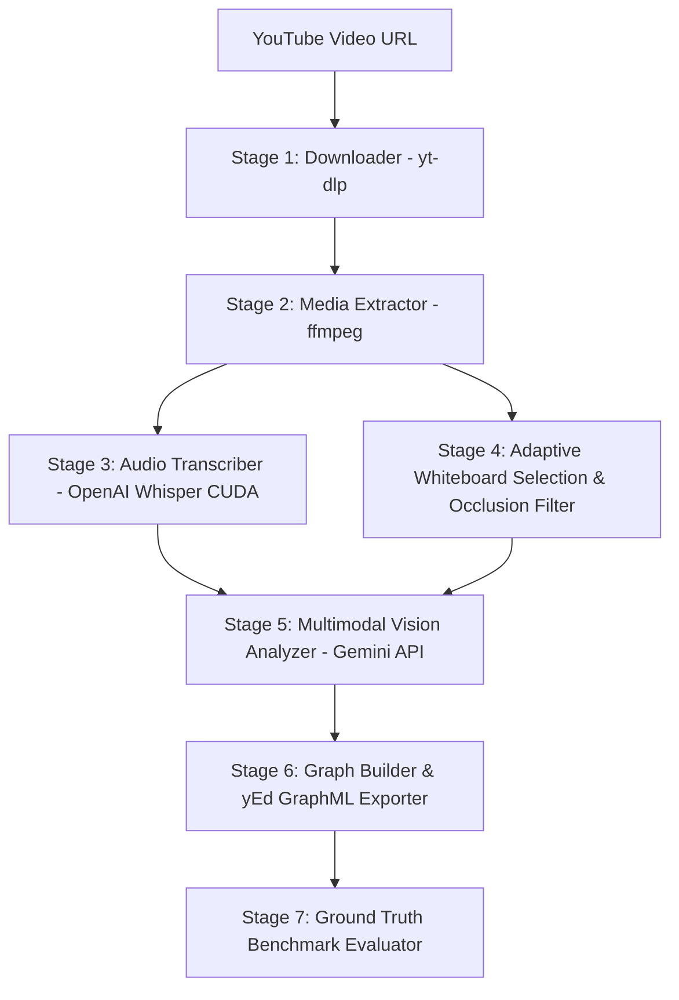

# 🏗️ Solution Architecture: 7-Stage Agentic Pipeline

The Cloud Architecture Extractor is structured as an automated 7-stage pipeline that processes unstructured technical video URLs into yEd-compatible GraphML diagrams.

## Stage Descriptions

### Stage 1: Download & Metadata Extraction (`scripts/downloader.py`)
- Fetches video stream (`.mp4`) and info metadata (`.info.json`) using `yt-dlp`.

### Stage 2: Media Processing (`scripts/extractor.py`)
- Converts audio stream to 16 kHz mono PCM WAV format for optimal Whisper speech recognition.
- Extracts keyframes at regular intervals (default: 1 frame every 10 seconds).

### Stage 3: Audio Transcription (`scripts/transcriber.py`)
- Loads local GPU-accelerated OpenAI Whisper model (`cuda`, FP16).
- Generates timestamped segment transcriptions saved as JSON cache.

### Stage 4: Whiteboard Selection & Occlusion Filtering (`scripts/pizarra_filter.py`, `pizarra_occlusion_filter.py`)
- Applies dark pixel area ratio thresholding adaptively based on video age.
- Performs 5x5 rectangular morphological opening to suppress thin drawing arrows.
- Evaluates presenter body occlusion in the central 50% ROI, selecting the frame with minimal blockage (`best_whiteboard.jpg`).

### Stage 5: Multimodal Vision Analysis (`scripts/vision_analyzer.py`)
- Fuses the selected whiteboard keyframe and Whisper speech transcript into a prompt payload sent to Gemini Vision API (`temperature=0.1`, JSON response schema).
- Employs Parsimonious Prompting rules to prevent ghost actor nodes and spurious edge creation.

### Stage 6: Graph Construction & Rendering (`scripts/graph_builder.py`)
- Normalizes AWS service names into canonical categories.
- Builds NetworkX `MultiDiGraph` with node attributes, flow IDs, sequence IDs, and edge types.
- Exports standard `.graphml` and yEd-formatted `_visual.graphml` with AWS category color coding.

### Stage 7: Ground Truth Evaluation (`scripts/graph_builder.py`)
- Performs graph alignment against Cloudscape Ground Truth reference graphs.
- Computes Precision, Recall, and F1 scores under strict and permissive matching rules.
