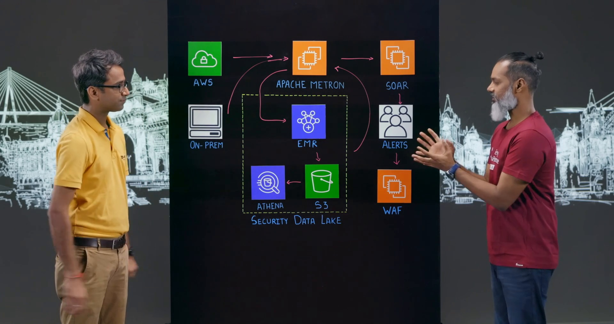
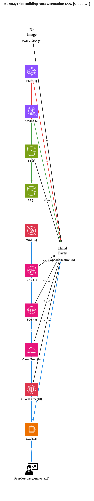
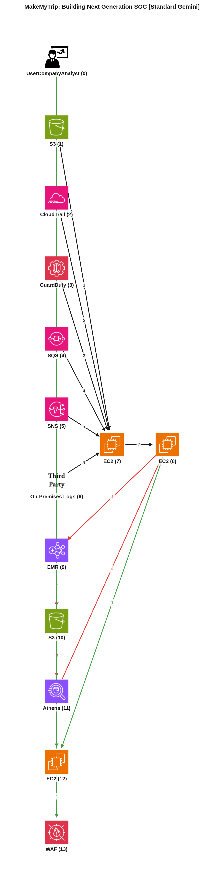
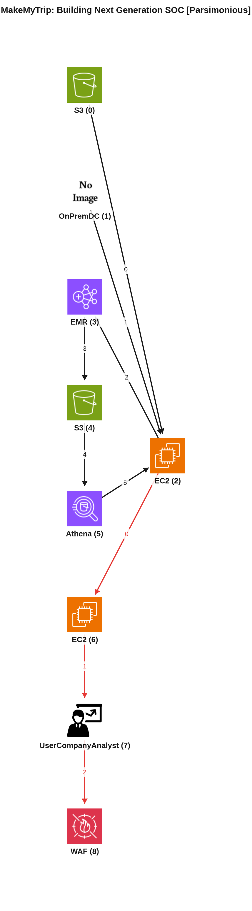

# Reporte de Comparación Cloudscape — Video -3lnf5lzsH0 (MakeMyTrip: Building Next Generation SOC)

Este reporte tiene como objetivo comparar el grafo de arquitectura manual de referencia (Ground Truth) con dos grafos generados automáticamente por inteligencia artificial: uno producido por el agente estándar (Gemini Vision) y otro por el agente simplificado o parsimonioso (Gemini Vision Parsimonioso). El análisis se centrará en la interpretación de los componentes, los flujos de datos y las interacciones clave de la arquitectura descrita en el video.

---

## 📹 Descripción del Video
*   **ID del Video:** `-3lnf5lzsH0`
*   **Título:** *MakeMyTrip: Building Next Generation SOC*
*   **Canal:** Amazon Web Services
*   **Duración:** 10:18
*   **Resumen General:** En este episodio de "This is My Architecture", Vikram Mehta de MakeMyTrip, una de las principales agencias de viajes en línea de la India, describe cómo construyeron un Centro de Operaciones de Seguridad (SOC) de próxima generación desde cero para combatir ataques cada vez más avanzados y rápidos. La solución se centra en ir más allá de la detección basada en firmas o reglas, buscando detectar comportamientos anómalos y responder de manera oportuna y automatizada. La arquitectura se basa en Apache Metron como el corazón del SOC, ingiriendo datos de fuentes híbridas (AWS Cloud y entornos on-premise). Estos datos son procesados en tiempo real (parsing, enriquecimiento, perfilado) y luego almacenados en un "Security Data Lake" escalable (basado en S3 y Athena) para análisis a largo plazo y generación de modelos más precisos. Un sistema de orquestación y respuesta de seguridad (SOAR) personalizado llamado "Blitz" automatiza la respuesta a incidentes, permitiendo a los analistas de SOC tomar acciones rápidas, como bloquear IPs maliciosas a través de WAFs. La plataforma maneja aproximadamente 5,000 eventos por segundo y indexa 250 millones de eventos por día en el lago de datos. El sistema es capaz de detectar amenazas "desconocidas" o desviaciones de comportamientos normales, como el ratio de productor-consumidor de un servidor web comprometido.

---

## 🖼️ Mejor Imagen de Pizarra (Fotograma de Trabajo)
La mejor imagen seleccionada por los filtros y aprobada en el pipeline fue **`best_whiteboard.jpg`**.

### Razón de la Selección:
Este fotograma final es óptimo para el análisis ya que expone el diagrama completo de la arquitectura dibujada en la pizarra, mostrando todos los iconos, servicios y flujos de datos esenciales. Además, la oclusión de los presentadores es mínima, permitiendo una visión clara de la topología y las etiquetas.

---

## 🗣️ Traducción de la Transcripción (Whisper a Español)
A continuación se presenta la traducción al español de la transcripción del diálogo de los presentadores:

> **Lalit:** Bienvenidos a otro episodio de "Esta es mi arquitectura". Mi nombre es Lalit. Hoy nuestro invitado es Vikram Mehta de MakeMyTrip. Vikram, cuéntanos qué batallas estás librando.
> **Vikram:** Claro. Gracias Lalit. Es un placer estar aquí. En MakeMyTrip, siendo el agregador de viajes líder de la India, vemos que los ataques son cada vez más avanzados. Los adversarios son cada vez más inteligentes y más rápidos. Hay una creciente necesidad de complementar esto con algo más que la detección basada en firmas o reglas. Necesitamos poseer la capacidad de detectar comportamientos anormales y luego responder a estos ataques de manera oportuna o semi-automatizada.
> **Lalit:** Así que construiste un sistema SOC desde cero.
> **Vikram:** Sí. Completamente.
> **Lalit:** ¿Podrías llevarnos a través de la arquitectura, cómo la construiste, cuáles son los diversos componentes y cómo funcionan juntos?
> **Vikram:** Claro. Absolutamente. Creo que lo que vemos aquí es un SOC de próxima generación típico que consiste prácticamente en empezar con la ingesta de datos. Ahora, el desafío con la ingesta de datos son las fuentes de datos híbridas. Así que tenemos la nube pública y tenemos fuentes de datos on-premise. Tenemos el corazón del SOC de próxima generación allí, que es Apache Metron. Un gran agradecimiento al equipo de Hortonworks por presentarlo a la comunidad. Después de eso, tenemos un lago de datos de seguridad que alberga eventos de telemetría durante un largo período de tiempo. Tenemos una plataforma de orquestación y respuesta de seguridad en el lado derecho que se ocupa principalmente de la respuesta a incidentes y la automatización.
> **Lalit:** De acuerdo. Profundicemos en esto. Así que tienes sistemas dispares. ¿Cómo ingieres los logs en tiempo real?
> **Vikram:** Claro. Como decía, en el caso de una nube pública, hay varios sistemas diferentes que necesitan ser integrados para, ya sabes, extraer eventos de telemetría. Por ejemplo, S3, por ejemplo, SNS, SQS, CloudTrail, GuardDuty. Existe la necesidad de integrar con AWS con herramientas como Apache NIFI que poseen la capacidad de construir flujos de trabajo y luego extraer los eventos de telemetría a Apache Metron. En cuanto al ecosistema on-premise, es una integración bastante estándar de syslog o Kafka que se puede utilizar para extraer los eventos directamente a Apache Metron.
> **Lalit:** De acuerdo. Así que tienes los logs en Apache Metron. ¿Cuáles son los componentes dentro de Apache Metron que trabajan con estos datos ingeridos?
> **Vikram:** Claro. Creo que la primera pieza es poder convertir el formato de log de telemetría estándar en un formato de log que Apache Metron y los sistemas posteriores entiendan. Así que a eso lo llamamos, quiero decir, lo llamamos parsing. Esencialmente, convierte un mensaje de log de syslog o un mensaje de log de CloudTrail o GuardDuty en otro formato JSON que Apache Metron entiende. Así que se convierte en un formato JSON, un formato mucho más legible.
> **Lalit:** Ahora estás haciendo el parsing y también hay otro proceso que mencionaste sobre el enriquecimiento y el perfilado, que es importante. La inteligencia contextual es importante en torno a los logs. ¿Cómo logras eso?
> **Vikram:** Absolutamente. Creo que el enriquecimiento es clave para, ya sabes, proporcionar información contextual sobre un evento, ¿verdad? Digamos que hay un log que contiene una dirección IP de origen y una dirección IP de destino. Ahora, una dirección IP de origen y destino por sí misma no significa mucho, ¿verdad? Sería importante entender de dónde se origina el origen, su geolocalización, tal vez el número AS. En cuanto al destino, en un entorno de nube pública, las direcciones IP cambian constantemente, ¿verdad? Podría ser importante entender qué servidor es realmente. ¿Es un servidor de vuelos? ¿Es un servidor de hotel? ¿Es un servidor de pagos? Toda esta inteligencia contextual se alimenta al sistema Apache Metron, que luego etiqueta los datos de telemetría entrantes con esta inteligencia contextual.
> **Lalit:** Así que tenemos eventos en tiempo real en Apache Metron, tenemos la visibilidad. Ahora también tenemos un lago de datos de seguridad.
> **Vikram:** Sí.
> **Lalit:** ¿Cómo se integran estos dos y qué tan crítico es construir un lago de datos de seguridad?
> **Vikram:** Claro. Creo que en cualquier entorno SOC, es clave almacenar e indexar datos de telemetría durante un largo período de tiempo. Eso podría ser durante meses, podría ser durante años. A la escala a la que operamos, se vuelve extremadamente importante mantener un entorno escalable horizontalmente en el que se pueda confiar para albergar cantidades tan grandes de información. Inicialmente estábamos aprovechando el backbone de Apache Metron, que es HDFS, para almacenar e indexar estos eventos. Migramos de la configuración HDFS on-premise al lago de datos de seguridad sin servidor, como se puede ver aquí. Así que los datos persistentes en Apache Metron desde HDFS son recogidos por un trabajo de EMR que transforma los datos persistentes en HDFS en S3. Desde S3 construimos, aprovechamos Athena para construir consultas SQL y análisis y, ya sabes, para diversos propósitos como la minería de logs, análisis, forenses, etc.
> **Lalit:** Así que hay una visión a partir de los datos que residen en S3 durante un período de tiempo más largo.
> **Vikram:** Absolutamente.
> **Lalit:** Tal vez durante meses.
> **Vikram:** Años.
> **Lalit:** Y luego lo retroalimentas a quizás Apache Metron para enriquecerlo aún más.
> **Vikram:** Absolutamente, creo que ese es un aspecto muy importante aquí. La capa de procesamiento de flujo tiene la capacidad de crear perfiles solo por un período de tiempo limitado, ¿verdad?, según lo permita la infraestructura. El lago de datos de seguridad nos da la flexibilidad de generar modelos o perfiles a partir de meses de información de telemetría, lo que esencialmente es mucho más preciso en comparación con, digamos, unos pocos minutos de información de perfil. Así que ese es el bucle de retroalimentación que va desde el lago de datos de seguridad de vuelta a Apache Metron.
> **Lalit:** Así que, en este punto, una vez que identificas un incidente, ¿cómo actúan tus usuarios, tus analistas o el sistema sobre estos eventos o incidentes?
> **Vikram:** Claro. Creo que tan importante como detectar un incidente es responder a ese incidente lo antes posible y de tantas maneras como sea posible de forma automatizada o semi-automatizada. Había la necesidad de construir todo este framework de orquestación al que llamamos Blitz. También está disponible en nuestro repositorio de GitHub de código abierto. Esencialmente toma una alerta de Metron, etiqueta más información contextual relevante que probablemente no se puede alimentar a Apache Metron, como DNS inverso, como una búsqueda de whois, por ejemplo, presenta toda esta alerta en un único panel de cristal a un analista de SOC, ya sabes, probablemente en su dispositivo móvil o a través de una integración con Jira y, por lo tanto, reduce el tiempo de investigación, ¿verdad?, o el tiempo de triaje que un analista de SOC normalmente pasaría. El siguiente paso es responder o mitigar la amenaza actual. Tenemos varias integraciones diferentes que hemos hecho con, digamos, un WAF o un firewall o nuestros routers internos que un analista podría, digamos, con solo pulsar un botón, responder a un incidente que recibe, digamos, bloqueando una fuente.
> **Lalit:** De acuerdo. Muy bien. Así que también tienes respuesta automatizada a incidentes.
> **Vikram:** Sí. Hasta cierto punto, podemos decir.
> **Lalit:** Sí. Entendido la arquitectura. ¿Podrías darnos un par de casos de uso o un caso de uso que estés resolviendo con esto?
> **Vikram:** Claro. Creo que esa es probablemente la parte más interesante y también mi tema favorito. Creo que todo el concepto de un SOC externo es poder detectar comportamientos inusuales, desviaciones de la actividad normal, ¿verdad? Así que hablemos de un caso de uso en el que estamos tratando de detectar un compromiso de servidor que realmente ha eludido toda la seguridad, ya sabes, basada en reglas o basada en firmas o la protección que uno podría tener. Un servidor tiene una característica típica, digamos que un servidor web tendría una cierta relación de egreso e ingreso que llamamos relación productor-consumidor y cuando se perfila durante un período de tiempo, un servidor web típico tendría un cierto patrón de PCR normal, rango de PCR normal. Ahora, si ese servidor comienza a hacer algo que no se supone que debe hacer, por ejemplo, si se compromete, eso podría sesgar la relación PCR hasta un punto que es una desviación del comportamiento normal y que es lo que puede ser detectado por una configuración como esta.
> **Lalit:** ¿Así que estás detectando lo desconocido?
> **Vikram:** Sí, absolutamente.
> **Lalit:** De acuerdo. ¿Y cuál es la escala de esta arquitectura? ¿Cuántos eventos estás manejando?
> **Vikram:** Así que creo que de diferentes fuentes de datos, probablemente tenemos alrededor de 20 fuentes de datos operando en este momento, sumando unos 5000 eventos por segundo. Y en cuanto al lago de datos de seguridad, indexamos alrededor de 250 millones de eventos por día.
> **Lalit:** De acuerdo. Muy bien. Y ahora que tienes los datos en el lago de datos, ¿cuáles son tus próximos pasos? ¿Qué más estás haciendo en esta plataforma?
> **Vikram:** Así que creo que como próximo paso, principalmente, ya sabes, sentimos que nos gustaría aprovechar el lago de datos de seguridad y las grandes cantidades de datos disponibles para llevar a cabo la búsqueda de amenazas, para detectar incluso más de lo que estamos haciendo hoy.
> **Lalit:** Gracias Vikram. Gracias por la información.
> **Vikram:** El placer es todo mío.
> **Lalit:** Gracias por mirar. Esta es mi arquitectura.

---

## 📐 Redacción y Explicación del Diagrama Resultante

### 1. ¿Por qué el Grafo Manual (Ground Truth) está estructurado de esa manera?

*   **Estructura de Nodos:** El grafo Ground Truth identifica los componentes principales que conforman la arquitectura del SOC de MakeMyTrip.
    *   `NodeID: 0, Service: OnPremDC`: Representa las fuentes de datos on-premise de MakeMyTrip (ej., Syslog, Kafka).
    *   `NodeID: 3, Service: S3`, `NodeID: 7, Service: SNS`, `NodeID: 8, Service: SQS`, `NodeID: 9, Service: CloudTrail`, `NodeID: 10, Service: GuardDuty`: Representan las diversas fuentes de logs y eventos de telemetría de AWS en la nube pública.
    *   `NodeID: 6, Service: ThirdParty, Name: Apache Metron`: Es el corazón del SOC, un componente central para el procesamiento en tiempo real.
    *   `NodeID: 1, Service: EMR`: Representa un servicio de Amazon EMR utilizado para el procesamiento de datos a gran escala.
    *   `NodeID: 4, Service: S3`: Sirve como el "Security Data Lake", el almacenamiento persistente para los datos de telemetría a largo plazo.
    *   `NodeID: 2, Service: Athena`: Un servicio de AWS para ejecutar consultas SQL sobre los datos en S3.
    *   `NodeID: 11, Service: EC2`: Representa la plataforma de orquestación y respuesta (Blitz) corriendo sobre instancias EC2.
    *   `NodeID: 5, Service: WAF`: Un Web Application Firewall de AWS, utilizado para mitigar ataques.
    *   `NodeID: 12, Service: UserCompanyAnalyst`: El analista de SOC, un actor humano que interactúa con el sistema.

*   **Flujos e Interacciones Clave:** El grafo manual describe los siguientes flujos principales:
    *   **Ingesta de Datos (FlowID: 0):** Los datos de fuentes on-premise (`NodeID: 0`) y de AWS (S3 `NodeID: 3`, SNS `NodeID: 7`, SQS `NodeID: 8`, CloudTrail `NodeID: 9`, GuardDuty `NodeID: 10`) fluyen hacia Apache Metron (`NodeID: 6`) para el procesamiento en tiempo real.
    *   **Lago de Datos de Seguridad (FlowID: 1):** Apache Metron (`NodeID: 6`) envía datos persistentes que son procesados por EMR (`NodeID: 1`). EMR transforma estos datos y los almacena en el Security Data Lake (`NodeID: 4`, S3).
    *   **Análisis y Retroalimentación (FlowID: 2):** Los datos en el Data Lake (S3 `NodeID: 4`) son consultados por Athena (`NodeID: 2`). Los resultados de Athena (`NodeID: 2`) pueden retroalimentarse a Apache Metron (`NodeID: 6`) para enriquecer los perfiles en tiempo real.
    *   **Respuesta a Incidentes (FlowID: 3):** El analista de SOC (`NodeID: 12`) interactúa con la plataforma de orquestación (Blitz, en EC2 `NodeID: 11`). Apache Metron (`NodeID: 6`) envía alertas a la plataforma de orquestación (`NodeID: 11`). La plataforma de orquestación (`NodeID: 11`) puede enviar comandos al WAF (`NodeID: 5`) para bloquear amenazas y presenta información al analista de SOC (`NodeID: 12`).

### 2. ¿Por qué el Grafo Automático Estándar (Gemini Vision) está estructurado de esa manera y en qué parte del texto se basó?

*   **Mapeo de Nodos y Justificación de Flujos:** El modelo estándar (Service F1: 95.7%, Edge F1: 38.7%) interpretó la arquitectura siguiendo un flujo detallado de la transcripción. Identificó correctamente la mayoría de los servicios de AWS y componentes de terceros.
    *   Las fuentes de logs de AWS (S3, CloudTrail, GuardDuty, SQS, SNS) se mapean a nodos separados (`NodeID: 1` a `5`), y las fuentes on-premise a `NodeID: 6`.
    *   La mención de Apache NiFi ("*integrar con AWS con herramientas como Apache NIFI que poseen la capacidad de construir flujos de trabajo y luego extraer los eventos de telemetría a Apache Metron*") llevó a la inclusión de `NodeID: 7, Service: EC2, Name: Apache NiFi` como un punto de ingesta intermedio, enviando datos a Apache Metron (`NodeID: 8`).
    *   Apache Metron (`NodeID: 8`) es identificado como el "corazón del SOC de próxima generación", realizando parsing, enriquecimiento y perfilado.
    *   El proceso del lago de datos se basa en la descripción de "datos persistentes en Apache Metron desde HDFS son recogidos por un trabajo de EMR que transforma los datos persistentes en HDFS en S3" y "aprovechamos Athena para construir consultas SQL y análisis". Esto mapea `NodeID: 8 (Metron)` a `NodeID: 9 (EMR)` y luego a `NodeID: 10 (Security Data Lake en S3)`, que a su vez es consultado por `NodeID: 11 (Athena)`. El bucle de retroalimentación de Athena a Metron también se detecta.
    *   La sección sobre la respuesta a incidentes ("*construir todo este framework de orquestación al que llamamos Blitz... toma una alerta de Metron... presenta esta alerta... al analista de SOC... El siguiente paso es responder o mitigar la amenaza actual... integraciones... con... un WAF*") llevó a la creación de `NodeID: 12 (Blitz SOAR)` que recibe alertas de Metron (`NodeID: 8`), interactúa con `NodeID: 0 (SOC Analyst)` y `NodeID: 13 (AWS WAF)`.

*   **⚠️ Brecha Clave Detectada:** Aunque el F1 de servicios es alto, el F1 de aristas es significativamente más bajo, lo que indica que el modelo estándar tuvo dificultades para capturar las relaciones correctas entre los componentes. La principal brecha es la inclusión de Apache NiFi (`NodeID: 7`). Si bien se menciona en la transcripción como una herramienta *potencial* para integrar con AWS, el diagrama de la pizarra y la narrativa principal no lo representan como un componente *esencial y activo* en el flujo de datos principal del SOC, sino más bien como un ejemplo de cómo se podría hacer la integración. El Ground Truth lo omite, implicando una integración más directa o genérica a Metron. Además, las fuentes de logs de AWS son representadas como nodos individuales cuando en el Ground Truth se agrupan o se asume un flujo más directo a Metron.

### 3. ¿Por qué el Grafo Automático Parsimonioso (Gemini Vision Parsimonioso) está estructurado de esa manera y cómo mejora el resultado?

*   **Análisis de Mejoras y Razonamiento del Agente Parsimonioso:** El modelo parsimonioso (Service F1: 73.7%, Edge F1: 24.0%), aunque tiene métricas F1 más bajas en términos brutos, intenta crear una representación de arquitectura de "alto nivel" más cercana a cómo un arquitecto humano dibujaría el diagrama. Su razonamiento se centra en la identificación de nodos cronológicamente desde la pizarra y la transcripción, pero con una fuerte inclinación a la simplificación:
    *   Agrupa las "AWS Log Sources" (`NodeID: 0`) y "On-Prem Sources" (`NodeID: 1`) para representar el punto de partida de la ingesta de datos, en lugar de nodos individuales para cada servicio AWS, lo cual es más conciso y similar al Ground Truth.
    *   Apache Metron (`NodeID: 2`) es central, recibiendo logs de ambas fuentes.
    *   Identifica el flujo de persistencia a través de EMR (`NodeID: 3`) al Security Data Lake (`NodeID: 4`, S3) y la consulta por Athena (`NodeID: 5`), incluyendo el bucle de retroalimentación a Metron.
    *   Para la respuesta a amenazas, el SOAR (Blitz, `NodeID: 6`) recibe alertas de Metron, las presenta al SOC Analyst (`NodeID: 7`), quien puede usarlo para interactuar con AWS WAF (`NodeID: 8`).
    *   La mejora clave del modelo parsimonioso radica en la omisión de componentes que, aunque mencionados, no son parte de la *topología central y persistente* del diagrama principal. Por ejemplo, Apache NiFi no aparece, lo que simplifica la ingesta y la hace más alineada con la abstracción del Ground Truth, que tampoco lo incluye como un nodo explícito. Esto resulta en menos nodos y aristas, pero que capturan mejor la esencia de los flujos principales.

*   **Conclusión Comparativa:** La formulación parsimoniosa, a pesar de sus métricas F1 numéricas más bajas para nodos y aristas, es superior y más representativa de un diagrama arquitectónico real en comparación con el modelo estándar en este contexto. El modelo estándar tiende a incluir demasiados detalles operativos o ejemplos (como NiFi) que, aunque se mencionan en el discurso, no forman parte de la representación de alto nivel de la arquitectura en la pizarra. El modelo parsimonioso filtra estos detalles, centrándose en los servicios y componentes clave que definen la estructura y el flujo principal, lo que lo hace más conciso y alineado con la intención de un diagrama de arquitectura simplificado y de "caja negra" que el Ground Truth intenta reflejar. La agrupación de las fuentes de logs de AWS es un ejemplo claro de esta abstracción superior.