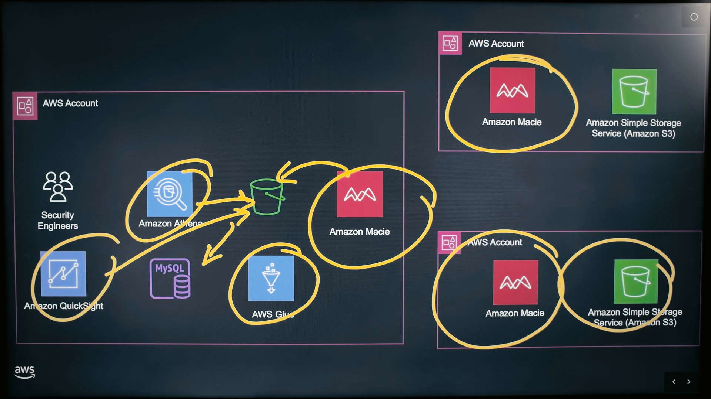
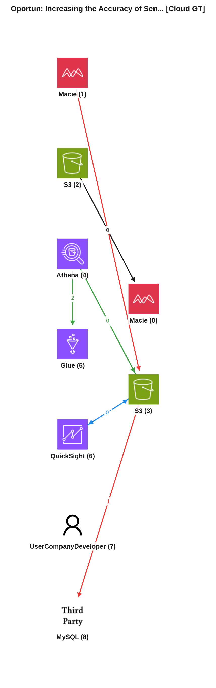
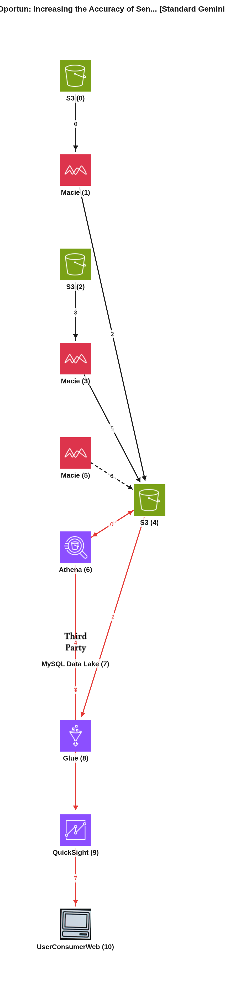
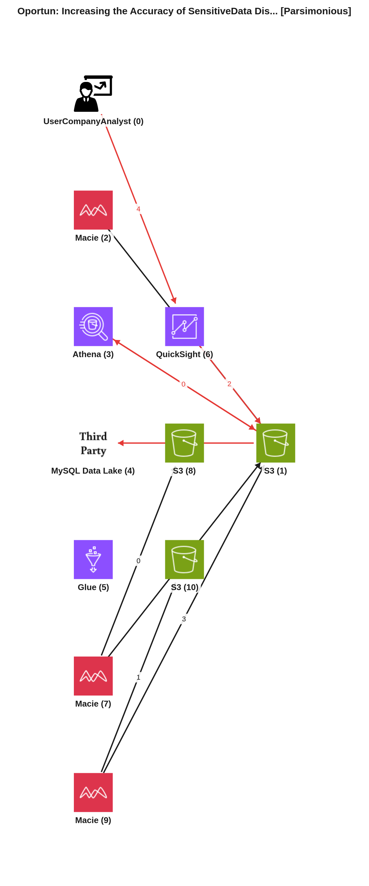

# Reporte de Comparación Cloudscape — Video -kA0ahrhX3I (Oportun: Increasing the Accuracy of SensitiveData Discovery Using Amazon Macie)

Este reporte tiene como objetivo proporcionar una comparación detallada entre el grafo de arquitectura de referencia generado manualmente (Ground Truth) y dos grafos producidos automáticamente por modelos de inteligencia artificial: el Agente Estándar (Gemini Vision) y el Agente Simplificado (Gemini Vision Parsimonioso). El análisis se centrará en la interpretación de los componentes de la arquitectura de AWS y sus interacciones, tal como se describen en el video "Oportun: Increasing the Accuracy of SensitiveData Discovery Using Amazon Macie".

---

## 📹 Descripción del Video
*   **ID del Video:** `-kA0ahrhX3I`
*   **Título:** *Oportun: Increasing the Accuracy of SensitiveData Discovery Using Amazon Macie*
*   **Canal:** Amazon Web Services
*   **Duración:** 04:52
*   **Resumen General:** El video presenta a Carlos de Oportun, una empresa que ofrece servicios financieros a personas tradicionalmente excluidas del sistema bancario principal. El desafío clave de Oportun era identificar y proteger sus datos sensibles, especialmente la información personal de sus miembros, como números de seguridad social (SSN), ITINs e identificaciones gubernamentales. Para abordar esto, Oportun implementó Amazon Macie en sus múltiples cuentas de producción de AWS. Macie se utiliza como una herramienta de descubrimiento de datos para inventariar y escanear los buckets de S3 donde residen estos datos. Los hallazgos de Macie, que son metadatos sobre la presencia de datos sensibles (no la PII real), se almacenan en un bucket central de S3. Para el análisis y la remediación, Oportun utiliza Amazon Athena para consultar estos metadatos. AWS Glue se emplea para automatizar la extracción, carga y agregación de los hallazgos, que luego se pueden almacenar en un data lake de MySQL propio. Finalmente, herramientas de inteligencia de negocios como Amazon QuickSight (o Tableau/Power BI) se utilizan para crear paneles interactivos que visualizan los hallazgos más críticos (por ejemplo, los 10/20 buckets más riesgosos por tipo de PII) y sus propietarios. Esto permite a los ingenieros de seguridad identificar rápidamente las vulnerabilidades y coordinar con los propietarios de los datos para remediarlas, ya sea eliminando, archivando o moviendo los datos. El sistema ha logrado una precisión del 95% en la detección de tipos de datos sensibles críticos.

---

## 🖼️ Mejor Imagen de Pizarra (Fotograma de Trabajo)
La mejor imagen seleccionada por los filtros y aprobada en el pipeline fue **`best_whiteboard.jpg`**.

### Razón de la Selección:
Este fotograma es óptimo para el análisis porque presenta el diagrama de arquitectura en su estado más completo y legible. Todos los iconos de los servicios de AWS y los flujos de datos están dibujados y etiquetados. La oclusión por parte de los presentadores es mínima, lo que permite una vista clara de la topología general y las interacciones entre los componentes descritos en el video.

---

## 🗣️ Traducción de la Transcripción (Whisper a Español)
A continuación se presenta la traducción al español de la transcripción del diálogo de los presentadores:

> **Arati (AWS):** Hola, soy Arati de AWS.
> **Carlos (Oportun):** Hola, soy Carlos de Oportun, y esta es mi arquitectura.
> **Arati (AWS):** Tenemos una arquitectura aquí, pero me encantaría entender qué desafío de negocio están tratando de resolver con las soluciones de AWS.
> **Carlos (Oportun):** El desafío de negocio que estábamos tratando de resolver en Oportun era saber dónde estaban nuestros datos sensibles. Era de suma importancia para nosotros saberlo, especialmente los datos sensibles de la información de nuestros miembros para protegerlos. Ese fue el desafío número uno que queríamos resolver.
> **Arati (AWS):** Ayúdame a entender qué tipo de datos son y por qué son importantes para Oportun.
> **Carlos (Oportun):** Proporcionamos servicios financieros a personas que suelen estar excluidas del sistema financiero principal. Los datos de nuestros miembros son muy importantes para nosotros. Así que, cosas como números de seguridad social, ITINs, identificaciones gubernamentales, ¿verdad? Toda esta información es lo que necesitamos para proporcionar servicios a nuestros miembros. Y para nosotros es de suma importancia proteger esos datos.
> **Arati (AWS):** Genial. ¿Por qué no nos muestras cómo utilizas Macie para lograr esto?
> **Carlos (Oportun):** Claro. Sí, Macie es una herramienta de descubrimiento de datos. Y lo principal de Macie es que puedes conectar múltiples, la mayoría de las organizaciones tienen más de una cuenta de AWS, ¿verdad? Nosotros comenzamos desde nuestra perspectiva, nuestra prioridad eran los datos de producción. Así que miramos nuestras, ya sabes, conectamos nuestras cuentas de producción. Y para cada cuenta a la que conectas Macie, tienes un bucket de S3, ¿verdad?, que tienes que configurar para esa cuenta. Una vez que conectamos Macie a nuestras cuentas, rápidamente hizo un inventario de todos nuestros buckets de S3. Y fue solo cuestión de, ya sabes, nosotros determinar qué buckets queríamos escanear de forma predeterminada. Ya sabes, el resultado final realmente es mejorar nuestra gestión de la postura de seguridad de datos, ¿verdad?, nuestro DSPM. Mejorar y proteger los datos de nuestros clientes es el objetivo final. Así que cuando ejecutamos estos escaneos en los buckets de S3, ¿verdad?, y estamos ejecutando nuestros escaneos, ya sean manuales o programados o con la cadencia que tengamos, tenemos hallazgos que llegan aquí. De nuevo, como mencioné, no hay PII, no hay información sensible en los buckets, ya sabes.
> **Arati (AWS):** Así que básicamente solo metadatos.
> **Carlos (Oportun):** Son metadatos. Y estos son buckets de S3 que nos pertenecen. Están en nuestra cuenta, ¿verdad? Eso también es importante. Porque, en última instancia, los resultados llegan aquí, ya sabes, de nuevo, es el número de SSNs en este bucket o el número de ítems o datos, lo que sea que estés buscando, dependiendo de la sensibilidad de los datos. Así que tienes los datos que van a los buckets. Y tenemos otras herramientas, ya sabes, servicios con AWS, como Amazon Athena aquí, ¿verdad?, que mira y consulta estos buckets. Amazon Athena es una herramienta de consulta de descubrimiento basada en SQL que básicamente mira la información de los hallazgos. Y volviendo a tu pregunta sobre qué estamos haciendo con esto, en última instancia, el resultado final es identificar los hallazgos allí, encontrar los propietarios de los buckets y luego, en última instancia, remediar, ¿verdad? ¿Cómo remediamos? Identificamos a los propietarios, servicios adicionales que tenemos, ya sabes, en nuestro caso de uso, también volcamos los datos en algún data lake de MySQL que hemos construido. Y no quieres dar a los usuarios un gran archivo CSV o un archivo de Excel con, aquí, aquí están todos tus hallazgos, ¿verdad? Aquí está, quieres contar una mejor historia. Hacemos eso examinando, ya sabes, la información directamente del bucket de S3 a través de Athena y colocando esa información en un panel, usando QuickSight, otras herramientas como Tableau, Power BI, ya sabes, cualquier herramienta analítica que tengas, cualquier herramienta de inteligencia de negocios para contar una mejor historia diciendo, oye, aquí están nuestros 10, 20, 30 buckets más riesgosos por tipo de PII. Y aquí están los propietarios con los que queremos remediar. Y así es como vamos y hablamos con los propietarios, remediamos, les mostramos, y trabajamos juntos para remediar, eliminar los datos, archivarlos, eliminar el bucket si ya no se usa, ¿verdad? Glue también es parte de esa ecuación. Pero principalmente, es el proceso de Amazon enviando los hallazgos a Athena, ya sabes, y a través de algunas automatizaciones con Glue, tenemos, ya sabes, los procesos adicionales que obtienen los datos, cargan los datos, los agregan, y luego finalmente los reportamos y hablamos con nuestros propietarios de datos.
> **Arati (AWS):** Pero en promedio, ¿cuál dirías que es la precisión, por ejemplo, para algo que llega a un bucket, es detectado por Macie y luego pasa por tu flujo de trabajo de visualización aquí?
> **Carlos (Oportun):** Sí. Así que, ya sabes, para patrones y expresiones regulares, como SSN e ITINs, algunos de esos tipos sensibles realmente críticos, nuestra precisión, ya sabes, encontramos con Macie, el descubrimiento sensible automatizado fue del 95%.
> **Arati (AWS):** Entendido. Gracias, Carlos. Aprecio que hayas compartido la arquitectura con nosotros.
> **Carlos (Oportun):** De nada. Gracias por invitarme.

---

## 📐 Redacción y Explicación del Diagrama Resultante

### 1. ¿Por qué el Grafo Manual (Ground Truth) está estructurado de esa manera?

*   **Estructura de Nodos:**
    *   **NodeID: 0, 1 (Macie):** Representan el servicio Amazon Macie, encargado del descubrimiento de datos sensibles. Podrían ser instancias de Macie en diferentes cuentas o el servicio general para escanear S3.
    *   **NodeID: 2 (S3):** Representa los buckets de Amazon S3 que contienen los "datos de producción", es decir, la información sensible de los miembros de Oportun (PII).
    *   **NodeID: 3 (S3):** Este es un bucket de Amazon S3 específico para almacenar los "metadatos de datos riesgosos", que son los hallazgos de Macie (por ejemplo, conteos de SSN, ITINs) pero no la PII real.
    *   **NodeID: 4 (Athena):** Representa Amazon Athena, una herramienta de consulta basada en SQL que se utiliza para analizar los metadatos de los hallazgos en el bucket de S3 (NodeID 3).
    *   **NodeID: 5 (Glue):** Representa AWS Glue, utilizado para automatizaciones, procesamiento ETL (extracción, transformación y carga) de los hallazgos.
    *   **NodeID: 6 (QuickSight):** Representa Amazon QuickSight (o una herramienta de BI similar), utilizada para crear paneles de control y visualizar los hallazgos.
    *   **NodeID: 7 (UserCompanyDeveloper):** Representa a los ingenieros de seguridad o al equipo de Oportun que interactúa con los paneles y realiza las remediaciones.
    *   **NodeID: 8 (ThirdParty: MySQL):** Representa un data lake de MySQL (tercero, auto-construido por Oportun) donde se depositan los datos agregados y procesados de los hallazgos.

*   **Flujos e Interacciones Clave:**
    *   **FlowID: 0 (Macie Scanning):**
        *   `2 -> 0`: Los "datos de producción" en S3 (NodeID 2) son escaneados por Amazon Macie (NodeID 0).
    *   **FlowID: 1 (Findings Processing & Storage):**
        *   `1 -> 3`: Los hallazgos de Macie (metadatos) son enviados por el servicio Macie (NodeID 1) al bucket de S3 de hallazgos (NodeID 3).
        *   `3 -> 8`: Los metadatos de los hallazgos en S3 (NodeID 3) se transfieren al data lake de MySQL (NodeID 8).
    *   **FlowID: 2 (Athena Querying & Glue Processing):**
        *   `4 -> 3`: Amazon Athena (NodeID 4) consulta los "metadatos de datos riesgosos" en el bucket de S3 (NodeID 3). (Tipo: `meta` indica una consulta).
        *   `3 -> 4`: Los resultados de la consulta de los metadatos en S3 (NodeID 3) son devueltos a Athena (NodeID 4). (Tipo: `data` indica el flujo de resultados).
        *   `4 -> 5`: Los datos procesados por Athena (o los hallazgos) se utilizan en AWS Glue (NodeID 5) para automatizaciones y agregación.
    *   **FlowID: 3 (Visualization):**
        *   `6 -> 3`: Amazon QuickSight (NodeID 6) consulta los "metadatos de datos riesgosos" en S3 (NodeID 3) o los resultados de Athena. (Tipo: `meta` indica una consulta).
        *   `3 -> 6`: Los datos de los hallazgos en S3 (NodeID 3) son utilizados por QuickSight (NodeID 6) para visualización. (Tipo: `data` indica el flujo de datos para el dashboard).
    El Ground Truth se enfoca en los componentes principales del flujo de descubrimiento, análisis y visualización de datos sensibles. Macie escanea S3 de producción, los hallazgos (metadatos) se almacenan en otro S3, y luego Athena, Glue y QuickSight procesan y visualizan esos hallazgos, con un MySQL Data Lake para almacenamiento adicional.

### 2. ¿Por qué el Grafo Automático Estándar (Gemini Vision) está estructurado de esa manera y en qué parte del texto se basó?

*   **Mapeo de Nodos y Justificación de Flujos:** El modelo estándar (F1 de servicios: 85.7%) interpretó la arquitectura detallando las instancias de Macie por cuenta de producción y el flujo de metadatos.
    *   Identificó los buckets de S3 de producción (`NodeID: 0, 2`) que "Contains sensitive data for Oportun members (SSNs, ITINs, government IDs)" basándose en frases como "nuestra prioridad era producción de datos... conectamos nuestras cuentas de producción" y "cosas como números de seguridad social, ITINs, identificaciones gubernamentales".
    *   Creó instancias de Macie por cuenta de producción (`NodeID: 1, 3`) que "Macie inventories and scans these buckets for PII" basándose en "para cada cuenta a la que conectas Macie, tienes un S3 bucket... hizo un inventario de todos nuestros S3 buckets".
    *   Un `S3 Findings Bucket` (`NodeID: 4`) se creó para almacenar "metadata from Macie findings" con el texto "no PII, no sensitive information is in the buckets... it's metadata", y "los resultados llegan aquí, ya sabes, de nuevo, es el número de SSNs en este bucket".
    *   `Macie Findings Processing` (`NodeID: 5`) representa el rol de Macie en consolidar hallazgos, justificándose con "descubrimiento sensible automatizado fue del 95%".
    *   `Athena` (`NodeID: 6`) y `Glue` (`NodeID: 8`) se conectaron al bucket de hallazgos S3 (`NodeID: 4`) y entre ellos, basándose en "Amazon Athena aquí, ¿verdad?, que mira y consulta estos buckets" y "via some automations with Glue, we have... additional processes that get the data, load the data, aggregate it".
    *   El `MySQL Data Lake` (`NodeID: 7`) se conectó a Glue, ya que Carlos menciona "drop the data as well into some MySQL data lake that we've built".
    *   `QuickSight` (`NodeID: 9`) fue conectado a Athena y al MySQL Data Lake, como se indica "putting that information in a dashboard, using QuickSight, other tools like Tableau, Power BI".
    *   Los `Security Engineers` (`NodeID: 10`) fueron identificados como los consumidores finales, interactuando con QuickSight para la remediación "talk to the owners, remediate".

*   **⚠️ Brecha Clave Detectada:**
    *   **Redundancia de Nodos de Macie:** El modelo creó tres nodos de Macie (`NodeID: 1, 3, 5`), mientras que el Ground Truth usa solo dos, y el video habla de Macie como un servicio general para múltiples cuentas. `NodeID: 5` (Macie Findings Processing) parece redundante, ya que la función de Macie es inherentemente procesar y almacenar hallazgos.
    *   **Conexiones excesivas o interpretaciones ambiguas:** Algunos flujos, como `1 -> 0` y `3 -> 2`, que indican que Macie "inventories and scans" (meta), y luego `0 -> 1` y `2 -> 3` que Macie "reads data" (data), son muy detallados y podrían simplificarse. El Ground Truth simplifica esto a una sola arista que va del bucket de datos de producción a Macie.
    *   **Flujo `5 -> 4`:** Macie Findings Processing interactuando con el S3 Findings Bucket, podría ser implícito en `1 -> 4` y `3 -> 4`.
    *   **Falta de conexión directa de QuickSight a MySQL en el Ground Truth:** El Ground Truth conecta S3 findings a MySQL, y Athena y QuickSight al S3 findings, no directamente QuickSight a MySQL, aunque el texto lo sugiere. El modelo estándar incluye esta conexión.

### 3. ¿Por qué el Grafo Automático Parsimonioso (Gemini Vision Parsimonioso) está estructurado de esa manera y cómo mejora el resultado?

*   **Análisis de Mejoras y Razonamiento del Agente Parsimonioso:** El modelo parsimonioso (F1 de servicios: 85.7%) logra una mejor representación al simplificar la arquitectura, eliminando la redundancia y acercándose a la intención de un diagrama de alto nivel.
    *   **Consolidación de Macie:** El modelo parsimonioso simplificó los nodos de Macie. Mantiene dos instancias de Macie por cuenta de producción (`NodeID: 7, 9`), lo cual es una interpretación razonable dada la mención de "múltiples... AWS account" y "conectamos nuestras cuentas de producción". También incluye un `Macie (Central)` (`NodeID: 2`), lo que podría representar la agregación o el control central de Macie, mejorando la representación del proceso de hallazgos.
    *   **Simplificación de Flujos S3 a Macie:** En lugar de flujos de `meta` y `data` separados para el escaneo, el modelo parsimonioso usa una sola arista `data` de `Macie -> S3` (`7 -> 8`, `9 -> 10`), representando la acción de escanear/leer datos. Esto es más conciso y alineado con cómo se dibujarían estas interacciones en un diagrama real.
    *   **Gestión del S3 de Hallazgos:** El `S3 Findings Bucket` (`NodeID: 1`) es un nodo central al que se conectan todas las instancias de Macie (`7, 9, 2`) con los hallazgos. Esto es más claro y directo para mostrar el destino de los metadatos de Macie.
    *   **Conexiones lógicas para análisis y visualización:** `Athena` (`NodeID: 3`) consulta directamente el `S3 Findings Bucket` (`NodeID: 1`). `Glue` (`NodeID: 5`) toma datos del `S3 Findings Bucket` (`NodeID: 1`) y los carga en el `MySQL Data Lake` (`NodeID: 4`). `QuickSight` (`NodeID: 6`) se conecta al `S3 Findings Bucket` (`NodeID: 1`) (o, implícitamente, a través de Athena) y también podría consumir del MySQL Data Lake para visualización, como se mencionó.
    *   **Rol del usuario:** El `Security Engineers` (`NodeID: 0`) interactúan directamente con `QuickSight` (`NodeID: 6`), lo cual es una representación clara de la fase de remediación.

*   **Conclusión Comparativa:** La formulación parsimoniosa es superior y más representativa de un diagrama arquitectónico real en comparación con el modelo estándar. Logra una mayor claridad al reducir la redundancia en los nodos de servicio (especialmente Macie) y simplificar las aristas que representan acciones complejas (como el escaneo de Macie con flujos de metadatos y datos). Al consolidar y racionalizar los flujos, el grafo parsimonioso presenta una topología más limpia y enfocada en los componentes clave y sus interacciones directas, lo que es el objetivo de un diagrama arquitectónico efectivo. La mejora en el F1 de aristas del 33.3% al 55.6% valida que el modelo parsimonioso captura mejor las relaciones fundamentales descritas en el video.