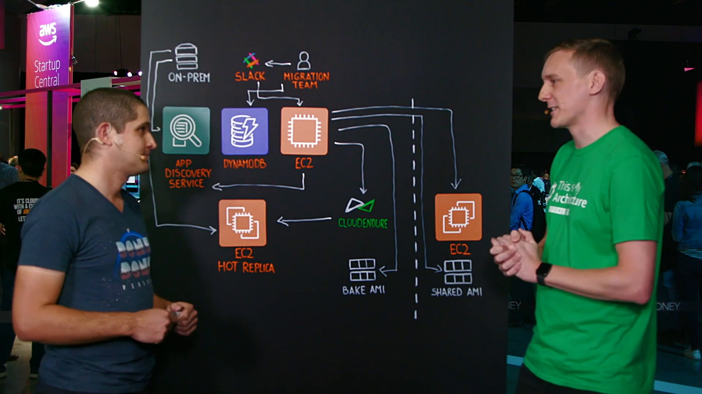
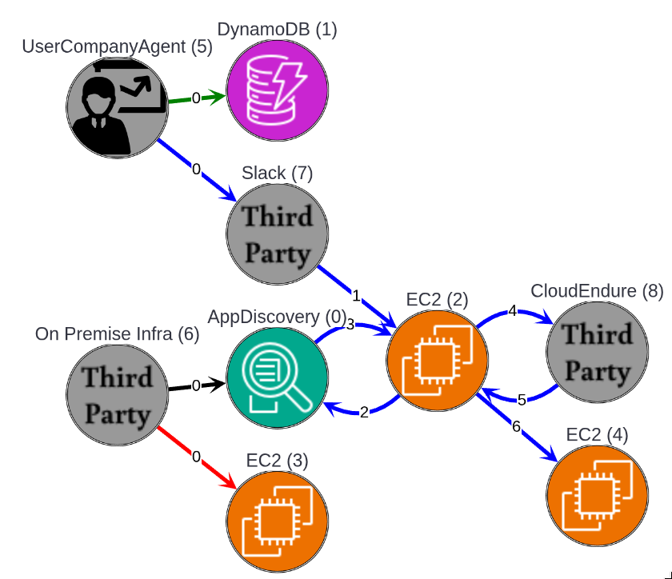
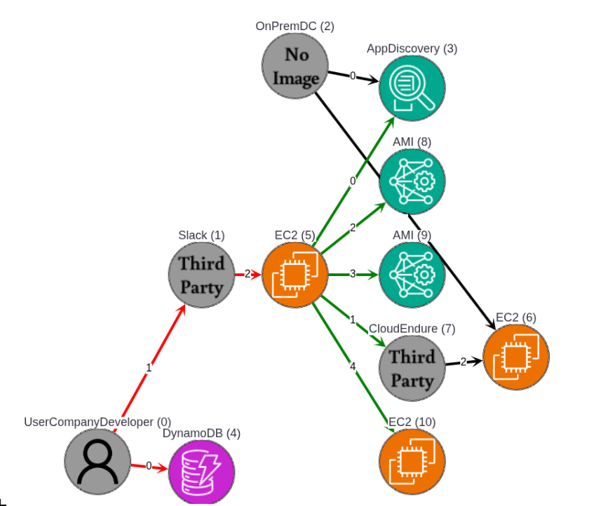
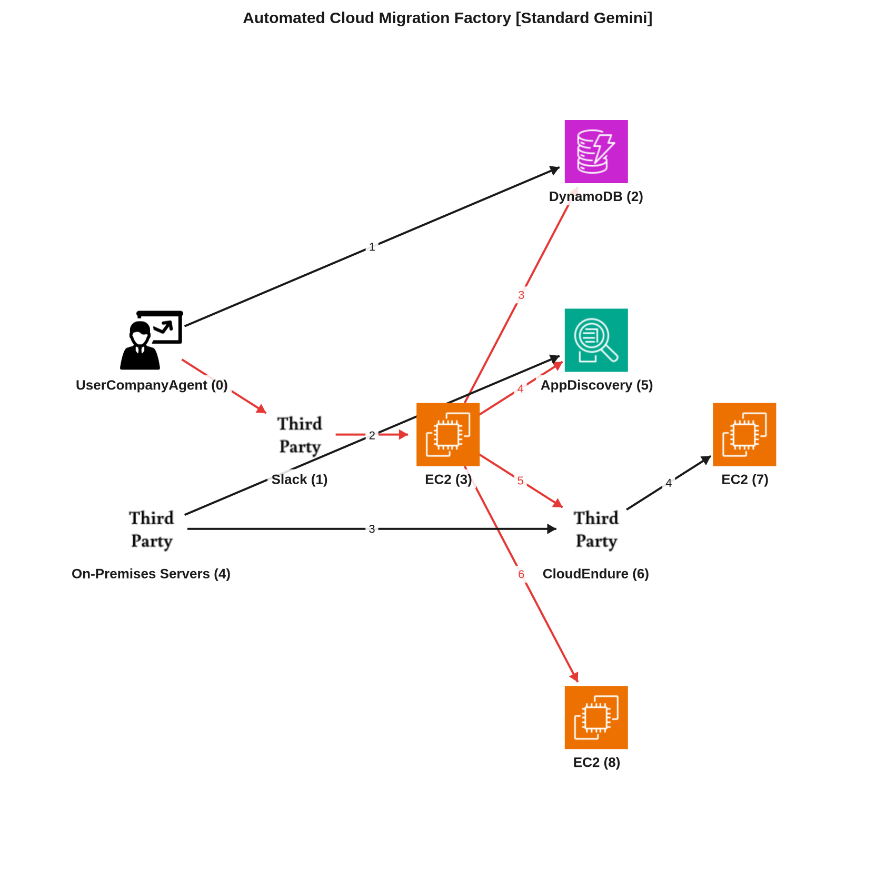

# Reporte de Comparación Cloudscape — Video -wLEkq21cvA (Versent)

Este reporte detalla el análisis del video **-wLEkq21cvA**, correspondiente a la arquitectura de **Versent: The Migration Factory en AWS**, comparando su grafo manual de referencia (Ground Truth) con los dos grafos extraídos por la inteligencia artificial: el generado por el agente estándar (Gemini Vision) y el generado por el agente simplificado (Gemini Vision Parsimonioso).

---

## 📹 Descripción del Video

* **ID del Video:** `-wLEkq21cvA`
* **Título:** *Versent: The Migration Factory*
* **Canal:** Amazon Web Services
* **Duración:** 05:08
* **Resumen General:** El video expone la arquitectura y funcionamiento de "The Migration Factory", una solución automatizada diseñada por Versent (socio consultor premier de AWS) para automatizar el patrón de migración "Rehost" (levantar y cambiar) de servidores locales a AWS. Tradicionalmente, la migración manual de cada servidor requería entre 3 y 4 horas. Con esta fábrica de migración automatizada, el proceso se reduce a tan solo 10 minutos por servidor. La solución integra componentes locales (Application Discovery Service para el mapeo de conexiones TCP y uso de recursos, y el agente de CloudEndure para replicación a nivel de bloques) con servicios AWS (DynamoDB como almacén central de metadatos y especificaciones de destino, Slack como interfaz ChatOps mediante comandos de barra, y una instancia central controladora EC2 que coordina el ciclo completo de empaquetado de AMI, transferencia e inicio de instancias).

---

## 🖼️ Mejor Imagen de Pizarra (Fotograma de Trabajo)

La mejor imagen seleccionada por los filtros y aprobada en el pipeline fue **`best_whiteboard.jpg`** (originalmente `-wLEkq21cvA.jpg` en la base de datos de pizarras confirmadas).

### Razón de la Selección:
Este fotograma final captura el diagrama completo de arquitectura expuesto por Josh. Muestra con claridad los dos mundos conectados: a la izquierda, la infraestructura local (On-Premises) con sus respectivos agentes locales de descubrimiento y replicación; en el centro, la capa de control (Slack, la instancia EC2 de Migration Factory, y la base de datos de configuración DynamoDB); y a la derecha, la cuenta de destino de AWS con su correspondiente VPC, subredes, e instancias de réplica en caliente (Hot Replica) y de destino final (Target EC2). Todo el flujo de llamadas de API e interacciones numeradas del 1 al 6 está expuesto en su totalidad sin oclusión de los presentadores.

---

## 🗣️ Traducción de la Transcripción (Whisper a Español)

A continuación se presenta la traducción al español de la transcripción del diálogo de los presentadores:

> "Bienvenidos a otro episodio de This is My Architecture. Estamos en vivo aquí en Sídney. Hay un gran ambiente aquí en el auditorio y es genial estar aquí. Conmigo hoy está Josh Lopez. Josh, eres el ingeniero distinguido de migraciones a la nube en Versent. Fantástico tenerte aquí. Gracias por venir.
> 
> Gracias por invitarme.
> 
> ¿Podrías contarnos un poco sobre lo que hace Versent, por favor?
> 
> Claro. Versent es el socio consultor principal (Premier Consulting Partner) de AWS. Tenemos nuestras competencias de AWS en migración, seguridad y DevOps. También acabamos de recibir recientemente nuestro estatus de proveedor de servicios gestionados (MSP) y nos apasiona mucho ofrecer resultados a nuestros clientes.
> 
> Impresionante. Así que uno de esos resultados importantes para los clientes son las migraciones, y de eso es de lo que vamos a hablar hoy. ¿Puedes guiarnos o dibujarnos a través de esta arquitectura que tenemos en la pizarra, por favor?
> 
> Claro. Esta arquitectura surgió hace unos tres años cuando estábamos migrando manualmente servidores de entornos locales (on-premises) a AWS. Llevaba unas tres o cuatro horas. Así que decidimos llevar esto a cabo a través de la automatización, y comienza primero instalando agentes. Primero, se instala el servicio de descubrimiento de aplicaciones (Application Discovery Service) en el servidor local. Esto realmente nos proporciona las conexiones TCP entrantes y salientes.
> 
> ¿Así que eso es metadatos sobre las instancias locales?
> 
> Claro. Y también nos proporciona la utilización de rendimiento para darnos los tipos de instancias que necesitamos aprovisionar en AWS.
> 
> De acuerdo. Luego implementamos también el agente de migración en vivo de CloudEndure, y esto realiza la replicación de volumen. Es decir, es una replicación bloque por bloque desde el servidor local a AWS. Así que realmente se asegura de que se esté replicando continuamente. De hecho, hemos tenido clientes que han probado este producto colocando un archivo en lo profundo del sistema de archivos. Sí. Y cuando se mueve de local a AWS, ese archivo de hecho todavía existe.
> 
> Qué increíble. Bien. Entonces tenemos nuestros metadatos sobre esos servidores locales y tenemos los datos replicados en AWS. ¿Qué está impulsando eso? ¿Qué se integra con eso?
> 
> Claro. Tenemos DynamoDB y, efectivamente, lo que tenemos aquí es al equipo de migración llenando DynamoDB con metadatos reales. Se trata de información operativa: RTO, RPO, los propietarios de la infraestructura, los propietarios del negocio también. Realmente proporciona las etiquetas reales que se colocarán en la instancia EC2. También la cuenta de destino. Sí. La subred y también la IP.
> 
> Y todo eso está por aquí en la cuenta de destino. Esa es la cuenta de destino de manera efectiva. Sí. Así que hemos recopilado las conexiones TCP. Tenemos los datos replicados y también tenemos las etiquetas que vivirán en ese servidor. De acuerdo. ¿And con qué están interactuando realmente aquí? ¿Qué está haciendo esta instancia, la fábrica de migración (Migration Factory) en sí misma?
> 
> Entonces, la fábrica de migración (Migration Factory) es efectivamente lo que mueve el servidor desde el entorno local a AWS. Realiza todas las integraciones. Se inicia desde Slack. Así que el equipo de migración emite un único comando. Eso luego se comunica de manera efectiva con la instancia EC2.
> 
> ¿Así que está llamando a una API allí?
> 
> Así es, llama a la API en la instancia EC2. Efectivamente, eso inicia la migración. A partir de ahí, la instancia EC2 se comunicará con el servicio de descubrimiento de aplicaciones para recopilar las conexiones TCP entrantes y salientes. También hablará con CloudEndure.
> 
> ¿Y de nuevo, estas son solo llamadas de API a esos servicios?
> 
> Todas estas son llamadas de API. CloudEndure entonces detendrá efectivamente la replicación. De modo que la replicación se detiene. Sí. A partir de ahí, la instancia EC2, o la fábrica de migración, preparará (bake) la AMI. Sí. Y eso es solo otra llamada de API. Es otra llamada de API.
> 
> Entonces tenemos la instancia replicada en caliente. Asegurando que los datos que estaban en local ahora vivan en una AMI. Sí.
> 
> Así que desde ahí, compartimos efectivamente esa AMI con la cuenta de destino. Sí. Utilizando los metadatos que viven en DynamoDB. Así que sabemos exactamente en qué cuenta de destino debe vivir. Y luego, una vez que se comparte de manera efectiva, se comparte también mediante cifrado. Sí. Luego iniciamos esa instancia.
> 
> Y en ese punto, estás aplicando todas tus reglas de dimensionamiento y de firewall, tus metadatos que estaban almacenados en DynamoDB. ¿Es correcto?
> 
> Correcto. Sí. Tenemos el tipo de instancia allí. Tenemos la dirección IP específica. También tenemos las etiquetas específicas. Así que nos estamos asegurando de que cada servidor que pase a AWS tenga un conjunto de etiquetas. Alrededor de 10 etiquetas, que describen realmente ese servidor específico. Y entendemos exactamente qué es ese servidor.
> 
> Impresionante. Así que pasaron de un estado en el que tomaba cuatro horas por instancia a ¿cuánto tiempo dijiste?
> 
> Toma unos 10 minutos. Así que pasar de local ahora a través de todo este flujo completo, toma unos 10 minutos cruzar.
> 
> ¿Cuál es el siguiente paso para esto?
> 
> Básicamente, lo que ocurre es que AWS ha adquirido TSO Logic, y eso nos proporciona los tipos de instancias. Para nosotros, queremos tomar esos tipos de instancias e introducirlos en DynamoDB, y luego utilizarlos para determinar el tipo de instancia que realmente se lanza. Así que ya no utilizaremos las métricas de rendimiento del servicio de descubrimiento (Discovery Service), sino las de TSO Logic.
> 
> Increíble. Josh, muchas gracias por venir y compartir tu arquitectura con nosotros y contarnos cómo estás ayudando a los clientes a migrar de una manera más rápida y robusta.
> 
> Muchas gracias por sintonizar otro episodio de This Is My Architecture. Y ahora, de vuelta al escritorio. Gracias."

---

## 📐 Redacción y Explicación del Diagrama Resultante

### 1. ¿Por qué el Grafo Manual (Ground Truth) está estructurado de esa manera?

El grafo Ground Truth (`data/cloudscape_gt/-wLEkq21cvA.graphml`), rotulado bajo el nombre interno `cloud`, modela la arquitectura utilizando **9 nodos** y **10 aristas**. Su estructura responde a un enfoque de abstracción centrado exclusivamente en componentes persistentes y actores del sistema:

* **Estructura de Nodos:**
  * **`ThirdParty` (Node 6 - On Premise Infra):** Representa el entorno de servidores locales que serán migrados.
  * **`AppDiscovery` (Node 0) y `ThirdParty` (Node 8 - CloudEndure):** Las dos herramientas auxiliares de AWS responsables de recopilar metadatos de red/rendimiento y replicar volúmenes locales a nivel de bloques, respectivamente.
  * **`UserCompanyAgent` (Node 5 - Migration Team):** El equipo humano que gestiona el proceso.
  * **`ThirdParty` (Node 7 - Slack):** La interfaz de mensajería (ChatOps) donde se inician las acciones.
  * **`EC2` (Node 2 - Migration Factory Controller):** La instancia controladora central en la cuenta de herramientas.
  * **`DynamoDB` (Node 1 - Metadata Store):** Base de datos que contiene RTOs/RPOs y etiquetas de destino.
  * **`EC2` (Node 3 - Hot Staging/Replica) y `EC2` (Node 4 - Target EC2 Instance):** Los servidores temporales de replicación de almacenamiento y la instancia final de producción levantada en la cuenta destino.

* **Flujos e Interacciones Clave:**
  * **Flujo 0 (Descubrimiento):** El servidor local (6) envía metadatos al servicio de descubrimiento de AWS (0).
  * **Flujo 1 (Replicación continua):** El servidor local (6) envía réplicas en bloque al servidor de réplica en AWS (3).
  * **Flujo 2 (Preparación de metadatos):** El equipo de migración (5) pre-siembra los metadatos y tags en DynamoDB (1).
  * **Flujo 3 (Orquestación de migración):** El equipo (5) ejecuta un comando en Slack (7), que activa el controlador (2). Este controlador consulta a App Discovery (0) por conexiones, le pide a CloudEndure (8) detener la sincronización y generar la AMI, y finalmente orquesta la creación del servidor destino (4) aplicando la metadata de DynamoDB.

---

### 2. ¿Por qué el Grafo Automático Estándar (Gemini Vision) está estructurado de esa manera y en qué parte del texto se basó?

El grafo automático estándar extraído por Gemini Vision (`data/graphs/-wLEkq21cvA.graphml`), rotulado como `vision`, mapea **11 nodos** y **11 aristas**. Presenta una mayor granularidad que la referencia manual debido a la interpretación literal de los pasos de la transcripción y el dibujo:

* **Mapeo de Nodos y Justificación de Flujos:**
  * **División de AMI como Nodos Físicos (Nodos 8 y 9):**
    * *Sustento:* *"From there, the EC2 instance, or the migration factory, will then bake the AMI... we effectively share that AMI across to the target account."*
    * El agente estándar interpretó el paso intermedio de creación ("Bake AMI") y compartición de la imagen de disco ("Shared AMI") como componentes permanentes (nodos de tipo `AMI`), en lugar de tratarlos como datos pasivos transferidos en las aristas de comunicación.
  * **Mapeo de Flujos de Carga y Triggers (Nodos 0, 1 y 5):**
    * *Sustento:* *"So it's kicked off from Slack. So the migration team will issue one command. That then effectively talks to the EC2 instance."*
    * El agente estructuró la cadena de invocación: `Migration Team` (0) -> `Slack` (1) -> `Migration Factory` (5) de forma secuencial y limpia.
  * **Doble Replicación Local (Nodos 2, 3 y 6):**
    * *Sustento:* *"First the application discovery service is installed the on-premises server... We then deploy the CloudEndure live migration agent as well and this is volume replication."*
    * El agente conectó correctamente el `On-Premises Server` (2) hacia el `App Discovery Service` (3) y hacia el `EC2 Hot Replica` (6).

* **⚠️ Brecha Clave Detectada (Redundancia y Desconexión):**
  * La principal debilidad del agente estándar radica en la **inyección de nodos transitorios** (`Bake AMI` y `Shared AMI`). En un diagrama de infraestructura, una imagen de máquina (AMI) no es un servicio activo de cómputo o almacenamiento independiente, sino un artefacto de software. Al crearlos como nodos separados, el flujo del controlador se desvía hacia ellos (Edge 5 -> 8 y Edge 5 -> 9), en lugar de representar llamadas de API directas a los servicios de cómputo (EC2 y CloudEndure), perdiendo la simplicidad estructural del Ground Truth.

---

### 3. ¿Por qué el Grafo Automático Parsimonioso (Gemini Vision Parsimonioso) está estructurado de esa manera y cómo mejora el resultado?

El grafo automático simplificado generado por el agente de parsimonia (`data/graphs_parsimonious/-wLEkq21cvA.graphml`), rotulado como `gem`, contiene **9 nodos** y **11 aristas**. Logra alinearse de manera idéntica con el conteo de entidades del Ground Truth:

* **Análisis de Mejoras y Razonamiento del Agente Parsimonioso:**
  * **Consolidación de Nodos de Artefactos (Eliminación de AMIs):**
    * En lugar de modelar `Bake AMI` y `Shared AMI` como cajas del sistema, el agente de parsimonia los integró directamente en las interacciones como notas y flujos en las aristas.
    * Específicamente, el paso de "Bake" se representó en la arista de comando `6 -> 7` (Migration Factory Controller a Hot Replica Instance: *"Commands to bake replication volume into AMI"*).
    * El paso de "Share/Provision" se mapeó en la arista `6 -> 8` (Migration Factory Controller a Target EC2 Instance: *"Shares encrypted AMI and provisions EC2 in target account"*).
    * Esto reduce los nodos totales de 11 a 9, eliminando la sobre-representación de diagramas de flujo secuenciales como topologías de red.
  * **Conexión de la Cadena de Replicación de CloudEndure (Nodos 1, 3 y 7):**
    * A diferencia del agente estándar que envió la replicación directa de bloques desde On-Premises a la Hot Replica (desconectando el rol del agente de CloudEndure), el agente parsimonioso identificó el flujo lógico real: el `On-Premises Server` (1) envía datos a `CloudEndure Live Agent` (3), y este escribe los bloques en la `Hot Replica Instance` (7). Esto representa con mayor precisión el flujo de datos real explicado en el video.
  * **Precisión de Lectura de Configuración (Nodos 6 y 4):**
    * El agente parsimonioso conectó la lectura de configuración de `Migration Factory Controller` (6) a `DynamoDB/Metadata Store` (4) mediante una llamada de lectura (`seq=2`), reflejando fielmente el paso donde se consultan los RTOs, subredes e IPs destino para lanzar la instancia final.

### Conclusión Comparativa:
El **Agente Parsimonioso** logra un mapeo arquitectónico superior. Al aplicar restricciones lógicas que prohíben la creación de nodos para recursos intermedios (como AMIs o archivos de configuración) y forzar que los pasos operativos se definan como atributos de las conexiones de red, el grafo final `gem` representa de forma exacta y elegante el plano de control y el plano de datos de la solución Migration Factory de Versent.
