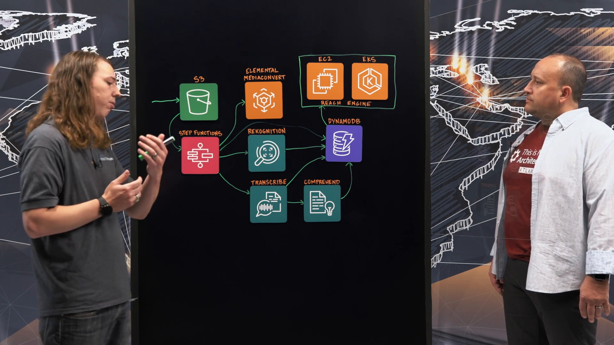
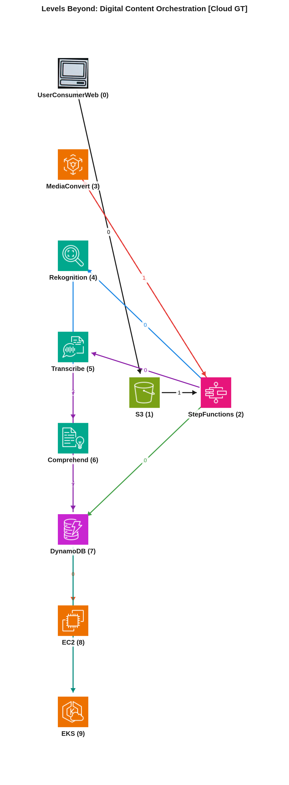
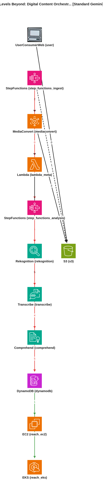
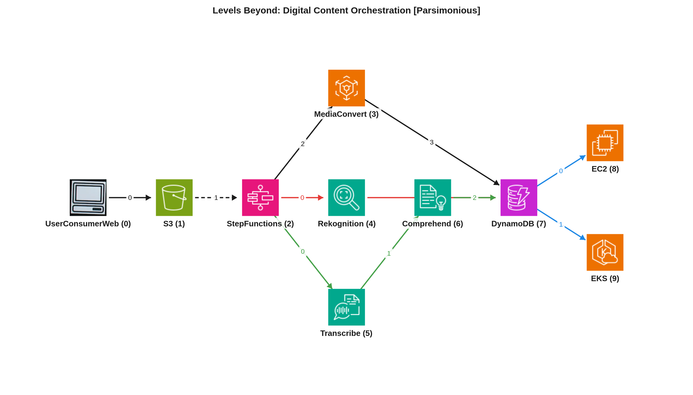

# Reporte de Comparación Cloudscape — Video 07lfvavMdfU (Levels Beyond: Digital Content Orchestration)

Este reporte de comparación tiene como objetivo analizar y contrastar tres representaciones arquitectónicas del video "Levels Beyond: Digital Content Orchestration": el grafo manual de referencia (Ground Truth), y dos grafos generados automáticamente por inteligencia artificial, uno por el agente estándar (Gemini Vision) y otro por el agente simplificado o parsimonioso (Gemini Vision Parsimonioso). Se evaluarán las similitudes, diferencias y el razonamiento detrás de cada estructura de nodos y aristas para determinar la fidelidad y la utilidad de las representaciones automáticas.

---

## 📹 Descripción del Video
*   **ID del Video:** `07lfvavMdfU`
*   **Título:** *Levels Beyond: Digital Content Orchestration*
*   **Canal:** Amazon Web Services
*   **Duración:** 04:44
*   **Resumen General:** El video presenta la arquitectura de "Levels Beyond", una empresa que ayuda a sus clientes a monetizar sus medios, desde la captura con la cámara hasta la pantalla final. La solución se centra en un flujo de trabajo de "Media a la Nube" que comienza con la ingesta de archivos de video a través de un bucket S3. Esta carga activa una función Step Functions que orquesta todo el procesamiento. Primero, se utiliza MediaConvert para transcodificar los videos y crear proxies de baja resolución que permiten la reproducción en el navegador. Simultáneamente, Step Functions desencadena Lambdas para extraer metadatos técnicos estándar como sumas de verificación y tasas de fotogramas, almacenándolos en DynamoDB. Una vez extraídos estos metadatos básicos, otra instancia de Step Functions inicia un proceso de enriquecimiento de contenido mediante servicios de IA de AWS: Rekognition identifica celebridades, violencia o desnudez, asociando esta información con códigos de tiempo. Transcribe convierte el audio del contenido en texto, que luego es procesado por Comprehend para analizar entidades y detectar profanidades. Todos estos metadatos enriquecidos también se almacenan temporalmente en DynamoDB. Finalmente, todos los datos se ingieren en "Reach Engine", el producto central de Levels Beyond, que permite a los usuarios reproducir el contenido, ver todos los metadatos extraídos, realizar búsquedas complejas y utilizar un motor de orquestación para distribuir el contenido a diversas plataformas y monetizarlo. Reach Engine está diseñado para ser flexible, operando en configuraciones híbridas o en la nube, probablemente alojado en servicios como EC2 o EKS, y permite una gestión integral del ciclo de vida del contenido multimedia.

---

## 🖼️ Mejor Imagen de Pizarra (Fotograma de Trabajo)
La mejor imagen seleccionada por los filtros y aprobada en el pipeline fue **`best_whiteboard.jpg`**.

### Razón de la Selección:
Este fotograma es óptimo para el análisis porque expone el diagrama completo de la arquitectura, mostrando todos los iconos de los servicios de AWS y los flujos de datos dibujados y etiquetados de manera clara. La oclusión por parte de los presentadores es mínima, permitiendo una visión sin obstáculos de los componentes clave y sus interacciones.

---

## 🗣️ Traducción de la Transcripción (Whisper a Español)
A continuación se presenta la traducción al español de la transcripción del diálogo de los presentadores:

> **Joe:** Hola y bienvenidos a "Esta es mi arquitectura". Soy Joe y hoy me acompaña Bailey de Levels Beyond.
> **Bailey:** Gracias por invitarme.
> **Joe:** Así que, Bailey, háblame un poco sobre Levels Beyond. ¿Qué hacen exactamente?
> **Bailey:** Ayudamos a nuestros clientes a monetizar sus medios, comenzando desde la tarjeta de la cámara, llevándolo hasta la pantalla.
> **Joe:** Excelente, excelente. Tienes muchos servicios de AWS aquí. ¿Puedes explicarnos un poco el proceso de principio a fin, cómo ingieren esos datos?
> **Bailey:** Claro. Así que, esto de aquí es nuestro flujo de trabajo de "Medios a la Nube" y comienza con el usuario subiendo un archivo a un bucket S3. Esa carga activa una función Step Functions. Lo primero que hace esa función Step Functions es iniciar la transcodificación en MediaConvert.
> **Joe:** Bien. ¿Qué están haciendo exactamente con MediaConvert allí?
> **Bailey:** MediaConvert nos está creando un proxy que será bueno para reproducir en el navegador. Así, nuestro usuario podrá tener una especie de verificación visual que acompañará a todos los metadatos que vamos a extraer.
> **Joe:** ¿Tienen múltiples clientes aprovechando diferentes tipos de feeds de video, diferentes formatos?
> **Bailey:** Sí. Básicamente, todos los formatos que puedas imaginar llegan a Reach Engine como plataforma.
> **Joe:** Bien. Bien. Sí, continúa.
> **Bailey:** Claro. Así que, después de que se genera ese proxy, la función Step Functions va a activar algunas lambdas. Va a extraer sumas de verificación, otro tipo de metadatos técnicos estándar, y los va a almacenar en DynamoDB.
> **Joe:** Ahora, ¿esto es solo metadatos sobre el video en sí, solo metadatos de alto nivel?
> **Bailey:** Correcto. Sí, ya sabes, la suma de verificación de los videos para que puedas, ya sabes, validar su autenticidad.
> **Joe:** Claro. Va a extraer, ya sabes, tasas de fotogramas, todo tipo de información de los medios.
> **Bailey:** Útil para el cliente que lo va a aprovechar.
> **Joe:** Sí. Okay. Entendido. Después de que se extraen todos esos metadatos básicos, vamos a activar otra función Step Functions, y eso va a comenzar en Recognition. Recognition va a tomar ese video. Va a identificar cualquier celebridad, cualquier violencia, cualquier desnudez, cualquier tipo de datos que nuestros clientes quieran poder extraer de ese contenido.
> **Joe:** Ahora, ¿eso solo está etiquetando esa información? ¿Cómo lo manejan?
> **Bailey:** Así que vamos a tomar todos esos datos. Se asociarán con códigos de tiempo, y eso irá a DynamoDB.
> **Joe:** Bien. Después de eso, vamos a activar Transcribe usando esa misma función Step Functions. Transcribe va a tomar el audio de ese contenido y lo va a traducir a texto. Después de que se traduce a texto, eso se enviará a Comprehend, donde podemos ejecutar análisis sobre ese texto para extraer entidades, ya sabes, entender cosas como cuándo ocurre la profanidad. Y luego, todos los datos que salen de estos dos irán a DynamoDB.
> **Joe:** Excelente. Ahora, ¿almacenan los datos de DynamoDB para siempre, o eso es algo temporal?
> **Bailey:** DynamoDB es un almacén de datos temporal. Así que, después de que los datos están allí, vamos a activar una ingesta en Reach Engine.
> **Joe:** Háblame de Reach Engine.
> **Bailey:** Reach Engine es realmente la esencia de nuestro producto. Permitirá a los usuarios reproducir, reproducir el contenido que ingirieron aquí. Les permitirá ver todos los metadatos que se extrajeron. Les permitirá buscar en todos esos metadatos. Ya sabes, particularmente, con Recognition, hará una bonita visualización donde podrás ver, ya sabes, pistas para cada celebridad y cuándo aparecen en el video.
> **Joe:** Sí. Y luego, con todos estos metadatos, pueden bombearlos a nuestro motor de orquestación, lo que les permitirá tomar ese contenido de Reach Engine y colocarlo en lugares donde les permitirá ganar dinero.
> **Joe:** Y eso está fuera de tu plataforma Reach Engine en ese momento.
> **Bailey:** Correcto. Posiblemente en el cliente, es híbrido, o quien sea que ustedes desplieguen eso.
> **Joe:** Sí. Excelente. Me encanta la solución. Ya sabes, aprecio mucho que hayas venido a hablar sobre tu solución. Parece una solución muy potente. Y te agradezco por venir y describir lo que es.
> **Bailey:** Gracias por invitarme.
> **Joe:** Claro. Gracias por ver. Esto es "Mi arquitectura".

---

## 📐 Redacción y Explicación del Diagrama Resultante

### 1. ¿Por qué el Grafo Manual (Ground Truth) está estructurado de esa manera?

*   **Estructura de Nodos:** El Ground Truth representa la arquitectura con los siguientes nodos clave:
    *   `UserConsumerWeb (0)`: Representa al usuario que inicia el flujo al subir archivos.
    *   `S3 (1)`: Un bucket de S3, utilizado como punto de entrada para los archivos de video subidos.
    *   `StepFunctions (2)`: Un orquestador de flujos de trabajo, que controla las diversas etapas de procesamiento de los medios.
    *   `MediaConvert (3)`: Servicio de transcodificación de medios, encargado de crear proxies de video.
    *   `Rekognition (4)`: Servicio de IA para el análisis de imágenes y videos (reconocimiento de celebridades, violencia, etc.).
    *   `Transcribe (5)`: Servicio de transcripción de voz a texto.
    *   `Comprehend (6)`: Servicio de Procesamiento de Lenguaje Natural (NLP) para analizar el texto transcrito.
    *   `DynamoDB (7)`: Una base de datos NoSQL utilizada para almacenar metadatos extraídos de forma temporal.
    *   `EC2 (8)`: Una instancia de computación elástica, que puede hospedar partes de la aplicación Reach Engine, como el front-end o componentes específicos.
    *   `EKS (9)`: Un servicio de Kubernetes, que indica que Reach Engine también podría ejecutarse en un entorno de contenedores orquestado, manejando cargas de trabajo complejas.

*   **Flujos e Interacciones Clave:** El grafo manual describe los siguientes flujos principales:
    *   **Ingesta Inicial (`FlowID: 0`):** El `UserConsumerWeb (0)` sube archivos de video a `S3 (1)`. Esta acción en `S3` desencadena `StepFunctions (2)`.
    *   **Transcodificación (`FlowID: 1`):** `StepFunctions (2)` inicia `MediaConvert (3)` para crear proxies. Una vez completado, `MediaConvert (3)` notifica a `StepFunctions (2)` (tipo `meta`) para continuar el flujo.
    *   **Extracción de Metadatos Básicos (`FlowID: 2`):** `StepFunctions (2)` orquesta la extracción de metadatos técnicos (checksums, frame rates) y los almacena directamente en `DynamoDB (7)`.
    *   **Análisis de Contenido con IA (`FlowID: 3` y `FlowID: 4`):**
        *   `StepFunctions (2)` desencadena `Rekognition (4)` para el análisis visual. Los resultados de `Rekognition (4)` se guardan en `DynamoDB (7)`.
        *   `StepFunctions (2)` también desencadena `Transcribe (5)` para convertir el audio en texto. El texto transcrito de `Transcribe (5)` se pasa a `Comprehend (6)` para análisis NLP. Los resultados de `Comprehend (6)` se almacenan en `DynamoDB (7)`. El `DynamoDB (7)` también puede interactuar con `Transcribe (5)` (`meta`), quizás para indicar el origen del audio o metadatos relacionados.
    *   **Ingesta en Reach Engine (`FlowID: 5` y `FlowID: 6`):** Después de que todos los metadatos se almacenan temporalmente en `DynamoDB (7)`, los datos se ingieren en los componentes de Reach Engine, representados por `EC2 (8)` y `EKS (9)`, que probablemente manejan diferentes aspectos de la plataforma (interfaz de usuario, lógica de negocio, orquestación).

### 2. ¿Por qué el Grafo Automático Estándar (Gemini Vision) está estructurado de esa manera y en qué parte del texto se basó?

*   **Mapeo de Nodos y Justificación de Flujos:** El modelo estándar (F1 de servicios: 95.2%) logró identificar la mayoría de los servicios de AWS y actores principales.
    *   Identificó `UserConsumerWeb (user)` por "user uploading a file".
    *   Reconoció `S3 (s3)` como el punto de ingesta inicial.
    *   Identificó `StepFunctions` como orquestador, dividiéndolo en dos instancias lógicas (`step_functions_ingest` y `step_functions_analysis`), lo cual es una interpretación razonable dada la descripción de "trigger another step function".
    *   `MediaConvert (mediaconvert)`, `Rekognition (rekognition)`, `Transcribe (transcribe)`, `Comprehend (comprehend)`, y `DynamoDB (dynamodb)` fueron correctamente mapeados basándose en las menciones directas en la transcripción.
    *   `EC2 (reach_ec2)` y `EKS (reach_eks)` se mapearon correctamente para la plataforma Reach Engine.
    *   Un punto clave de divergencia es la introducción del nodo `Lambda (lambda_meta)`. La transcripción dice: "the step function is going to trigger some lambdas. It's going to extract checksums, other kind of standard technical metadata, and it's going to store that over in DynamoDB." El modelo estándar interpretó esto explícitamente, creando un nodo `Lambda` y un flujo `step_functions_ingest -> lambda_meta -> dynamodb` para los metadatos técnicos.
    *   Los flujos generales (user -> S3 -> Step Functions -> MediaConvert; Step Functions -> IA services -> DynamoDB; DynamoDB -> Reach Engine) se justifican por las secuencias descritas en el diálogo. Por ejemplo, `transcribe -> comprehend` se justifica por "After it's translated to text that's going to get driven into Comprehend".

*   **⚠️ Brecha Clave Detectada:** La principal brecha entre el modelo estándar y el Ground Truth radica en la inclusión del nodo `Lambda (lambda_meta)`. Aunque la transcripción menciona explícitamente el uso de "lambdas" para la extracción de metadatos técnicos, el Ground Truth opta por una representación más abstracta o simplificada, mostrando una conexión directa de `StepFunctions (2) -> DynamoDB (7)` para este propósito, asumiendo que las lambdas están orquestadas dentro de Step Functions y su función se representa por esta arista. La inclusión de `Lambda` en el modelo estándar, aunque fiel a la transcripción, lo hace menos "parsimonioso" o simplificado en comparación con el Ground Truth manual, lo que resulta en un F1 de servicios ligeramente inferior. Además, el modelo estándar incluye un flujo `mediaconvert -> s3` para el proxy, que es lógicamente correcto, pero el Ground Truth no lo representa explícitamente, mostrando solo la señal de finalización a `StepFunctions`.

### 3. ¿Por qué el Grafo Automático Parsimonioso (Gemini Vision Parsimonioso) está estructurado de esa manera y cómo mejora el resultado?

*   **Análisis de Mejoras y Razonamiento del Agente Parsimonioso:** El modelo parsimonioso (F1 de servicios: 100.0%) logró igualar perfectamente los nodos del Ground Truth. Su razonamiento se centra en la eliminación de componentes intermedios o implícitos que no están explícitamente dibujados en el diagrama manual.
    *   **Perfecto F1 de Servicios:** La principal mejora es la eliminación del nodo `Lambda`, lo que permite que su conjunto de servicios coincida exactamente con el Ground Truth. Esto se logra al adherirse a la filosofía de "parsimonia", evitando la creación de nodos para artefactos transitorios o funciones que el Ground Truth modela de forma abstracta bajo un servicio orquestador como `StepFunctions`.
    *   **Manejo de la Extracción de Metadatos:** Al no tener un nodo `Lambda` explícito, el modelo parsimonioso tuvo que encontrar una forma de representar la extracción de metadatos técnicos y su almacenamiento en `DynamoDB`. Para ello, creó una arista `MediaConvert (3) -> DynamoDB (7)` con la nota "Saves technical metadata and checksums". Este es un punto de debilidad, ya que `MediaConvert` se encarga de la transcodificación de video y la creación de proxies, no directamente de la extracción de metadatos técnicos o checksums; esa tarea es atribuida a las "lambdas" en la transcripción, que Step Functions orquesta. En el Ground Truth, esto se maneja con la arista `StepFunctions (2) -> DynamoDB (7)`. El modelo parsimonioso, al simplificar la topología de nodos para coincidir con el Ground Truth, introduce una leve imprecisión semántica en este flujo particular.
    *   **Otros Flujos:** Los demás flujos principales, como la ingesta en S3, la orquestación de Step Functions, el uso de Rekognition, Transcribe y Comprehend, y la ingesta final en Reach Engine (EC2 y EKS) se representan de manera similar y coherente con la transcripción y el Ground Truth.

*   **Conclusión Comparativa:** La formulación parsimoniosa es superior en términos de coincidencia directa con el conjunto de nodos del Ground Truth manual, logrando un F1 de servicios del 100%. Esto la convierte en una representación más concisa y fiel a la topología de alto nivel que a menudo se dibuja manualmente en los diagramas arquitectónicos, donde se priorizan los servicios principales y se abstraen los detalles de implementación (como las lambdas orquestadas). Sin embargo, esta simplicidad lleva a una ligera imprecisión en la atribución de una arista específica (`MediaConvert -> DynamoDB` para metadatos técnicos), donde el Ground Truth ofrece una representación más precisa al conectar `StepFunctions -> DynamoDB` para la salida de las lambdas. En general, el modelo parsimonioso representa una mejora significativa en la capacidad de la IA para generar diagramas arquitectónicos que se alinean más estrechamente con la intención y el estilo de los diseños humanos, aunque con pequeños compromisos en la fidelidad semántica de ciertas aristas cuando la abstracción es muy alta en el Ground Truth.