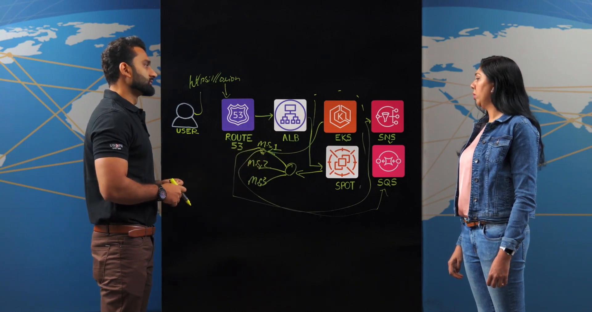
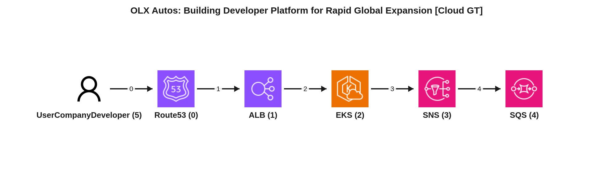
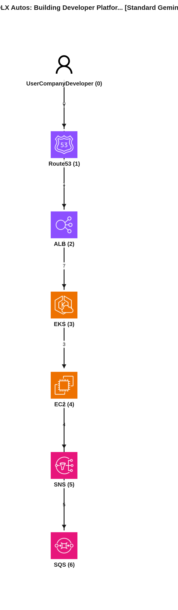
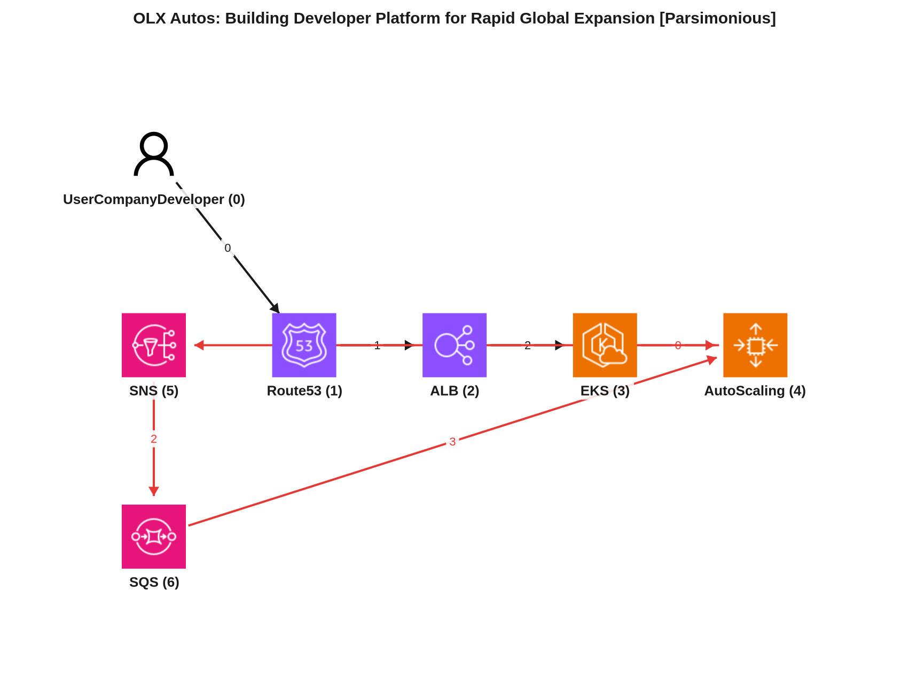

# Reporte de Comparación Cloudscape — Video 1aYoIZvabbk (OLX Autos: Building Developer Platform for Rapid Global Expansion)

Este reporte tiene como propósito comparar la representación arquitectónica de un video de Amazon Web Services, "OLX Autos: Building Developer Platform for Rapid Global Expansion", mediante tres enfoques: un grafo manual de referencia (Ground Truth) y dos grafos generados automáticamente por modelos de inteligencia artificial (Gemini Vision Estándar y Gemini Vision Parsimonioso). Se analizará la estructura de nodos, los flujos de datos y las interacciones clave para identificar la precisión y las diferencias entre las extracciones automáticas y la referencia manual.

---

## 📹 Descripción del Video
*   **ID del Video:** `1aYoIZvabbk`
*   **Título:** *OLX Autos: Building Developer Platform for Rapid Global Expansion*
*   **Canal:** Amazon Web Services
*   **Duración:** 06:05
*   **Resumen General:** OLX Autos, una empresa global dedicada a la compra y venta de vehículos usados, enfrentó desafíos significativos en su expansión rápida a 11 países, incluyendo India, Indonesia, Sudamérica y Turquía. Para abordar la necesidad de reducir el tiempo de comercialización y acelerar la velocidad de despliegue, la compañía desarrolló una plataforma interna para desarrolladores llamada "Orion portal".

    Esta plataforma permite a los usuarios (desarrolladores) solicitar y crear réplicas de entornos de OLX Autos de manera eficiente. La arquitectura subyacente utiliza varios servicios de AWS: las solicitudes de creación de entorno son resueltas por **Amazon Route 53** y dirigidas por un **Amazon Application Load Balancer (ALB)** a **Amazon EKS (Elastic Kubernetes Service)**. EKS actúa como orquestador de contenedores, gestionando la aplicación principal de OLX Autos y sus cargas de trabajo. Para una optimización de costos extrema, OLX Autos utiliza **instancias Spot al 100%**, lo que reduce drásticamente los gastos operativos al crear múltiples réplicas de entornos.

    Para garantizar la resiliencia frente a las interrupciones de las instancias Spot, la arquitectura incorpora el **AWS Node Termination Handler**, que drena las cargas de trabajo de los nodos Spot a punto de ser terminados para evitar interrupciones. Además, cuando un trabajo de Kubernetes (destinado a lanzar microservicios) se activa, envía un evento a **Amazon SNS (Simple Notification Service)**, que luego lo enruta a **Amazon SQS (Simple Queue Service)**. Si una instancia Spot es terminada y un trabajo se interrumpe, un nuevo trabajo puede consultar SQS para recuperar el estado y reanudar la tarea pendiente, garantizando la consistencia y la finalización.

    Esta arquitectura ha permitido a OLX Autos aumentar drásticamente su velocidad de despliegue, expandiéndose de 9 a 11 mercados en poco tiempo, y reducir el tiempo de comercialización para nuevas funcionalidades, todo mientras se mantiene un control estricto sobre los costos.

---

## 🖼️ Mejor Imagen de Pizarra (Fotograma de Trabajo)
La mejor imagen seleccionada por los filtros y aprobada en el pipeline fue **`best_whiteboard.jpg`**.

### Razón de la Selección:
Este fotograma final es óptimo para el análisis porque expone el diagrama completo de la arquitectura con todos los iconos y flujos dibujados y etiquetados. Muestra claramente la secuencia de servicios y las interacciones, con una oclusión mínima por parte de los presentadores, lo que facilita la identificación de todos los componentes clave y las relaciones entre ellos.

---

## 🗣️ Traducción de la Transcripción (Whisper a Español)
A continuación se presenta la traducción al español de la transcripción del diálogo de los presentadores:

> **Jasmine:** Hola a todos, bienvenidos a "Esta es mi Arquitectura". Soy Jasmine y tengo aquí conmigo a Nikhil Sharma de OLX Autos. Hola Nikhil, gracias por acompañarnos.
> **Nikhil:** Hola Jasmine, gracias, gracias por invitarme.
> **Jasmine:** Cuéntanos sobre OLX Autos.
> **Nikhil:** En OLX Autos ofrecemos una solución integral para comprar y vender vehículos usados, desde tener una evaluación en línea de tu coche hasta una inspección propia. Ofrecemos de todo.
> **Jasmine:** Okay, ¿y tienen presencia global?
> **Nikhil:** Sí, la tenemos. A partir de ahora estamos operando en 11 países, incluyendo India, Indonesia, Sudamérica y Turquía.
> **Jasmine:** ¿Y cuáles son los desafíos de la expansión global?
> **Nikhil:** Bueno, ha habido innumerables desafíos. Algunos de los desafíos que hemos resuelto ha sido construyendo una herramienta interna de plataforma para desarrolladores porque, principalmente, uno de los desafíos era reducir nuestro tiempo de comercialización y acelerar nuestra velocidad de despliegue.
> **Jasmine:** Okay, entonces, si yo como usuario tengo que crear la plataforma, ¿qué hay bajo el capó de esta arquitectura?
> **Nikhil:** Okay, como usuario final, si quieres tener un entorno, simplemente vas al portal Orion y lo harás con el... Y luego, una vez que tienes el... También abrimos el portal Orion, y luego la resolución DNS va a Amazon Route 53. Lo estamos usando para la resolución DNS. Y luego resuelve el DNS al Amazon Application Load Balancer. Y luego el Amazon Application Load Balancer va a enviar la solicitud a nuestros pods de Kubernetes. Estamos usando Amazon EKS como orquestador de contenedores. Y luego toda nuestra carga de trabajo se ejecuta en AWS EKS. Así que cuando creas una solicitud para nuestro nuevo entorno, mencionarás algunos detalles como el nombre del entorno, el caso de uso comercial del entorno y el vertical de negocio para el cual se necesita este entorno. Y luego esta solicitud va a nuestro pod de aplicación que se ejecuta en Amazon EKS y por debajo está usando instancias Spot.
> **Jasmine:** Okay. ¿Y qué porcentaje de Spot utilizan?
> **Nikhil:** Por ahora, estamos usando 100% de instancias Spot.
> **Jasmine:** Vaya. Eso es increíble. Entonces, ¿qué tal la optimización de costos que han logrado con el 100%?
> **Nikhil:** El caso de uso que teníamos es que estamos creando réplicas de entornos de OLX Autos. Y teníamos que mantener los costos bajo control porque si creamos demasiadas réplicas, obviamente el costo aumenta exponencialmente. Por eso finalizamos que íbamos a usar 100% Spot para una utilización eficiente de los costos. Y solo teníamos que averiguar cómo podíamos aprovechar Spot a su máxima capacidad.
> **Jasmine:** Okay. Y al aprovechar Spot, también deben encargarse de la terminación de Spot, ¿verdad? ¿Cómo hacen eso?
> **Nikhil:** Sí. Sí. Para eso, estamos usando el AWS Node Termination Handler. Así, cada vez que Amazon va a terminar alguna instancia Spot, envía un evento que el AWS Termination Handler está escuchando y luego drena esos nodos. Así, toda la carga de trabajo que se ejecutaba en esas instancias Spot se traslada a otro nodo. Para no experimentar ninguna interrupción en el negocio. Entendido. Entonces, básicamente la solicitud llega a los pods que se despliegan en Spot, ¿verdad? Y esto es orquestado por Amazon Elastic Kubernetes Service.
> **Jasmine:** Exactamente.
> **Nikhil:** Okay. ¿Y cómo les ayuda Amazon EKS? Nos ayuda al descargar la sobrecarga operativa y nos ayuda a manejar la carga de microservicios que le estamos poniendo. Empezamos con 100 pods y ahora estamos ejecutando más de 10,000 pods. Así que estamos probando incrementalmente Amazon EKS.
> **Jasmine:** Vaya. Y ese es todo un viaje, ¿verdad? Empezar con 100 pods y llegar a 10,000 pods.
> **Nikhil:** Sí. Así que eso es increíble. ¿Y qué hay de este Amazon SNS y SQS? ¿Cuál es el papel de estos dos?
> **Jasmine:** Okay. Cuando un usuario intenta hacer una solicitud para crear un entorno, en última instancia, lo que está solicitando es un conjunto de microservicios para ese vertical de negocio. Por ejemplo, si estás creando un entorno para el vertical de negocio X, puede que necesites más de 70 microservicios. Así que nuestra aplicación principal, que se ejecuta como un pod, va a crear una serie de trabajos, trabajos de Kubernetes para cada microservicio. Por ejemplo, si estás lanzando tres microservicios, entonces creará un trabajo que se encargará de lanzar el microservicio uno, lanzar el microservicio dos, lanzar el microservicio tres. Ahora, como estamos ejecutando todo en Spot, existe una alta probabilidad de que antes de que este trabajo se complete, las instancias Spot terminen el nodo subyacente y este trabajo se interrumpa. EKS se encarga de reemplazar este trabajo por otro trabajo, pero en última instancia el proceso no pudo terminar la tarea que se le asignó. Así que lo que estamos haciendo es que cada vez que un trabajo se activa para crear el microservicio, envía un evento a Amazon SNS y luego Amazon SNS envía ese mensaje a SQS. Así que el nuevo trabajo que está siendo reemplazado por este observa el AWS SQS y nota, "okay, hay un trabajo sin terminar y ese trabajo debía lanzar el microservicio uno, pero falló debido a la razón XYZ". Así que eso se encarga de lanzar y finalizar el trabajo.
> **Nikhil:** Okay, genial. Entonces tienen diferentes trabajos iniciando diferentes microservicios.
> **Jasmine:** Sí.
> **Nikhil:** ¿Verdad? Cada trabajo almacena el estado a través de SNS a SQS.
> **Jasmine:** Sí.
> **Nikhil:** Y cuando el trabajo se inicia, el nuevo trabajo se inicia, también verifica SQS si hay algo pendiente de procesar.
> **Jasmine:** Exactamente. Así que observa SQS para que tengamos un estado consistente del aprovisionamiento y mantenimiento de los entornos.
> **Nikhil:** Okay. ¿Y cuál es el beneficio de esta arquitectura? Con esta arquitectura, podemos aumentar nuestra velocidad de despliegue y nuestra expansión global. En diciembre de 2021, estábamos operando en nueve mercados. Ahora estamos operando en 11 mercados, así de bien. Y también ayudó a reducir nuestro tiempo de comercialización, enviando nuestras funcionalidades a producción más rápido. Impresionante. Muchas gracias, Nikhil, por compartir esta arquitectura. Es un placer, Jasmine. Gracias. Gracias. Y gracias a todos por acompañarnos en "Esta es mi Arquitectura". Gracias.

---

## 📐 Redacción y Explicación del Diagrama Resultante

### 1. ¿Por qué el Grafo Manual (Ground Truth) está estructurado de esa manera?

*   **Estructura de Nodos:**
    *   **NodeID: 5, Service: UserCompanyDeveloper:** Representa al desarrollador de OLX Autos, el actor que inicia la solicitud para crear nuevos entornos.
    *   **NodeID: 0, Service: Route53:** Servicio de DNS de AWS, encargado de resolver los nombres de dominio para el acceso al portal Orion.
    *   **NodeID: 1, Service: ALB:** Amazon Application Load Balancer, distribuye el tráfico entrante a los servicios adecuados.
    *   **NodeID: 2, Service: EKS:** Amazon Elastic Kubernetes Service, el orquestador de contenedores donde se ejecutan las cargas de trabajo de la aplicación principal y los trabajos de microservicios. Se destaca en sus notas el uso del 100% de instancias Spot.
    *   **NodeID: 3, Service: SNS:** Amazon Simple Notification Service, utilizado para publicar eventos cuando los trabajos de microservicios se activan.
    *   **NodeID: 4, Service: SQS:** Amazon Simple Queue Service, que actúa como una cola para almacenar los mensajes de estado de los trabajos de microservicios, asegurando la resiliencia ante las terminaciones de instancias Spot.
*   **Flujos e Interacciones Clave:** El grafo manual modela el flujo de datos principal de la siguiente manera:
    *   **Edge: 5 -> 0 (FlowID: 0, Seq: 0, Type: data):** El desarrollador (UserCompanyDeveloper) inicia una solicitud, que pasa por la resolución DNS de Route 53.
    *   **Edge: 0 -> 1 (FlowID: 0, Seq: 1, Type: data):** Route 53 dirige el tráfico resuelto al Application Load Balancer.
    *   **Edge: 1 -> 2 (FlowID: 0, Seq: 2, Type: data):** El ALB envía las solicitudes a los pods de Kubernetes, orquestados por EKS.
    *   **Edge: 2 -> 3 (FlowID: 0, Seq: 3, Type: data):** Cuando la aplicación en EKS activa un trabajo de microservicio, envía un evento a SNS.
    *   **Edge: 3 -> 4 (FlowID: 0, Seq: 4, Type: data):** SNS publica el mensaje del evento en la cola de SQS. Este flujo asegura que, incluso si un trabajo se interrumpe debido a la terminación de una instancia Spot, el estado de la tarea queda registrado en SQS para que un nuevo trabajo pueda reanudarla.

### 2. ¿Por qué el Grafo Automático Estándar (Gemini Vision) está estructurado de esa manera y en qué parte del texto se basó?

*   **Mapeo de Nodos y Justificación de Flujos:** El modelo estándar (F1 de servicios: 92.3%) interpretó la arquitectura de la siguiente manera, basándose en la transcripción:
    *   **NodeID: 0, Service: UserCompanyDeveloper (Developer):** "si yo como usuario tengo que crear la plataforma..." -> "como usuario final si quieres tener un entorno, simplemente vas al portal Orion". Inicia el flujo.
    *   **NodeID: 1, Service: Route53:** "la resolución DNS va a Amazon Rout of 53. Lo estamos usando para la resolución DNS".
    *   **NodeID: 2, Service: ALB:** "resuelve el DNS al Amazon Application Load Balancer. Y luego el Amazon Load Application Load Balancer es va a enviar la solicitud a nuestros Kubernetes pods."
    *   **NodeID: 3, Service: EKS:** "Estamos usando Amazon EKS como un orquestador de contenedores. Y luego toda nuestra carga de trabajo se ejecuta en AWS EKS." -> "Empezamos con 100 pods y ahora estamos ejecutando más de 10,000 pods".
    *   **NodeID: 4, Service: EC2 (Spot Instances):** "nuestra aplicación principal que se ejecuta como un pod, está usando instancias Spot." -> "estamos usando 100% de instancias Spot." El modelo creó un nodo explícito para las instancias Spot como EC2.
    *   **NodeID: 5, Service: SNS:** "envía un evento a Amazon SNS".
    *   **NodeID: 6, Service: SQS:** "Amazon SNS envía ese mensaje a SQS".
    Los flujos se establecieron así:
    *   `0 -> 1`: "Developer accesses Orion portal".
    *   `1 -> 2`: "Resolves DNS to ALB".
    *   `2 -> 3`: "Forwards request to Orion app on EKS".
    *   `3 -> 4`: "Lanza trabajos en instancias EC2 Spot para aprovisionar microservicios". Esto refleja la relación entre EKS y las instancias Spot subyacentes.
    *   `4 -> 5`: "Publica el estado de seguimiento de la tarea en la ejecución". Aquí el modelo atribuye directamente a las instancias Spot la publicación en SNS, lo cual es una simplificación de que los *trabajos* que se ejecutan en ellas lo hacen.
    *   `5 -> 6`: "Distribuye los estados de las tareas a la cola".
    *   `6 -> 4`: "Los trabajos de reemplazo leen los estados pendientes de la cola SQS". Nuevamente, los trabajos en instancias Spot interactúan con SQS.

*   **⚠️ Brecha Clave Detectada:** La principal brecha con el Ground Truth es la introducción de un nodo `EC2` explícito para las "Spot Instances" (NodeID 4). El Ground Truth, más abstracto, considera el uso de instancias Spot como una característica o una nota asociada al servicio EKS, sin un nodo separado. Esto hace que el grafo automático sea más detallado en la implementación de las máquinas virtuales, pero menos conciso como diagrama de arquitectura de alto nivel. Además, el modelo estándar incluye bordes "meta" (`2 -> 0` y `3 -> 2`) que representan respuestas o acuses de recibo, no flujos de datos primarios en el sentido del Ground Truth, lo que añade complejidad innecesaria a la topología.

### 3. ¿Por qué el Grafo Automático Parsimonioso (Gemini Vision Parsimonioso) está estructurado de esa manera y cómo mejora el resultado?

*   **Análisis de Mejoras y Razonamiento del Agente Parsimonioso:** El modelo parsimonioso (F1 de servicios: 92.3%, F1 de bordes: 66.7%) logra una mejor representación al aplicar restricciones para simplificar la topología y eliminar artefactos transitorios o conexiones redundantes del modelo estándar.
    *   **NodeID: 4, Service: AutoScaling (Spot Instances):** A diferencia del modelo estándar que usa `EC2`, el parsimonioso clasifica las "Spot Instances" bajo `AutoScaling`. Esta es una mejora significativa, ya que las instancias Spot en EKS suelen gestionarse a través de grupos de Auto Scaling, lo que es una abstracción más precisa y una mejor representación del componente lógico que la simple `EC2`.
    *   Los flujos de datos son más limpios:
        *   `0 -> 1`, `1 -> 2`, `2 -> 3`: Estos flujos de entrada son idénticos y correctos.
        *   `3 -> 4`: "Lanza trabajos ejecutándose en instancias Spot". Este flujo de EKS a AutoScaling (Spot Instances) es una representación más explícita y correcta de EKS orquestando trabajos que se ejecutan en nodos provistos por Auto Scaling con instancias Spot.
        *   `4 -> 5`: "Dispara un evento en el lanzamiento o interrupción del trabajo". Este flujo es más coherente, ya que los *trabajos* que se ejecutan en las instancias Spot (gestionadas por AutoScaling) son los que envían eventos a SNS.
        *   `5 -> 6`: "Distribuye mensajes de trabajo a la cola".
        *   `6 -> 4`: "Nuevos trabajos observan la cola para reanudar tareas interrumpidas". Los nuevos trabajos, también ejecutándose en instancias Spot, consumen de SQS.
    El modelo parsimonioso eliminó los bordes "meta" que el modelo estándar había introducido, resultando en un diagrama más directo y enfocado en el flujo de datos principal y las interacciones entre los servicios de AWS.

*   **Conclusión Comparativa:** La formulación parsimoniosa es superior y más representativa de un diagrama arquitectónico real en comparación con el modelo estándar. Si bien el Ground Truth es aún más abstracto al subsumir las instancias Spot como una característica de EKS, el modelo parsimonioso hace un excelente trabajo al representar este componente como `AutoScaling (Spot Instances)`, que es una abstracción lógica y precisa de cómo se gestionarían estas instancias en un entorno de producción. La mejora en la F1 de los bordes, junto con la eliminación de conexiones redundantes, produce un diagrama más conciso, comprensible y fiel a una topología de red cloud típica, a la vez que captura todos los componentes esenciales y sus interacciones.