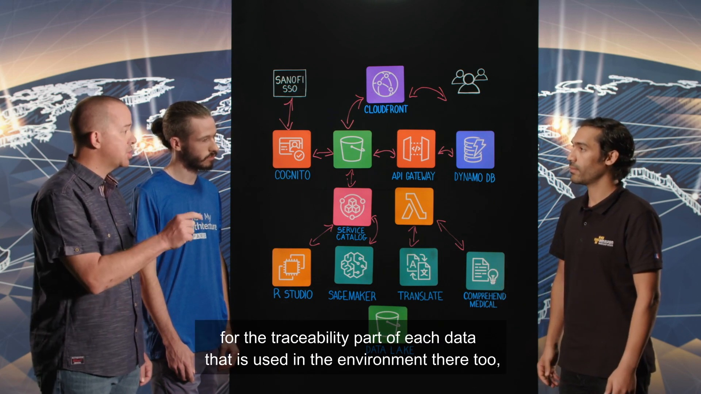
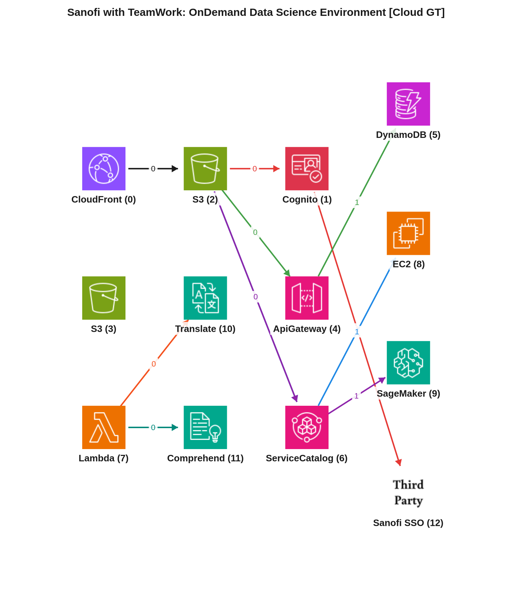
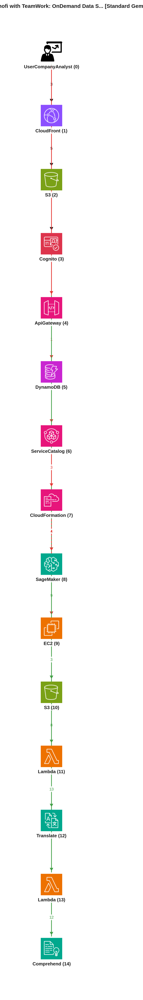
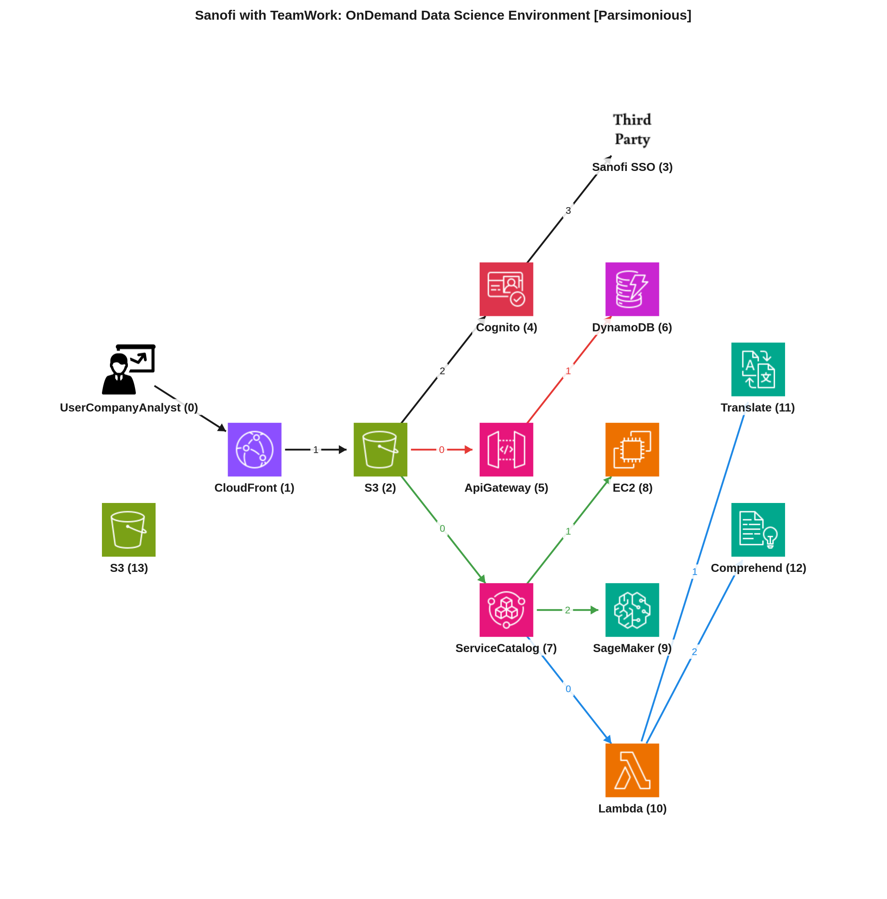

# Reporte de Comparación Cloudscape — Video 2L0m28ZLmtE (Sanofi with TeamWork: OnDemand Data Science Environment)

Este reporte tiene como objetivo comparar la arquitectura de referencia manual (Ground Truth) de un entorno de ciencia de datos a petición de Sanofi con dos interpretaciones generadas por inteligencia artificial: el modelo estándar (Gemini Vision) y el modelo parsimonioso (Gemini Vision Parsimonioso). Analizaremos las estructuras de nodos y aristas, los flujos de datos y las justificaciones de cada modelo para evaluar su precisión y su capacidad para representar eficazmente una arquitectura de nube.

---

## 📹 Descripción del Video
*   **ID del Video:** `2L0m28ZLmtE`
*   **Título:** *Sanofi with TeamWork: OnDemand Data Science Environment*
*   **Canal:** Amazon Web Services
*   **Duración:** 06:10
*   **Resumen General:** El video presenta la solución desarrollada por Sanofi en colaboración con TeamWork para crear un entorno de ciencia de datos bajo demanda en AWS, específicamente para la gestión de "Real World Evidence Data" (Datos de Evidencia del Mundo Real). Martin de Sanofi explica la necesidad de sus científicos de datos (aproximadamente el 30-40% de sus análisis) de trabajar con conjuntos de datos más pequeños ("smart data sets") utilizando herramientas como RStudio y SageMaker, y la necesidad de capacidades de traducción NLP. La solución implementada por Arnaud de TeamWork consiste en un portal web seguro y trazable. Este portal estático (alojado en S3 y distribuido por CloudFront) utiliza Cognito y el SSO de Sanofi para la autenticación. La parte dinámica se gestiona con API Gateway y DynamoDB, que almacena metadatos de usuario y un registro de acciones para garantizar la trazabilidad. A través del portal, los usuarios pueden aprovisionar productos como SageMaker Notebooks y entornos RStudio (instancias EC2) utilizando AWS Service Catalog y CloudFormation, garantizando entornos cifrados, segregados y con control de acceso estricto. Además, el sistema integra servicios de Machine Learning de AWS como Amazon Translate (para traducción masiva) y Amazon Comprehend Medical (para identificación de datos dentro de archivos brutos), orquestados a través de funciones Lambda. Todas las operaciones y el acceso a los datos sensibles se realizan dentro de un Data Lake basado en S3, con un fuerte énfasis en la seguridad, la segregación, el cifrado y la imposibilidad de extraer datos del entorno, manteniendo la traza de cada acción. El proyecto ha tenido un éxito rotundo, pasando de 5-10 beta-testers a 30-40 usuarios en pocas semanas.

---

## 🖼️ Mejor Imagen de Pizarra (Fotograma de Trabajo)
La mejor imagen seleccionada por los filtros y aprobada en el pipeline fue **`best_whiteboard.jpg`**.

### Razón de la Selección:
Este fotograma es óptimo para el análisis porque expone el diagrama de arquitectura final completo, con todos los iconos de los servicios de AWS, los flujos de datos dibujados claramente y las etiquetas textuales visibles. La oclusión por parte de los presentadores es mínima, lo que permite una visualización despejada de la topología general del sistema.

---

## 🗣️ Traducción de la Transcripción (Whisper a Español)
A continuación se presenta la traducción al español de la transcripción del diálogo de los presentadores:

> Walid: Bonjour et bienvenue à This is my architecture. Je m'appelle Walid et aujourd'hui je suis accompagné par Martin de Sanofi et Arnaud de Teamwork. Bonjour Martin, parlez-nous de ce que vous faites chez Sanofi.
> Martin: Bonjour Walid, je travaille comme solution architecte dans le département ITS CMO, Chief Medical Officer, sur la partie Real World Evident de l'écosystème d'Arwen.
> Walid: Bonjour Arnaud.
> Arnaud: Bonjour, je suis data architecte au sein de la société Teamwork et nous sommes partenaires à WS.
> Walid: Martin, parlez-nous de votre besoin métier et pourquoi cette solution?
> Martin: Dans le cadre de l'écosystème d'Arwen, travaillant sur les données du monde réel, les Real World Evidence Data, on avait un besoin de nos data scientists, environ 30 à 40 % de leur analyse était nécessaire, nécessairement être faite sur des données plus moins big data, plus smart data set. Avec des environnements ou des outils plutôt centrés vers RStudio, SageMaker, il y avait aussi un besoin de traduction NLP nécessaire à leur analyse aussi.
> Walid: Donc vous avez besoin d'un écosystème pour des data scientists sur AWS.
> Martin: Oui, c'est un système sécurisé, on peut implémenter la traçabilité des données et tout ça en même temps.
> Walid: Très bien. Arnaud, est-ce que vous pouvez nous donner un peu plus d'input sur la partie technique?
> Arnaud: Oui, tout à fait. Nous avons construit la solution entièrement sur AWS avec l'ensemble des services qui s'offrent à nous et nous avons développé un site web statique via la fonctionnalité static website de S3 et pour réduire les coûts nous avons utilisé une distribution cloud front qui détient également le certificat. Nous avons identifié nos utilisateurs avec Cognito et le SSO de Sanofi. Puis cette partie statique, nous avons aussi une partie dynamique avec la traçabilité des données que nous avons implémentées avec API Gateway et DynamoDB.
> Walid: Très bien. Donc il y a un portail web auquel les utilisateurs ont accès. Donc une partie statique avec une authentification via la fédération d'identité sur Cognito et les identités sur votre SSO de Sanofi. Et une partie dynamique avec l'utilisation d'Api Gateway. Quel est l'usage de DynamoDB ici?
> Arnaud: DynamoDB permet de contenir les métadatas des utilisateurs mais aussi l'ensemble des actions qui sont effectuées sur le portail Data Analytics. Donc il y a une traçabilité forte des utilisateurs sur DynamoDB.
> Walid: Tout à fait. Très bien. Donc ça c'est la partie portail. A quoi les utilisateurs ont accès justement par la suite?
> Arnaud: Via ce portail, les utilisateurs ont la possibilité de se provisionner des produits que nous avons développés avec Martin. Il s'agit de deux produits principalement que sont SageMaker et RStudio. Et nous avons développé ces produits via l'utilisation de Service Catalog. En effet, Service Catalog nous permet de construire des produits spécifiques via CloudFormation. Ainsi, les SageMaker Notebooks sont chiffrés avec un disque de 100 gigas pour stocker les données, mais aussi tracés puisque chaque utilisateur a son propre SageMaker Notebook ou Machinaire Studio. Ce qui lui permet d'accéder à uniquement son set de données auxquelles il doit avoir accès.
> Walid: Très bien. Donc ce que je comprends ici, vous faites appel à Service Catalog pour avoir un portfolio de produits à proposer à vos utilisateurs directement depuis le portail. Sur Service Catalog, vous allez utiliser bien sûr CloudFormation qui vous permet de répéter le déploiement à ces utilisateurs-là avec des environnements spécifiques, avec un accent sur la partie sécurité et cloisonnement des utilisateurs.
> Arnaud: Tout à fait.
> Walid: Très bien. Alors ça, c'est la partie Service Catalog que je vois ici. Par ici, je vois d'autres services de machine learning sur AWS. À quoi ils servent et comment vous les utilisez sur votre portail?
> Arnaud: Au travers du portail que nous avons développé, nous avons utilisé deux services. Le premier, Translate, car il y avait un besoin de traduction en masse de fichiers bruts. Pour cela, nous avons utilisé directement le SDK via des lambdas afin de traduire d'une langue automatiquement détectée via Comprehend vers une langue cible choisie par l'utilisateur. La seconde possibilité également est Comprehend médical car nous avons des besoins d'identification des données au sein de fichiers bruts. Pour cela, nous avons également développé des lambdas qui utilisent le SDK de Comprehend afin d'identifier ces métadonnées.
> Walid: Très bien. Donc là, de ce côté-là, vous faites appel à des services proposés par AWS, qui sont préentraînés par AWS pour vos data scientists directement avec Translate et Comprehend médical. Très bien. Et là, on voit un Data Lake. À quoi il sert et comment vous l'intégrez dans votre plateforme?
> Martin: Aujourd'hui, la grosse criticité de cette plateforme-là, c'est que les données sont très sensibles. Donc, les données doivent rester dans l'environnement. On permet à l'utilisateur d'extraire des données dans le Data Lake, dans leur home user, leur bucket S3, et les traiter par la suite dans les différents systèmes, que ce soit Air Studio, SageMaker, Translate ou bien Comprehend, NLP. Donc, toute la donnée qui est utilisée dans notre environnement Darwin, donc au système aujourd'hui, doit rester en environnement, mais pas extractable, ne peut pas être téléchargée dans une poste de travail ou quoi que ce soit. Elle est ségrée, on utilise la partie Data Lake et l'environnement qu'on a mis en place pour ça besoin.
> Walid: Très bien. Donc, le Data Lake, c'est pour avoir des données, mais il y a un accent encore supplémentaire sur la ségrégation des données, sur le chiffrement des données, sur le contrôle et l'audit des données.
> Martin: Oui. Aujourd'hui, on utilise l'almoDB comme expliquait Arnaud pour la partie traçabilité de chaque donnée qui est utilisée dans l'environnement. Et chaque utilisateur a le droit a son propre home user où il faut mettre ses données à lui et nous faut partager avec d'autres utilisateurs. Car chaque donnée n'est accessible que par un utilisateur selon des droits déjà prédéfinis.
> Walid: Très bien. Alors, quel est le retour des utilisateurs avec votre portail?
> Martin: On ciblait au début, c'était vraiment, on est en production depuis début août, je dirais Arnaud.
> Arnaud: Oui.
> Martin: On ciblait 5 à 10 utilisateurs bêta-testeurs et au bout de 2-3 semaines, on a monté rapidement à 30-40 utilisateurs et on continue de monter. Donc, aujourd'hui, on regarde avec Teamwork aujourd'hui et mettre en place d'autres services basés aussi sur des outils analytiques ou des parties data lake, un peu comme Lake Formation. Mais c'est très, très positif chez nous aujourd'hui.
> Walid: Merci Martin. Merci Arnaud.
> Martin: Merci.
> Arnaud: Merci Walid.
> Walid: Merci d'avoir regardé Decisement Architecture. Merci à vous.

---

## 📐 Redacción y Explicación del Diagrama Resultante

### 1. ¿Por qué el Grafo Manual (Ground Truth) está estructurado de esa manera?

*   **Estructura de Nodos:** El grafo manual representa la arquitectura de Sanofi utilizando los siguientes componentes clave:
    *   **CloudFront (NodeID: 0):** Actúa como la red de entrega de contenido (CDN) para el portal web.
    *   **Cognito (NodeID: 1):** Gestiona la identidad de los usuarios y la autenticación.
    *   **S3 (NodeID: 2):** Se utiliza para alojar la aplicación web estática del portal.
    *   **S3 (NodeID: 3):** Sirve como el Data Lake central para almacenar los datos sensibles.
    *   **ApiGateway (NodeID: 4):** Proporciona un punto de entrada unificado para las solicitudes de API dinámicas.
    *   **DynamoDB (NodeID: 5):** Almacena metadatos de usuario y registra la actividad para la trazabilidad.
    *   **ServiceCatalog (NodeID: 6):** Permite a los usuarios aprovisionar sus propios entornos de ciencia de datos.
    *   **Lambda (NodeID: 7):** Funciones sin servidor que orquestan las llamadas a servicios de ML como Translate y Comprehend.
    *   **EC2 (NodeID: 8):** Instancias que alojan el entorno de RStudio.
    *   **SageMaker (NodeID: 9):** Entornos de notebooks para ciencia de datos y aprendizaje automático.
    *   **Translate (NodeID: 10):** Servicio de traducción de texto de AWS.
    *   **Comprehend (NodeID: 11):** Servicio de procesamiento de lenguaje natural de AWS, específicamente Comprehend Medical.
    *   **ThirdParty (NodeID: 12 - Sanofi SSO):** El sistema de inicio de sesión único (SSO) de Sanofi para la federación de identidades.

*   **Flujos e Interacciones Clave:**
    *   **Flujo 0 (Acceso al portal):** El usuario accede al sitio web estático alojado en S3 (Node 2) a través de CloudFront (Node 0).
    *   **Flujo 1 (Autenticación):** El portal (Node 2) dirige al usuario a Cognito (Node 1) para la autenticación, que a su vez se federa con el SSO de Sanofi (Node 12).
    *   **Flujo 2 (Interacción dinámica):** Las interacciones dinámicas del portal (Node 2) pasan por API Gateway (Node 4), que registra las acciones y metadatos en DynamoDB (Node 5).
    *   **Flujo 3 y 4 (Aprovisionamiento de entornos):** El portal (Node 2) permite a los usuarios aprovisionar productos a través de Service Catalog (Node 6). Service Catalog puede desplegar entornos de RStudio (Node 8, representado como EC2) o SageMaker (Node 9).
    *   **Flujo 5 y 6 (Servicios de ML):** Funciones Lambda (Node 7) se invocan para utilizar servicios como Translate (Node 10) para la traducción o Comprehend (Node 11, específicamente Comprehend Medical) para el análisis de texto. El Ground Truth no especifica explícitamente la interacción de Lambda con el S3 Data Lake, pero se infiere que procesaría datos de allí.

### 2. ¿Por qué el Grafo Automático Estándar (Gemini Vision) está estructurado de esa manera y en qué parte del texto se basó?

*   **Mapeo de Nodos y Justificación de Flujos:** El modelo estándar (Service F1: 88.0%, Edge F1: 21.1%) interpretó la arquitectura siguiendo una granularidad bastante detallada, incluyendo nodos para los actores finales y distinguibles etapas de la arquitectura.
    *   **Nodos:** Identificó correctamente los servicios principales como CloudFront (Node 1), S3 (Node 2, 10), Cognito (Node 3), API Gateway (Node 4), DynamoDB (Node 5), Service Catalog (Node 6), SageMaker (Node 8), EC2 (Node 9 para RStudio), Translate (Node 12), y Comprehend (Node 14 para Medical). También añadió `UserCompanyAnalyst` (Node 0) y servicios intermediarios como `CloudFormation` (Node 7) y `Lambda` (Node 11, 13) para los trabajos de traducción y NLP.
    *   **Justificación de Flujos:** El razonamiento original del modelo estándar indica que "la arquitectura comienza con un frontend estático (sitio web S3, CDN CloudFront, Cognito con autenticación SSO). El backend dinámico aprovecha API Gateway y DynamoDB para acciones y trazabilidad." Esto se refleja en los flujos del usuario (Node 0) a CloudFront (Node 1), S3 (Node 2), Cognito (Node 3) y API Gateway (Node 4) que se conecta a DynamoDB (Node 5). Para el aprovisionamiento, "API Gateway se comunica con Service Catalog, que utiliza CloudFormation para lanzar notebooks SageMaker y instancias RStudio personalizadas (mapeadas a EC2)." Esto justifica los flujos de API Gateway (Node 4) a Service Catalog (Node 6) y luego a CloudFormation (Node 7), que a su vez despliega SageMaker (Node 8) y EC2 (Node 9). Los servicios de IA son invocados por "funciones Lambda distintas: una que utiliza el SDK de Amazon Translate para traducciones de documentos por lotes, y otra que aprovecha Comprehend Medical para identificar y desidentificar metadatos médicos críticos," lo que sustenta los nodos Lambda (Node 11, 13) que invocan a Translate (Node 12) y Comprehend (Node 14). El `S3 Data Lake` (Node 10) es correctamente identificado como el almacenamiento de datasets.

*   **⚠️ Brecha Clave Detectada:** Aunque el modelo estándar identifica la mayoría de los servicios correctamente (alta precisión en nodos), su **precisión y recall de aristas son muy bajos (Edge F1: 21.1%, Precision: 14.8%, Recall: 36.4%)**. Esto significa que el modelo genera muchas aristas incorrectas o omite muchas de las conexiones esenciales. Por ejemplo:
    *   **Sobrecarga de componentes intermedios:** Incluir `CloudFormation` (Node 7) como un nodo distinto entre `ServiceCatalog` y `SageMaker/EC2` es a menudo redundante en un diagrama de arquitectura de alto nivel, ya que CloudFormation es un motor de despliegue, no un componente de tiempo de ejecución de datos. El Ground Truth lo omite por esta razón.
    *   **Conexiones de Flujo de Datos Incompletas o Incorrectas:** El modelo no captura completamente cómo los entornos de SageMaker (Node 8) y RStudio (Node 9) interactúan con el Data Lake (Node 10). Las Lambdas (Node 11, 13) también tienen conexiones más complejas con S3 (para leer/escribir archivos) que no están totalmente representadas o están incorrectamente secuenciadas. Por ejemplo, el `FlowID: 2` de SageMaker y RStudio al Data Lake no se refleja adecuadamente en el Ground Truth con los mismos FlowID y Secuencias.
    *   **Falta de flujo entre S3 (portal) y Service Catalog:** El Ground Truth muestra que el portal estático (S3) invoca directamente a Service Catalog para el aprovisionamiento, mientras que el modelo estándar lo enruta a través de `ApiGateway`, lo cual puede ser una implementación válida pero no la única y no necesariamente la más directa según el diagrama original.

### 3. ¿Por qué el Grafo Automático Parsimonioso (Gemini Vision Parsimonioso) está estructurado de esa manera y cómo mejora el resultado?

*   **Análisis de Mejoras y Razonamiento del Agente Parsimonioso:** El modelo parsimonioso (Service F1: 96.0%, Edge F1: 87.0%) demuestra una mejora significativa sobre el modelo estándar al aplicar restricciones para simplificar la representación de la arquitectura, alineándose más estrechamente con la filosofía de un diagrama arquitectónico de alto nivel.
    *   **Nodos Simplificados:** Mantiene solo los servicios esenciales, eliminando nodos intermedios que representan artefactos de implementación (como CloudFormation) y enfocándose en los componentes de tiempo de ejecución. Por ejemplo, `CloudFormation` es omitido porque es una herramienta de despliegue subyacente a `Service Catalog`, y su función se modela como una parte del flujo del `Service Catalog`.
    *   **Mejor Precisión en Aristas:** El razonamiento original del modelo parsimonioso destaca que "evita la sobreconexión o nodos redundantes". Esto se refleja en su alta precisión y recall de aristas. Captura los flujos clave de manera más limpia:
        *   Usuario (Node 0) accede a CloudFront (Node 1), que sirve el S3 Static Website (Node 2).
        *   S3 (Node 2) interactúa con Cognito (Node 4) para autenticación, que se federa con Sanofi SSO (Node 3).
        *   S3 (Node 2) también rutea a API Gateway (Node 5) para requests dinámicos.
        *   API Gateway (Node 5) se conecta a DynamoDB (Node 6) para logs.
        *   Service Catalog (Node 7) se invoca desde el portal (Node 2) y despliega RStudio (Node 8 en EC2) y SageMaker (Node 9).
        *   Lambda (Node 10) se encarga de las invocaciones a Translate (Node 11) y Comprehend Medical (Node 12).
        *   S3 Data Lake (Node 13) como el repositorio central de datos.

    *   **Captura de la intencionalidad arquitectónica:** El modelo parsimonioso se enfoca en los *servicios* que interactúan en la ejecución, en lugar de los *mecanismos* de despliegue. Por ejemplo, los entornos de RStudio y SageMaker se aprovisionan *a través* de Service Catalog, y el hecho de que CloudFormation sea el motor subyacente es un detalle de implementación que no siempre se incluye en el diagrama de alto nivel.

*   **Conclusión Comparativa:** La formulación parsimoniosa es superior y más representativa de un diagrama arquitectónico real en comparación con el modelo estándar. Al omitir nodos redundantes y centrarse en las interacciones de los servicios principales en tiempo de ejecución, el grafo parsimonioso ofrece una vista más clara y concisa de la arquitectura. Su mejora en las métricas F1 (especialmente en Edge F1) indica una mayor fidelidad a la intención del diseñador de la arquitectura y una mejor capacidad para identificar las relaciones directas y significativas entre los componentes, lo que lo hace más útil para comprender y comunicar la arquitectura del sistema.