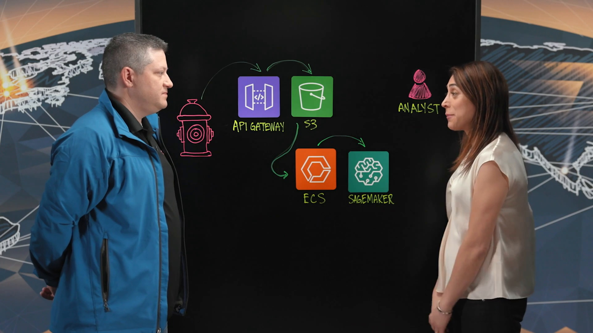
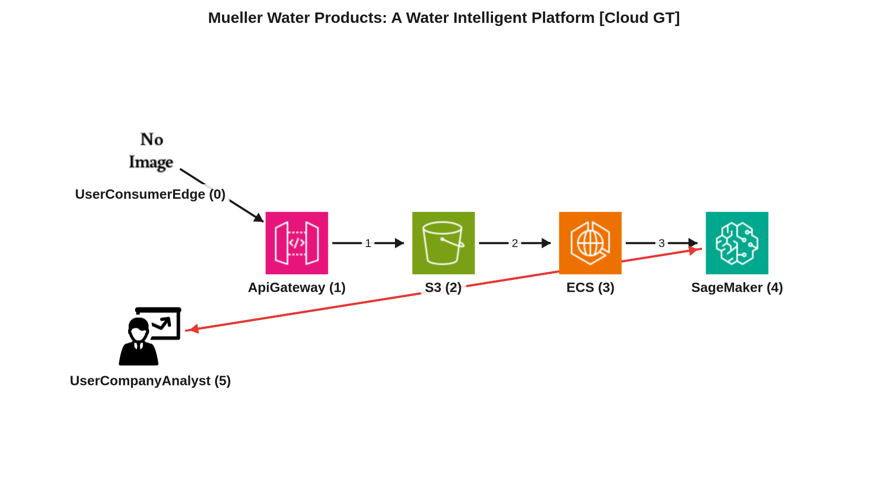
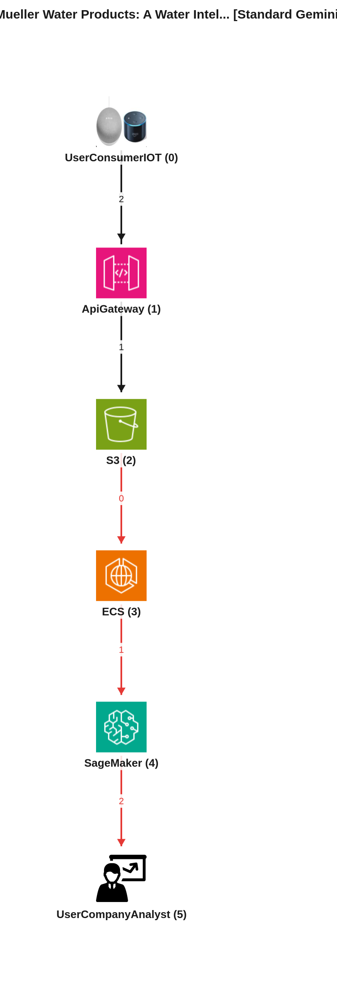
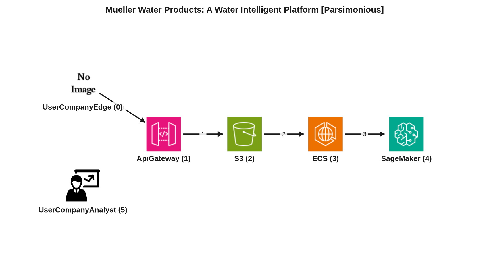

# Reporte de Comparación Cloudscape — Video 2e3vOxsHekE (Mueller Water Products: A Water Intelligent Platform)

Este reporte tiene como propósito comparar el grafo de arquitectura manual de referencia (Ground Truth) con dos grafos extraídos automáticamente por inteligencia artificial: el generado por el agente estándar (Gemini Vision) y el generado por el agente simplificado (Gemini Vision Parsimonioso), para el video 2e3vOxsHekE, destacando las similitudes, diferencias y el razonamiento detrás de cada representación.

---

## 📹 Descripción del Video
*   **ID del Video:** `2e3vOxsHekE`
*   **Título:** *Mueller Water Products: A Water Intelligent Platform*
*   **Canal:** Amazon Web Services
*   **Duración:** 05:30
*   **Resumen General:** El video presenta la "Plataforma Inteligente de Agua" de Mueller Water Products, una empresa con 150 años de experiencia en distribución de agua, infraestructura e inteligencia. La plataforma resuelve el problema de la pérdida de agua no facturable y el impacto ecológico de las fugas. Utiliza una red IoT a gran escala de medidores, hidrantes inteligentes y dispositivos de monitoreo de presión y calidad del agua para recolectar datos. El caso de uso central se enfoca en la detección de fugas mediante hidrantes inteligentes que recogen señales acústicas diarias de la red de tuberías. Estos archivos de datos se envían a través de AWS API Gateway, que proporciona seguridad y autenticación, y se persisten en Amazon S3. Posteriormente, un proceso por lotes diario en AWS ECS ejecuta algoritmos acústicos intensivos en procesamiento para encontrar correlaciones (incluyendo correlaciones persistentes) en las señales. Las correlaciones persistentes se clasifican aún más utilizando un endpoint de Machine Learning de AWS SageMaker, que asigna una probabilidad de fuga. Esta "puntuación de fuga" se entrega a un equipo de analistas humanos, quienes verifican y clasifican la fuga, pudiendo requerir una investigación de campo. La plataforma incorpora un mecanismo de retroalimentación donde el modelo de ML es reentrenado cada seis semanas utilizando datos del campo para mejorar su precisión. Los principales beneficios para el consumidor final son la protección contra la pérdida de agua no facturable y un beneficio ecológico al prevenir el derrame de agua clorada en vías fluviales. El futuro de la plataforma se centra en una mayor inversión en ML y analítica, incorporando fuentes de datos adicionales como el flujo y la presión para una inteligencia de distribución de agua aún más completa.

---

## 🖼️ Mejor Imagen de Pizarra (Fotograma de Trabajo)
La mejor imagen seleccionada por los filtros y aprobada en el pipeline fue **`best_whiteboard.jpg`**.

### Razón de la Selección:
Este fotograma final es óptimo para el análisis porque expone el diagrama completo con todos los iconos y flujos dibujados y etiquetados de la arquitectura. La oclusión por parte de los presentadores es mínima, lo que permite una clara visualización y comprensión de la topología y los componentes principales del sistema, facilitando así la extracción precisa del grafo.

---

## 🗣️ Traducción de la Transcripción (Whisper a Español)
A continuación se presenta la traducción al español de la transcripción del diálogo de los presentadores (redactado de forma natural y fluida como diálogo teatral con marcas de cita `>`):

> **Andrea:** Hola, bienvenidos a "Esta es mi arquitectura". Mi nombre es Andrea y estoy aquí con Heath de Muller Water Products. Hola, Heath.
> **Heath:** Hola.
> **Andrea:** Bienvenido al programa.
> **Heath:** Gracias.
> **Andrea:** ¿A qué se dedican ustedes?
> **Heath:** Muller Water Products es una empresa que existe desde hace unos 150 años. Nos centramos en la distribución de agua, la infraestructura y la inteligencia.
> **Andrea:** Maravilloso. Hoy vamos a hablar de su plataforma inteligente de agua.
> **Heath:** Así es.
> **Andrea:** ¿Qué es eso?
> **Heath:** Nuestra plataforma inteligente de agua ingiere datos de una red IoT a gran escala de medidores, hidrantes inteligentes y dispositivos de monitoreo de presión y calidad del agua.
> **Andrea:** Maravilloso. Así que, vamos directamente a ello, ¿te parece?
> **Heath:** Claro.
> **Andrea:** Veo un hidrante. ¿Qué recogen allí?
> **Heath:** En nuestros hidrantes, recolectamos datos acústicos que miden ruidos que ocurren en la red de tuberías.
> **Andrea:** Ya veo. De acuerdo, entonces, veamos un caso de uso.
> **Heath:** Claro.
> **Andrea:** Estamos recolectando información. ¿Qué sucede después?
> **Heath:** Diariamente, estos dispositivos registran señales acústicas en la red de tuberías. Se correlacionan para que tengamos señales correlacionadas entre múltiples hidrantes. Esos archivos se envían a través de API Gateway diariamente.
> **Andrea:** De acuerdo. ¿Y luego qué hacen con eso? Entonces, lo están enviando a API Gateway. ¿Eso persiste entonces en S3?
> **Heath:** Sí, así es.
> **Andrea:** De acuerdo. Tenemos autenticación y seguridad en la capa de API Gateway.
> **Andrea:** Ya veo. Y esos archivos son luego enviados y persistidos en S3.
> **Andrea:** Ya veo. Entonces, ¿por qué no podrían simplemente tomar esos datos y enviarlos directamente a S3?
> **Heath:** Principalmente por la seguridad que rodea a API Gateway.
> **Andrea:** Ya veo.
> **Heath:** Nos enfocamos muy fuertemente en la seguridad IoT.
> **Andrea:** De acuerdo. Entonces, están obteniendo los datos en S3 y ¿qué sucede después?
> **Heath:** El siguiente proceso que se inicia es un proceso por lotes que ocurre diariamente, donde cada uno de los archivos se procesa como un par de nodos para buscar correlaciones en las señales acústicas.
> **Andrea:** De acuerdo. Y eso sucede en ECS.
> **Heath:** Así es. Ese es el servicio de contenedores.
> **Andrea:** ¿Tenían microservicios antes? ¿Cuál fue la razón o justificación para usar microservicios? ¿Por qué no simplemente una función codificada como Lambda?
> **Heath:** Cierto. Estos son algoritmos acústicos muy intensivos en cuanto a procesamiento. Así que sentimos que un microservicio era el mejor enfoque.
> **Andrea:** De acuerdo. Eso tiene sentido. Entonces, es intensivo en procesamiento y luego hacen algún preprocesamiento. ¿Qué sucede después? Veo SageMaker.
> **Heath:** Mmhmm.
> **Andrea:** Explícanos ese ejemplo.
> **Heath:** Claro. Nuestros servicios de ECS están diseñados para encontrar correlaciones y también para encontrar correlaciones que ocurren durante muchos días que llamamos correlaciones persistentes. Estas correlaciones persistentes se clasifican luego utilizando un endpoint de ML de SageMaker que asignará una probabilidad a esa correlación persistente.
> **Andrea:** De acuerdo. ¿Y esa probabilidad les da, digamos, una fuga, una probabilidad de fuga potencial?
> **Heath:** Así es.
> **Andrea:** De acuerdo. Entonces, ¿qué hacen con esa información?
> **Heath:** El propósito principal de todo este flujo de trabajo es permitir que nuestros analistas humanos se centren en las fuentes de ruido que son más importantes para nosotros.
> **Andrea:** Ya veo.
> **Heath:** Entonces, desde el endpoint de SageMaker, obtenemos una puntuación de fuga, una probabilidad, y luego alimentamos eso a nuestro equipo de analistas humanos que clasificarán aún más esa fuga.
> **Andrea:** De acuerdo. Ahora, el analista, veo un analista aquí, están recibiendo esa puntuación. ¿Qué hacen con esa información?
> **Heath:** Entonces, mirarán la correlación persistente. Hablarán con la empresa de servicios de agua y se asegurarán de que no haya alguna otra fuente de ruido cercana que pueda estar produciendo eso. Y luego, una vez que lo hayan calificado, actualizarán el estado de esa fuga a "se requiere una investigación de campo".
> **Andrea:** De acuerdo. Ya veo. ¿Hay alguna oportunidad aquí para que ustedes busquen mejorar este proceso en términos de, ya saben, si es un falso positivo? ¿Tienen algún mecanismo para lidiar con situaciones en las que ha habido una alerta, pero, ya saben, resulta que no ha habido una alerta verdadera?
> **Heath:** Claro. Y eso sucede de vez en cuando. De hecho, usamos la retroalimentación del campo aproximadamente cada seis semanas para clasificar aún más y reentrenar el modelo, de modo que los modelos mejoran cada vez más con el tiempo. También estamos buscando incorporar puntos de datos adicionales al proceso para poder medir cosas como el flujo y la presión junto con los datos de detección acústica de fugas.
> **Andrea:** Oh, maravilloso. Entonces, ¿cuál es el verdadero beneficio aquí para su consumidor final de esta plataforma?
> **Heath:** El beneficio es la protección de la pérdida de agua no facturable y también hay un beneficio ecológico porque ciertamente no queremos que el agua clorada se derrame en vías fluviales de agua dulce, etc.
> **Andrea:** Oh, maravilloso. Entonces, ¿qué depara el futuro para esta plataforma?
> **Heath:** Claro. El futuro es, creo, un enfoque realmente fuerte en ML y analítica, incorporando fuentes de datos adicionales y proporcionando inteligencia real de distribución de agua para nuestros clientes.
> **Andrea:** Muchas gracias por guiarnos a través de esta arquitectura, su plataforma inteligente de agua donde están recolectando información, información sensorial, procesándola y haciendo predicciones para fugas de agua. Gracias por estar en el programa y gracias por vernos. Esta es mi arquitectura.

---

## 📐 Redacción y Explicación del Diagrama Resultante

### 1. ¿Por qué el Grafo Manual (Ground Truth) está estructurado de esa manera?

*   **Estructura de Nodos:** El grafo manual (Ground Truth) se compone de seis nodos, cada uno representando un componente clave o actor en la plataforma inteligente de agua de Mueller Water Products:
    *   `NodeID: 0, Service: UserConsumerEdge`: Representa los dispositivos IoT de borde, como los hidrantes inteligentes, que son la fuente inicial de los datos.
    *   `NodeID: 1, Service: ApiGateway`: Corresponde a AWS API Gateway, utilizado como punto de entrada seguro y autenticado para la ingesta de datos.
    *   `NodeID: 2, Service: S3`: Se refiere a Amazon S3, donde los archivos de datos acústicos brutos se persisten de forma duradera.
    *   `NodeID: 3, Service: ECS`: Denota AWS Elastic Container Service (ECS), que aloja los microservicios responsables de procesar los datos y encontrar correlaciones.
    *   `NodeID: 4, Service: SageMaker`: Simboliza AWS SageMaker, el servicio de aprendizaje automático que clasifica las correlaciones y asigna probabilidades de fuga.
    *   `NodeID: 5, Service: UserCompanyAnalyst`: Representa al equipo de analistas humanos de la empresa, quienes revisan y validan las predicciones de fugas.

*   **Flujos e Interacciones Clave:** El grafo manual describe dos flujos principales y una interacción de retroalimentación:
    *   **Flujo Principal de Detección de Fugas (FlowID: 0):**
        *   `0 -> 1 (Seq: 0, Type: data)`: Los dispositivos IoT de borde (hidrantes inteligentes) envían diariamente datos acústicos a API Gateway para su ingesta.
        *   `1 -> 2 (Seq: 1, Type: data)`: API Gateway, después de la autenticación y seguridad, persiste estos archivos de datos brutos en S3.
        *   `2 -> 3 (Seq: 2, Type: data)`: ECS consume los archivos de S3 diariamente para ejecutar un procesamiento por lotes intensivo en recursos, buscando correlaciones en las señales acústicas.
        *   `3 -> 4 (Seq: 3, Type: data)`: Las correlaciones persistentes identificadas por ECS se envían a SageMaker, que utiliza un endpoint de ML para clasificar y asignar una probabilidad de fuga.
    *   **Flujo de Análisis y Retroalimentación (FlowID: 1):**
        *   `5 -> 4 (Seq: 0, Type: data)`: El equipo de analistas (UserCompanyAnalyst) proporciona retroalimentación a SageMaker. Esta interacción es crucial para el reentrenamiento y la mejora continua del modelo de ML cada seis semanas, como se menciona en el video.
        *   `4 -> 5 (Seq: 1, Type: data)`: SageMaker envía las puntuaciones de probabilidad de fuga (predicciones) al equipo de analistas humanos, quienes utilizan esta información para priorizar las investigaciones.

### 2. ¿Por qué el Grafo Automático Estándar (Gemini Vision) está estructurado de esa manera y en qué parte del texto se basó?

*   **Mapeo de Nodos y Justificación de Flujos:** El modelo estándar (F1 de servicios: 83.3%) identificó y estructuró la arquitectura de manera muy similar al Ground Truth en cuanto a los nodos principales. Utilizó nombres más descriptivos como "Smart Fire Hydrants" para el NodeID 0 y "Water Analyst Team" para el NodeID 5, lo cual es una mejora.
    *   La justificación para los flujos se basa en la transcripción:
        *   `0 -> 1 (Sends daily acoustic signals)`: Se deriva de "Daily, these devices record acoustic signals on the pipe network. They're correlated... Those files are pushed through API gateway on a daily basis."
        *   `1 -> 2 (Persists raw files)`: De "So you're pushing into API gateway. Does that persist then in S3? It does, yes."
        *   `1 -> 0 (Response/ACK)`: Esta es una adición del modelo estándar, interpretando que API Gateway envía una respuesta o acuse de recibo de vuelta al dispositivo IoT. Aunque no está explícitamente en el Ground Truth, es una interacción común y lógica en arquitecturas de ingesta de datos.
        *   `2 -> 3 (Pulls daily files for batch processing)`: De "The next process that kicks off is a batch process that occurs on a daily basis where each of the files is processed... That happens in ECS."
        *   `3 -> 4 (Sends persistent correlations for analysis)`: De "Our ECS services are designed to find correlations... These persistent correlations are then further classified using a SageMaker ML endpoint".
        *   `4 -> 5 (Feeds leak probability scores)`: De "from the SageMaker endpoint, we get a leak score, a probability, and then we feed that to our human analyst team".
*   **⚠️ Brecha Clave Detectada:** Aunque el modelo estándar tuvo una excelente detección de nodos y una buena interpretación de los flujos principales, se detecta una brecha clave en las aristas:
    *   **Omisión del flujo de retroalimentación `5 -> 4`:** El grafo estándar omite la conexión crítica del analista hacia SageMaker, que representa la retroalimentación para el reentrenamiento del modelo. La transcripción menciona explícitamente: "We actually use feedback from the field about every six weeks to further classify and retrain the model so the models get better and better over time." Esta omisión significa que el grafo estándar no captura completamente el ciclo de mejora continua del sistema.
    *   **Adición de arista `1 -> 0`:** El modelo añadió una arista de metadatos `1 -> 0` (API Gateway a los hidrantes inteligentes) para una respuesta/ACK. Aunque plausible, no estaba presente en el Ground Truth, que busca representar flujos de datos esenciales de alto nivel.

### 3. ¿Por qué el Grafo Automático Parsimonioso (Gemini Vision Parsimonioso) está estructurado de esa manera y cómo mejora el resultado?

*   **Análisis de Mejoras y Razonamiento del Agente Parsimonioso:** El modelo parsimonioso (F1 de servicios: 83.3%) presenta una estructura de nodos idéntica en cantidad y tipo de servicio al modelo estándar, pero con nombres más concisos (ej. "API Gateway" en lugar de "Ingestion API"). Su principal objetivo es simplificar la topología, omitiendo artefactos transitorios y enfocándose en los flujos directos.
    *   El grafo parsimonioso elimina la arista `1 -> 0` (respuesta/ACK de API Gateway a los dispositivos IoT) presente en el modelo estándar, lo que se alinea más con la filosofía del Ground Truth de enfocarse en los flujos de datos primarios y no en las interacciones de metadatos o detalles de implementación de bajo nivel. En este aspecto, es una mejora sobre el estándar.
    *   Los flujos identificados son `0 -> 1`, `1 -> 2`, `2 -> 3`, `3 -> 4`, los cuales corresponden a la primera parte del flujo principal de detección de fugas del Ground Truth y están directamente justificados por la transcripción, como se detalló para el modelo estándar.
*   **Conclusión Comparativa:** Si bien el modelo parsimonioso logró eliminar una arista superflua (`1 -> 0`), su F1 de aristas (60.0%) es significativamente menor que el del modelo estándar (66.7%), y ambos son inferiores al Ground Truth. La razón principal de esta disminución en la métrica de aristas es que el modelo parsimonioso **omite completamente las interacciones con el analista humano (NodeID 5)**. Faltan las aristas `4 -> 5` (envío de predicciones de SageMaker al analista) y `5 -> 4` (retroalimentación del analista a SageMaker).
    *   Esta omisión es una debilidad crítica, ya que el rol del analista y el ciclo de retroalimentación son componentes fundamentales y explícitamente descritos en la arquitectura del video. El objetivo de "simplificar y corregir las sobre-conexiones o nodos redundantes" no debe resultar en la eliminación de pasos críticos del flujo de trabajo.
    *   Por lo tanto, a pesar de la eliminación de una arista menos relevante, la formulación parsimoniosa no es superior ni más representativa de un diagrama arquitectónico real en comparación con el modelo estándar en este caso, debido a la grave omisión de la fase de análisis humano y el bucle de retroalimentación, elementos que son esenciales para el funcionamiento completo de la plataforma descrita. El modelo estándar, aunque añadió una arista extra, al menos incluyó la salida de SageMaker al analista, lo que lo acerca más a la completitud del workflow.