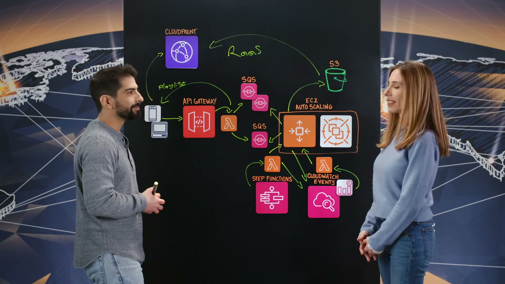
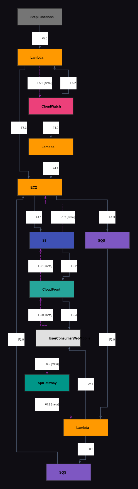
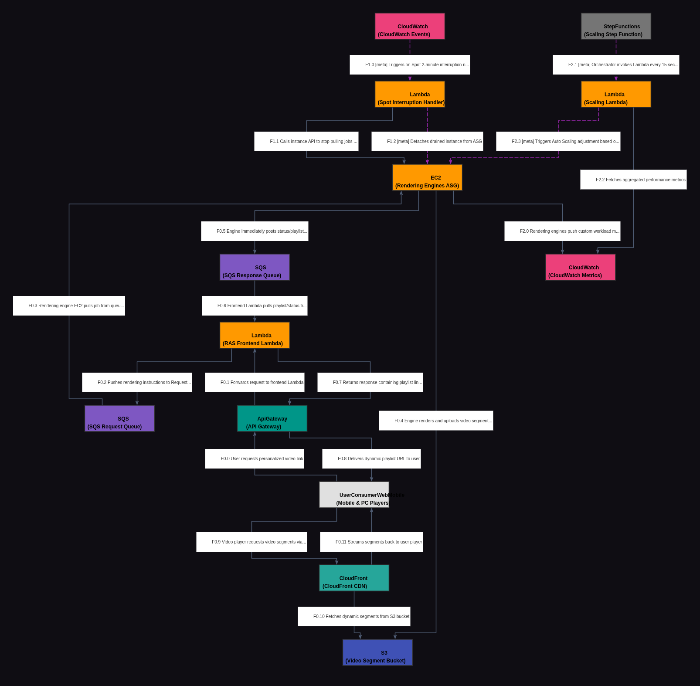

# Reporte de Comparación Cloudscape — Video 6CgqEzyWpeA (Sunday Sky)

Este reporte detalla el análisis del primer video de la base de datos de Cloudscape, correspondiente a **Sunday Sky**, comparando su grafo manual de referencia (Ground Truth) con el grafo extraído automáticamente por el modelo Gemini Vision.

---

## 📹 Descripción del Video

* **ID del Video:** `6CgqEzyWpeA`
* **Título:** *SundaySky: Create Personalized Videos in Real Time on GPU-based Spot Instances for Video Rendering*
* **Canal:** AWS - This is My Architecture
* **Duración:** 06:36
* **Resumen General:** El video describe la arquitectura **RAS (Rendering as a Service)** de la empresa Sunday Sky. Este servicio permite generar miles de millones de videos dinámicos y altamente personalizados (por ejemplo, facturas de telecomunicaciones en formato de video interactivo en lugar de PDF estáticos) para sus usuarios finales. Para ello, implementa un pipeline serverless que procesa peticiones en tiempo real y delega el renderizado pesado a una granja de instancias Spot de GPU en un grupo de Auto Scaling (ASG), logrando una alta disponibilidad, escalabilidad y eficiencia de costes.

---

## 🖼️ Mejor Imagen de Pizarra (Fotograma de Trabajo)

La mejor imagen seleccionada por los filtros automáticos fue **`6CgqEzyWpeA_frame_0039.jpg`** (guardada en este directorio como `best_whiteboard.jpg`). 

### Razón de la Selección:
Tanto el algoritmo de **Filtro de Oclusión Física** como el de **Filtro por Coincidencia de Plantillas AWS (logos)** coincidieron de forma unánime en el fotograma 39. Este fotograma ocurre al final de la explicación arquitectónica del presentador, justo cuando la pizarra de dibujo contiene todos los elementos y flujos dibujados y el presentador se ha desplazado hacia la izquierda, dejando visible el 100% de la pizarra con el menor porcentaje de oclusión física (22.5%) y permitiendo identificar nítidamente los **11 logotipos** de servicios de AWS en pantalla.

---

## 🗣️ Traducción de la Transcripción (Whisper a Español)

A continuación se presenta la traducción completa de la transcripción del video al español para facilitar el análisis del flujo:

> "Bienvenido a This is My Architecture. Soy Orit. Conmigo hoy, Shai de Sunday Sky. Hola Shai, cuéntanos sobre Sunday Sky.
> 
> Gracias por recibirme, Orit. Así es, Sunday Sky existe desde 2007. Nuestros clientes se relacionan con sus clientes utilizando experiencias impulsadas por video en las que el contenido del video está personalizado para el espectador.
> 
> ¿De qué vas a hablar hoy?
> 
> Hoy voy a hablar sobre nuestro ecosistema de renderizado, nuestro renderizado como servicio, lo que llamamos RAS. Imagino que recibes una factura de telecomunicaciones todos los meses.
> 
> Sí, así es.
> 
> E imagina que en lugar de recibir un PDF con datos estáticos, recibes un video personalizado para Orit. Digamos que estás viendo, recibes un enlace para ver tu factura mensual desde tu dispositivo móvil. Esa solicitud llega a nuestro ecosistema RAS. La primera parada es el API Gateway, donde aprovechamos las diferentes capacidades de API Gateway, que es un enlace frontal y donde podemos configurar planes de uso y claves de API para que nuestros clientes controlen la carga en nuestra granja de servidores.
> 
> Esa solicitud llega a una función Lambda, que es nuestro servicio frontend de RAS. Esa función Lambda realiza algunas validaciones sobre la solicitud de renderizado y, finalmente, envía la instrucción de renderizado a una cola SQS, desde la cual los motores del servicio que forman parte del ecosistema RAS extraen los trabajos de renderizado cuando tienen capacidad para hacerlo.
> 
> Una vez que la solicitud llega al grupo de auto-escalado (ASG), queremos obtener una respuesta lo más rápida posible del motor de renderizado. Por lo tanto, respondemos de inmediato a una cola SQS, de la cual realiza la extracción la misma invocación de la función Lambda. A partir de ese momento, tenemos un enlace a un archivo de lista de reproducción (playlist). Ese archivo de lista de reproducción contiene enlaces a los segmentos de video que el motor de renderizado sube a S3. Entonces, cuando el reproductor en el dispositivo móvil o la computadora (PC) solicita este segmento de video para mostrarlo, el enlace a CloudFront realmente extrae el segmento de video desde el origen (S3) y se lo reproduce al usuario.
> 
> Así que tu renderizado de video se basa prácticamente en su totalidad en instancias Spot. ¿Cómo gestionan la alta disponibilidad?
> 
> Hay dos aspectos para mantener esta alta disponibilidad de nuestro servicio. El primero es que creamos instancias en múltiples zonas de disponibilidad (AZ). Lo segundo es que intentamos diversificar los tipos de instancias dentro del grupo de auto-escalado tanto como sea posible. La combinación de distribuir instancias en múltiples zonas de disponibilidad y tener tipos de instancias diversificados nos proporciona alta disponibilidad incluso al utilizar instancias Spot.
> 
> ¿Cómo manejan el aviso de interrupción de Spot de dos minutos mientras se renderizan los trabajos de video?
> 
> Esa es una gran pregunta. Bueno, construimos un mecanismo para las interrupciones de instancias Spot donde CloudWatch notifica a una función Lambda a través de un evento de CloudWatch que un cierto ID de instancia está por ser retirado. Esa función Lambda interactúa con esa instancia a través de una llamada de API indicándole específicamente a esa instancia que deje de extraer solicitudes o trabajos de renderizado de la cola y que termine de procesar los trabajos actuales que ya está renderizando. Dado que nuestro motor de servicio es altamente eficiente, tenemos una alta certeza de que el trabajo de renderizado terminará antes de que expire el tiempo de espera de dos minutos. Así que una vez que la API para que la instancia deje de tomar trabajos de la cola finaliza, desasociamos (detach) la instancia del grupo de auto-escalado.
> 
> Tiene sentido. ¿Cuál es la escala que soporta actualmente el renderizado como servicio?
> 
> Generamos miles de millones de videos anualmente, millones de videos diariamente. Para tener servicios altamente disponibles, tenemos un mecanismo de escalado que construimos que depende de métricas de CloudWatch que se envían desde las instancias de renderizado y son consumidas por una función Lambda que es activada por una Step Function cada 15 segundos. Entonces, cuando calculamos que no tenemos o esperamos un mayor tráfico entrante, la función Lambda interactúa con el grupo de auto-escalado indicándole que aumente la cantidad de instancias que están actualmente en servicio.
> 
> Genial. Parece que construyeron un servicio altamente disponible, rentable y escalable. ¿Cuáles son los siguientes pasos para ustedes?
> 
> Queremos hacer uso de una característica reciente anunciada por AWS ASG donde podemos mapear tipos de instancias específicos a pesos específicos. De esa manera, nuestro mecanismo de escalado puede interactuar con el grupo de auto-escalado utilizando pesos, lo cual es más adecuado para representar la capacidad de renderizado que se requiere actualmente bajo la carga de la granja de servidores.
> 
> Gracias por compartir eso con nosotros. Y gracias por ver. Esto es My Architecture."

---

## 📐 Redacción y Explicación del Diagrama Resultante

Para comprender cómo debe quedar representado el diagrama arquitectónico, es vital analizar las diferencias y justificaciones del diseño en su formato **Manual (Ground Truth)** y su formato **Automático (Gemini Vision)**.

### 1. ¿Por qué el Grafo Manual (Ground Truth) está estructurado de esa manera?

El grafo de referencia de Cloudscape (`data/cloudscape_gt/6CgqEzyWpeA.graphml`) es un modelo de datos curado y simplificado enfocado estrictamente en la consistencia de tipos y flujos de datos. Está compuesto por **12 nodos** y flujos lógicos bien delimitados:

* **Estructura de Nodos:**
  * Define los límites externos con el nodo `UserConsumerWebMobile` (ID: 0) que actúa como el gatillo inicial y el sumidero de video final.
  * Mantiene una capa serverless frontend acoplada secuencialmente: `ApiGateway` -> `Lambda` (backend RAS frontend).
  * Separa dos colas de mensajería `SQS` (IDs 6 y 7): la cola de peticiones y la cola de respuesta rápida, asegurando un desacoplamiento asíncrono asimétrico.
  * Agrupa las instancias de renderizado en un nodo central `EC2` (ID: 8) con el atributo `SPOT: True`.
  * La orquestación periódica se modela mediante el bucle `StepFunctions` (ID: 9) -> `Lambda` (ID: 5) -> `CloudWatch` (ID: 10), donde CloudWatch actúa como el almacén de métricas y a su vez como el emisor de alertas de corte.
  * El origen de los datos es `S3` (ID: 11) y la entrega acelerada recae en `CloudFront` (ID: 1).

* **Lógica del Grafo Manual:**
  * **Flujo de Petición (Flow 0):** Entrada del usuario al API Gateway, de ahí al Lambda frontend y finalmente la escritura de la instrucción de renderizado en SQS (petición).
  * **Flujo de Renderizado y Enlace (Flow 1 y 2):** EC2 Spot extrae de SQS de petición, escribe los segmentos de video en S3, confirma a la cola de SQS de respuesta, el Lambda lee la cola de respuesta y devuelve el playlist al cliente.
  * **Flujo de Entrega (Flow 3):** El reproductor móvil del cliente pide los videos mediante CloudFront, el cual los recupera de S3 y los reproduce.
  * **Flujo de Interrupción (Flow 4):** CloudWatch detecta la interrupción Spot y activa el Lambda correspondiente, el cual manda la orden a EC2 de detenerse.
  * **Flujo de Escalado (Flow 5):** Step Functions corre cada 15 segundos para llamar al Lambda de autoescalado, el cual lee métricas de CloudWatch y ordena a las instancias EC2 (el ASG) ajustar su capacidad.

---

### 2. ¿Por qué el Grafo Automático (Gemini Vision) está estructurado de esa manera y en qué parte del texto se basó?

El grafo extraído automáticamente (`data/raw/6CgqEzyWpeA_revised_vision_analysis.json`) cuenta con **13 nodos** y reproduce los flujos con una alta fidelidad al audio e imagen. Gemini extrajo una estructura muy similar pero con dos refinamientos:
1. Identificó explícitamente el servicio `EC2 Auto Scaling` en lugar de un `EC2` genérico para el grupo de renderizado.
2. Dividió a `CloudWatch` en dos nodos funcionales separados: `CloudWatch Events` (para interrupciones) y `CloudWatch Metrics` (para el escalado periódico), lo cual coincide fielmente con el dibujo físico de la pizarra donde estos componentes están separados.

A continuación, se detalla en qué parte de la transcripción se fundamenta la creación de las aristas y conexiones automáticas de este grafo:

#### A. Flujo Principal de Petición de Video (Aristas 0.0 a 0.3)
* **Grafo Automático:** `User` -> `ApiGateway` -> `RAS Frontend Lambda` -> `Rendering Instruction Queue (SQS)` -> `ASG (EC2)`.
* **Sustento en el Texto:** 
  > *"So, let's say you're watching, you get a link to watch your monthly bill from your mobile device. That request arrives into our RAS ecosystem. First stop is the API Gateway... That request arrives into a Lambda function, which is our service, RAS service frontend. That Lambda function does some validations... and eventually, pushes rendering instruction to an SQS queue..."*
  * **Explicación:** Esta sección describe el viaje síncrono inicial de la petición. Gemini mapeó de forma exacta los intermediarios y la inserción del mensaje en SQS para que sea extraído por el ASG.

#### B. Flujo de Renderizado y Respuesta Asíncrona (Aristas 0.4 a 0.7)
* **Grafo Automático:** `ASG (EC2)` -> `Rendering Response Queue (SQS)` -> `RAS Frontend Lambda` -> `User` AND `ASG (EC2)` -> `S3`.
* **Sustento en el Texto:**
  > *"Once a request arrives into the auto scaling group... we immediately respond to an SQS queue, which the same Lambda function invocation pulls from. And from that moment on, we have a link to a playlist file. That playlist file contains links to video segments that the rendering engine uploads to S3."*
  * **Explicación:** Explica la naturaleza bidireccional asíncrona. Mientras el motor renderiza y sube los fragmentos a S3 de forma masiva, manda una señal rápida por una segunda cola SQS (Response) para liberar la conexión del cliente con una URL de reproducción inmediata.

#### C. Flujo de Reproducción y CDN (Aristas 0.8 a 0.10)
* **Grafo Automático:** `User` -> `CloudFront` -> `S3` -> `User`.
* **Sustento en el Texto:**
  > *"So, when the player on the mobile device or PC device asks for this video segment to show, then the link to CloudFront actually pulls from the origin a video segment and plays it to the user."*
  * **Explicación:** Cuando la reproducción inicia, el tráfico de datos pesados no pasa por el frontend serverless ni por los motores EC2, sino que va directo al CDN CloudFront, el cual tiene a S3 como backend (origen).

#### D. Flujo de Interrupción Spot Graceful (Aristas 1.0 a 1.2)
* **Grafo Automático:** `CloudWatch Events` -> `Spot Interruption Lambda` -> `ASG (EC2)`.
* **Sustento en el Texto:**
  > *"...we built a mechanism for spot instance interruptions where CloudWatch notifies a Lambda function via a CloudWatch event that a certain instance ID is about to be taken. That Lambda function interacts with that instance via an API call telling that instance specifically to stop pulling requests... and kind of drain out the current jobs... we detach the instance from the auto scaling group."*
  * **Explicación:** Se genera debido al aviso de 2 minutos de AWS. Gemini interpretó correctamente que el emisor es un evento de CloudWatch (`CloudWatch Event`) que gatilla una Lambda de remediación. Esta Lambda invoca al API del motor afectado para "drenar" y luego ejecuta un "detach" del ASG.

#### E. Flujo de Autoescalado por Métricas (Aristas 2.0 a 2.3)
* **Grafo Automático:** `ASG (EC2)` -> `CloudWatch Metrics` AND `Step Functions` -> `Auto Scaling Controller Lambda` -> `CloudWatch Metrics` -> `ASG (EC2)`.
* **Sustento en el Texto:**
  > *"...scaling mechanism that we built that is reliant on CloudWatch metrics that are pushed from the rendering instances and consumed by Lambda function that is triggered by a step function every 15 seconds. So, when we calculate... higher traffic... the Lambda function interacts with the auto scaling group telling it to increase the amount of instances..."*
  * **Explicación:** Mapea el bucle de control de capacidad. Las instancias EC2 activas registran sus métricas de carga en CloudWatch, mientras Step Functions actúa como un cronómetro de 15 segundos que invoca la función Lambda de escalado para que analice esas métricas y tome una decisión de aprovisionamiento en el Auto Scaling Group.

---

### Resumen Visual de Equivalencias de Servicios

| Elemento Visual Pizarra | Servicio en Grafo Manual (GT) | Servicio en Grafo Automático (Gemini) |
| :--- | :--- | :--- |
| **Api Gateway** (Logo AWS) | `ApiGateway` | `ApiGateway` |
| **Lambda (Frontend)** (Logo AWS) | `Lambda` (ID 3) | `Lambda` (ID 2) |
| **Request SQS** (Dibujo Cola) | `SQS` (ID 6) | `SQS` (ID 3) |
| **ASG Spot** (Caja / EC2s) | `EC2` (ID 8) | `EC2 Auto Scaling` (ID 4) |
| **Response SQS** (Dibujo Cola) | `SQS` (ID 7) | `SQS` (ID 5) |
| **S3 Bucket** (Logo AWS) | `S3` (ID 11) | `S3` (ID 6) |
| **CloudFront** (Logo AWS) | `CloudFront` | `CloudFront` |
| **Spot Interruption Handler** | `Lambda` (ID 4) | `Lambda` (ID 9) |
| **CloudWatch (Interrupción)** | `CloudWatch` | `CloudWatch Events` (ID 8) |
| **CloudWatch (Métricas)** | `CloudWatch` | `CloudWatch` (ID 10) |
| **Step Function** (Logo AWS) | `StepFunctions` | `Step Functions` (ID 11) |
| **Scaling Controller** | `Lambda` (ID 5) | `Lambda` (ID 12) |
