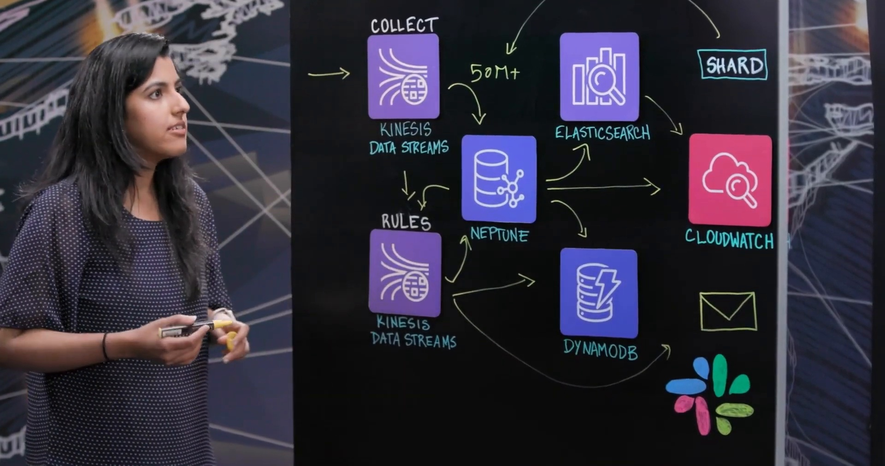
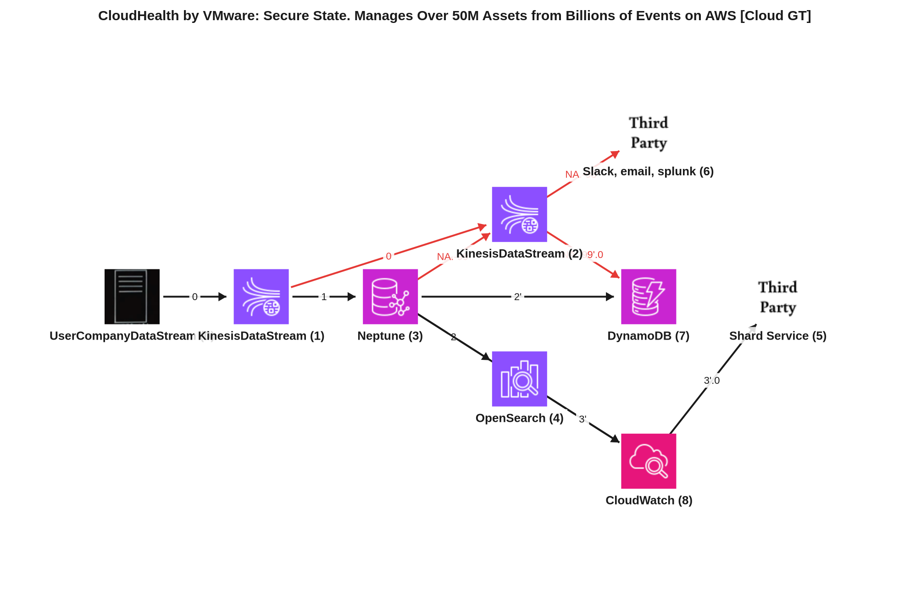
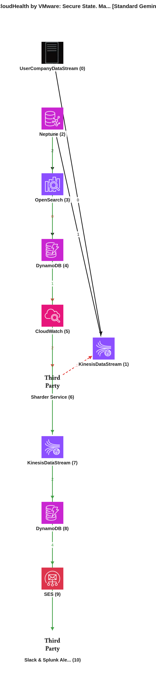
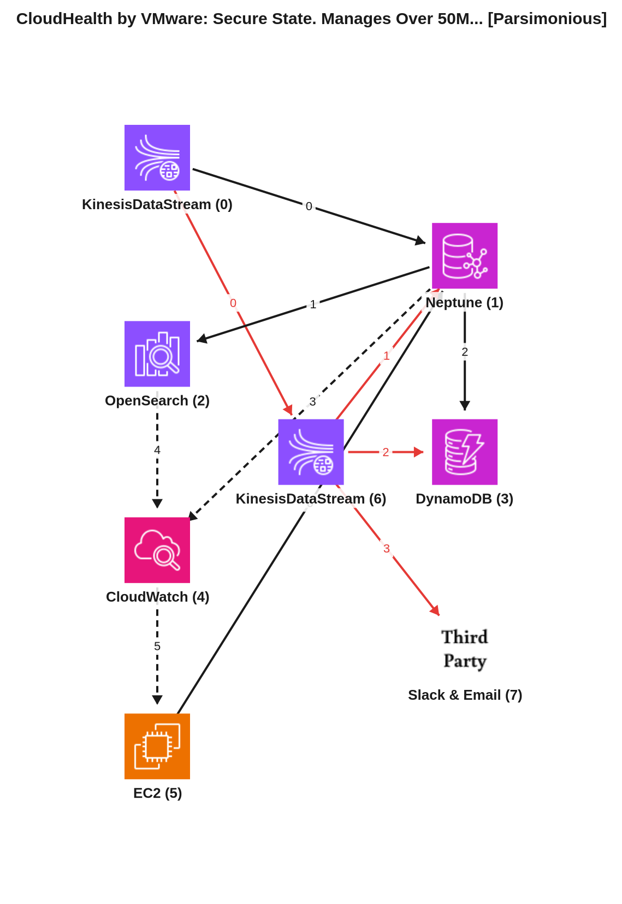

# Reporte de Comparación Cloudscape — Video 6EUknQqaV1w (CloudHealth by VMware: Secure State. Manages Over 50M Assets from Billions of Events on AWS)

El propósito de este reporte es comparar la arquitectura de referencia manual (conocida como Ground Truth) de la plataforma CloudHealth Secure State de VMware, tal como se describe en el video "CloudHealth by VMware: Secure State. Manages Over 50M Assets from Billions of Events on AWS", con dos representaciones de grafo generadas automáticamente por inteligencia artificial: una por el agente estándar (Gemini Vision) y otra por el agente simplificado (Gemini Vision Parsimonioso). El análisis se centrará en la precisión, la exhaustividad y la claridad de cada modelo en la interpretación de los componentes y flujos de datos presentados.

---

## 📹 Descripción del Video
*   **ID del Video:** `6EUknQqaV1w`
*   **Título:** *CloudHealth by VMware: Secure State. Manages Over 50M Assets from Billions of Events on AWS*
*   **Canal:** Amazon Web Services
*   **Duración:** 05:30
*   **Resumen General:**
    El video presenta CloudHealth Secure State de VMware, una plataforma de seguridad y monitoreo en la nube diseñada para ayudar a los clientes a mitigar riesgos de seguridad y cumplimiento a través de insights inteligentes en tiempo real. La arquitectura aborda el desafío de manejar una escala masiva, procesando miles de millones de eventos diarios y monitoreando más de 50 millones de recursos en tres proveedores de la nube principales.

    La solución comienza con la recopilación de datos de los flujos de eventos de seguridad nativos de los proveedores de la nube (como CloudWatch y Azure Activity Log). Estos eventos son evaluados por un framework de colección que determina el estado actual de los recursos y los publica en un Kinesis Data Stream. El componente central de persistencia es Amazon Neptune, una base de datos de grafos que permite la exploración de datos interconectados y soporta una gran escala de lectura, además de ser *schema-less*, lo que es crucial para la diversidad de configuraciones de recursos.

    Para complementar a Neptune, se utilizan Elasticsearch para capacidades de reporte, analíticas, búsqueda y agregaciones, y DynamoDB para la visualización del historial de configuración de recursos. Para manejar la escala de escritura, se implementa un servicio de "sharding" (particionamiento) personalizado que monitorea las métricas de CloudWatch (CPU, memoria) de Neptune y Elasticsearch para determinar la capacidad de los shards y balancear la carga de datos de los clientes.

    Finalmente, los eventos entrantes y los cambios de recursos se propagan a un pipeline de ejecución de reglas, orquestado por otro Kinesis Data Stream. Un motor de reglas inteligente ejecuta miles de reglas, realizando comprobaciones de seguridad sobre la base de datos de grafos de Neptune. Las violaciones de seguridad detectadas se persisten en DynamoDB y se envían notificaciones en tiempo real a los clientes a través de varios canales como Slack, correo electrónico y Splunk.

---

## 🖼️ Mejor Imagen de Pizarra (Fotograma de Trabajo)
La mejor imagen seleccionada por los filtros y aprobada en el pipeline fue **`best_whiteboard.jpg`**.

### Razón de la Selección:
Este fotograma final es óptimo para el análisis porque presenta el diagrama completo de la arquitectura, con todos los iconos de los servicios y los flujos de datos claramente dibujados y etiquetados. La oclusión por parte de los presentadores es mínima, lo que permite una visibilidad clara de la topología general y las interacciones entre los componentes, facilitando la comprensión de la arquitectura propuesta.

---

## 🗣️ Traducción de la Transcripción (Whisper a Español)
A continuación se presenta la traducción al español de la transcripción del diálogo de los presentadores:

> **Presentador:** Hola y bienvenidos a "This Is My Architecture". Estoy aquí con Shrapria de Cloud Health by VMware. Hola, Shrapria.
>
> **Invitada (Shrapria):** Hola, gracias por invitarme.
>
> **Presentador:** Sí, estamos felices de tenerte. ¿Puedes hablarnos un poco sobre Cloud Health by VMware?
>
> **Invitada (Shrapria):** Claro. Cloud Health Secure State es una plataforma de monitoreo y seguridad en la nube. Ayudamos a nuestros clientes a mitigar riesgos de seguridad y cumplimiento a través de nuestros insights inteligentes en tiempo real.
>
> **Presentador:** Eso es genial. Tengo muchas ganas de profundizar y aprender un poco más. Entonces, ¿puedes empezar por la parte de la recolección?
>
> **Invitada (Shrapria):** Claro. Tenemos principalmente dos modos de recolección. El aspecto principal, como mencioné, es la detección en tiempo real de violaciones de seguridad. Para eso, aprovechamos los flujos de eventos de seguridad nativos de los proveedores de la nube, como CloudWatch o el registro de actividad en el caso de Azure. Y una vez que los eventos llegan a nuestro sistema, tenemos un framework de recolección que evalúa esos eventos y determina el estado actual del recurso y publica esos recursos en un Kinesis data stream.
>
> **Presentador:** Impresionante. Como arquitecto, ¿qué desafíos enfrentarías en esta arquitectura?
>
> **Invitada (Shrapria):** Cierto. Uno de los principales desafíos, como con cualquier pipeline de datos, es la escala que tenemos que manejar, ¿verdad? Actualmente, soportamos tres proveedores de la nube principales. Y cada uno de estos proveedores de la nube tiene muchos servicios que también soportamos. Así que, dado eso, estamos hablando de miles de millones de eventos por día. Y esa escala es bastante enorme de manejar. Y a eso se suma la cantidad de recursos que recolectamos y monitoreamos. Y para proporcionar insights en tiempo real, tenemos que realizar una exploración basada en grafos sobre esos recursos. Esos son los desafíos principales que tenemos en nuestro sistema.
>
> **Presentador:** Sí. No, eso es genial. Mencionaste la pieza basada en grafos. Tengo curiosidad por saber cómo encaja Neptune.
>
> **Invitada (Shrapria):** Claro. Una vez que los recursos de la nube son ingeridos en nuestro flujo de datos, tenemos el consumidor, que publica esos recursos en Amazon Neptune, ¿verdad? El uso principal de Amazon Neptune es una base de datos de grafos, como todos sabemos. Y los datos de uso de la nube son un conjunto de datos altamente interconectados. Y queríamos proporcionar a nuestros clientes capacidades de exploración basadas en grafos. Neptune nos permite hacer eso de manera eficiente. Y además de eso, también proporciona una escala de lectura (read scale-out) que requerimos para ejecutar muchas reglas sobre ellos, sobre los recursos de la nube. Y también elegimos Neptune porque no tiene esquema (schema-less). Así que una de las consideraciones clave en nuestro sistema es que a medida que incorporamos más proveedores de la nube, soportamos más tipos de recursos, cada uno de ellos tiene configuraciones variadas. Y queremos que nuestra capa de datos sea agnóstica a esas representaciones. Y esa es otra razón por la que tuvimos que elegir Neptune.
>
> **Presentador:** Sí. No, eso tiene sentido. ¿De cuántos activos estamos hablando aquí?
>
> **Invitada (Shrapria):** Sí. Creo que, como dije, estamos manejando miles de millones de eventos, lo que asciende a más de 50 millones de recursos que recolectamos y monitoreamos en nuestro pipeline. Y este número es un número en constante crecimiento.
>
> **Presentador:** Sí. Guau. Eso es mucho. Eso es una gran cantidad de activos para procesar. Entonces, después de que los datos entran en Neptune, ¿qué sucede después?
>
> **Invitada (Shrapria):** Cierto. Creo que también queríamos ofrecer a nuestros clientes la capacidad de analizar (slice and dice) estos datos de recursos de la nube en varias formas y maneras. Queremos que tengan capacidades de reporte analítico, agregaciones de búsqueda. Y también queremos que visualicen cómo han cambiado las configuraciones de los recursos a lo largo del tiempo. Así que una cosa que descubrimos es que no hay una única base de datos que pueda realizar todas estas funciones de manera más eficiente. Así que, aparte de Neptune, que es nuestra persistencia principal, tenemos Elasticsearch y DynamoDB como nuestros almacenes de respaldo para potenciar algunos de los otros casos de uso.
>
> **Presentador:** Sí. No, eso tiene sentido. Son excelentes para procesar eso. Pero tengo mucha curiosidad por saber más sobre esta área de aquí. ¿Por qué estamos usando sharding?
>
> **Invitada (Shrapria):** Claro. Creo que Neptune proporciona la escala de lectura (read scale out) que necesitamos para ejercer y ejecutar las reglas. También queríamos una estrategia para escalar nuestras escrituras (writes out). Y la forma en que lo hacemos es con nuestro servicio de "sharder". El servicio de "sharder" básicamente nos proporciona una agrupación lógica de datos que queremos almacenar en nuestros clusters de Neptune provisionados. Y el servicio de "sharder" es inteligente en sí mismo, ya que utiliza métricas de CloudWatch de Neptune y Elasticsearch para determinar la capacidad de shard de estos clusters de Neptune provisionados. Así que utiliza CPU, memoria y algunos otros parámetros para determinar, "OK, dado que Neptune está lleno o no". Y eso nos permite equilibrar eficientemente la carga de datos de nuestros clientes en los clusters de Neptune provisionados. Esa información fluye de vuelta, lo que nos permite tomar decisiones en este frente.
>
> **Presentador:** Sí. No, ese es un uso realmente inteligente. Entonces, una vez que esos datos se han particionado (sharded) y se vuelven a colocar en Neptune, ¿a dónde van?
>
> **Invitada (Shrapria):** Claro. Una vez que todos los datos están persistidos, lo siguiente en nuestro pipeline son las ejecuciones de reglas, ¿verdad? El evento entrante junto con los cambios de recursos se propagan a nuestro pipeline de ejecución de reglas. El motor de reglas que tenemos es lo suficientemente inteligente como para determinar qué reglas deben ejecutarse para un evento dado y los cambios de recursos. Y esto podría ser como miles de reglas, ¿verdad?, que se ejecutan. Así que lo hemos puesto delante de un Kinesis data stream. Y lo ejercemos sobre la base de datos de grafos de Neptune para realizar esas comprobaciones de seguridad. Y si detecta alguna violación de seguridad, esas se persisten nuevamente en nuestro DynamoDB. Y también proporcionamos notificaciones en tiempo real a nuestros clientes a través de varios canales. Tenemos soporte para Slack, correo electrónico, Splunk y similares.
>
> **Presentador:** Eso es increíble. Eso es realmente genial para tus clientes. Shafriya, muchas gracias por acompañarnos hoy. He aprendido mucho sobre CloudHealth SecureState.
>
> **Invitada (Shrapria):** Gracias.
>
> **Presentador:** Y gracias por ver "This Is My Architecture".

---

## 📐 Redacción y Explicación del Diagrama Resultante

### 1. ¿Por qué el Grafo Manual (Ground Truth) está estructurado de esa manera?

*   **Estructura de Nodos:** El grafo manual representa los componentes clave y los puntos de decisión en la arquitectura de CloudHealth Secure State.
    *   **NodeID: 0 (UserCompanyDataStream):** Representa el punto de entrada de los flujos de eventos de seguridad nativos de los proveedores de la nube (como CloudWatch o Azure Activity Log), que son la fuente de datos.
    *   **NodeID: 1 (KinesisDataStream):** Es el primer Kinesis Data Stream que recibe los eventos recolectados y evaluados, actuando como un búfer y un punto de ingesta inicial.
    *   **NodeID: 3 (Neptune):** Amazon Neptune, la base de datos de grafos central, donde se almacenan y gestionan los más de 50 millones de recursos interconectados de la nube. Es la persistencia principal.
    *   **NodeID: 4 (OpenSearch):** Representa Elasticsearch (conocido como OpenSearch en AWS), utilizado para capacidades de reporte, análisis, búsqueda y agregaciones sobre los datos de recursos.
    *   **NodeID: 7 (DynamoDB):** Una instancia de Amazon DynamoDB que se utiliza para almacenar el historial de configuración de recursos y, más adelante en el flujo, las violaciones de seguridad detectadas.
    *   **NodeID: 8 (CloudWatch):** Amazon CloudWatch, el servicio de monitoreo que recolecta métricas de rendimiento (CPU, memoria) de los servicios AWS como Neptune y Elasticsearch.
    *   **NodeID: 5 (ThirdParty - Shard Service):** Un servicio personalizado de "sharder" que coordina dinámicamente la capacidad de escritura de los clusters de Neptune, utilizando métricas de CloudWatch.
    *   **NodeID: 2 (KinesisDataStream):** Un segundo Kinesis Data Stream que actúa como el *front-end* para el pipeline de ejecución de reglas. Recibe eventos y cambios de recursos para activar las comprobaciones de seguridad.
    *   **NodeID: 6 (ThirdParty - Slack, email, splunk):** Representa los canales de notificación externos utilizados para enviar alertas en tiempo real a los clientes (Slack, correo electrónico, Splunk) cuando se detectan violaciones de seguridad.

*   **Flujos e Interacciones Clave:** El Ground Truth describe dos flujos principales y un flujo de control:
    *   **Flujo 0 (Ingección y Persistencia Primaria):**
        *   **0 -> 1:** Los flujos de eventos de seguridad de los proveedores de la nube (Node 0) son ingeridos por el primer Kinesis Data Stream (Node 1).
        *   **1 -> 3:** Los recursos evaluados desde Kinesis (Node 1) se publican en Amazon Neptune (Node 3) para persistencia como grafo.
        *   **3 -> 4:** Los datos de Neptune (Node 3) se sincronizan con Elasticsearch (Node 4) para capacidades de búsqueda y análisis.
        *   **3 -> 7:** Los datos de Neptune (Node 3) se guardan también en DynamoDB (Node 7) para visualizar el historial de configuración.
        *   **3 -> 8:** Neptune (Node 3) envía métricas a CloudWatch (Node 8) para monitoreo.
        *   **4 -> 8:** Elasticsearch (Node 4) también envía métricas a CloudWatch (Node 8).
        *   **8 -> 5:** CloudWatch (Node 8) alimenta las métricas de rendimiento al Shard Service (Node 5).
    *   **Flujo 1 (Ejecución de Reglas y Notificaciones):**
        *   **1 -> 2:** Eventos de cambio de recursos desde el primer Kinesis (Node 1) se propagan al segundo Kinesis (Node 2) para el pipeline de reglas. (Nota: La secuencia en el Ground Truth para este edge es 0, lo que sugiere que es un flujo paralelo o de bifurcación).
        *   **3 -> 2:** El pipeline de reglas (Kinesis Node 2) consulta la base de datos de grafos de Neptune (Node 3) para realizar las comprobaciones de seguridad.
        *   **2 -> 7:** Las violaciones de seguridad detectadas por el pipeline de reglas (Kinesis Node 2) se persisten en DynamoDB (Node 7).
        *   **2 -> 6:** Las violaciones de seguridad detectadas también activan notificaciones en tiempo real a través de Slack, correo electrónico, Splunk (Node 6).
    *   El **Shard Service (Node 5)**, aunque recibe datos del Flujo 0, su interacción de control lógico es más hacia el lado de la ingesta (Kinesis Node 1 o directamente a Neptune Node 3, para balancear las escrituras). Aunque el Ground Truth no tiene un edge explícito de vuelta a 1 o 3 desde 5, la descripción del video indica que este servicio informa las decisiones de sharding que afectan la forma en que los datos son escritos en Neptune.

### 2. ¿Por qué el Grafo Automático Estándar (Gemini Vision) está estructurado de esa manera y en qué parte del texto se basó?

*   **Mapeo de Nodos y Justificación de Flujos:** El modelo estándar (F1 de servicios: 93.3%) logró una alta precisión en la identificación de servicios.
    *   Identifica correctamente **Cloud Provider Events (Node 0)** como el origen, **Kinesis (Collection) (Node 1)** como el primer *data stream*.
    *   **Amazon Neptune (Node 2)** es correctamente identificado como el almacén de grafos principal.
    *   **Elasticsearch (OpenSearch) (Node 3)** y **DynamoDB (Backing Store) (Node 4)** se mapean correctamente como almacenes de respaldo para funciones analíticas e históricas, respectivamente.
    *   **CloudWatch (Node 5)** se identifica para el monitoreo.
    *   El **Sharder Service (Node 6)** se reconoce como un servicio para coordinar límites de escritura.
    *   Se identifica un segundo **Kinesis (Rules Engine) (Node 7)** para la ejecución de reglas.
    *   Se introduce una segunda instancia de **DynamoDB (Violations) (Node 8)** para almacenar violaciones, lo que es una especialización correcta basada en la función descrita.
    *   Finalmente, las **Email Notifications (Node 9)** (SES) y **Slack & Splunk Alerts (Node 10)** (ThirdParty) representan los canales de notificación.

    Los flujos se justifican directamente por la transcripción:
    *   `0 -> 1`: "native security event streams... into our system, we have a collection framework which evaluates those events and determines the current state of the resource and publishes those resources into a Kinesis data stream."
    *   `1 -> 2`: "once the cloud resources are ingested into our data stream, we have the consumer, which publishes those resources into Amazon Neptune".
    *   `2 -> 3` y `2 -> 4`: "apart from Neptune, which is our primary persistence, we do have Elasticsearch and DynamoDB as our backing stores to power some of the other use cases."
    *   `2 -> 5` y `3 -> 5`: "sharder service basically provides us a logical grouping of data... it uses this CloudWatch metrics from Neptune and Elasticsearch to kind of determine the shard capacity".
    *   `5 -> 6`: "it uses this CloudWatch metrics... to kind of determine the shard capacity of these provision Neptune clusters." El Sharder Service es el que usa estas métricas.
    *   `6 -> 1`: "That information kind of flows back, which allows us to make decisions at this front." (Se interpreta como que el sharder influye en la ingesta o distribución hacia Neptune).
    *   `2 -> 7`: "the incoming event along with the resource changes are then propagated to our rule execution pipeline. The rule engine that we have is smart enough to determine what rules needs to be executed... We fronted with the Kinesis data stream."
    *   `7 -> 2`: "we exercise this over the Neptune graph database to perform those security checks."
    *   `7 -> 8`: "if it detects any security violations, those are again persisted in our DynamoDB."
    *   `7 -> 9` y `7 -> 10`: "we also provide real-time notifications to our customers through various channels. We have support for Slack, email, Splunk".

*   **⚠️ Brecha Clave Detectada:**
    La principal brecha detectada es que, aunque el modelo estándar tiene una alta precisión en los servicios, introduce una separación para DynamoDB (Node 4 como 'Backing Store' y Node 8 como 'Violations') y para los servicios de notificación (Node 9 para Email y Node 10 para Slack/Splunk) que, en el Ground Truth, se agrupan en un solo DynamoDB y un solo nodo de 'ThirdParty' para notificaciones. Si bien esta especialización es funcionalmente correcta, en un diagrama arquitectónico a nivel superior, a menudo se agrupan para evitar redundancia visual, reflejando una abstracción mayor. Además, el edge `6 -> 1` (Sharder -> Kinesis Collection) no es explícito en el Ground Truth; el Sharder se describe como un servicio que balancea la carga en los clusters de Neptune, no necesariamente en el Kinesis de colección.

### 3. ¿Por qué el Grafo Automático Parsimonioso (Gemini Vision Parsimonioso) está estructurado de esa manera y cómo mejora el resultado?

*   **Análisis de Mejoras y Razonamiento del Agente Parsimonioso:** El modelo parsimonioso (F1 de servicios: 85.7%) logra simplificar y corregir algunas de las sobre-conexiones o nodos redundantes del modelo estándar, acercándose más a la topología y la abstracción del Ground Truth, aunque con un F1 de servicio ligeramente menor debido a la agrupación.
    *   Combina los dos nodos de DynamoDB del estándar en un solo **Amazon DynamoDB (Node 3)**, que es una representación más concisa y coherente con la abstracción del Ground Truth, donde un solo servicio DynamoDB puede servir a múltiples propósitos (historial de configuración y almacenamiento de violaciones).
    *   Combina los nodos de notificación de Email (SES) y Slack/Splunk (ThirdParty) en un único nodo **Slack & Email (Node 7)**. Esto es más cercano al Ground Truth que los agrupa en un "Slack, email, splunk" genérico, aunque el parsimonioso omite explícitamente "Splunk".
    *   Modeló el **Sharder Service (Node 5)** como un EC2, lo cual es una inferencia razonable dado que es un "servicio" personalizado y no un servicio gestionado de AWS con un icono específico para un "sharder".
    *   El flujo `5 -> 1` (Sharder Service -> Amazon Neptune) es una mejora clara sobre el `6 -> 1` del estándar (Sharder Service -> Kinesis Collection) ya que el sharder está más directamente involucrado en la distribución de escrituras a Neptune que al Kinesis inicial.

    El razonamiento parsimonioso aplica restricciones para omitir artefactos transitorios o agrupar funcionalidades relacionadas, modelándolos directamente como aristas de red o nodos únicos con funciones múltiples, lo que resulta en un diagrama más limpio y de alto nivel. Por ejemplo, en lugar de detallar dos instancias de DynamoDB, reconoce que funcionalmente un solo servicio puede cumplir ambos roles en el diagrama lógico.

*   **Conclusión Comparativa:** La formulación parsimoniosa es superior y más representativa de un diagrama arquitectónico real en comparación con el modelo estándar en este caso específico. Aunque el modelo estándar tuvo una puntuación F1 de servicio más alta, el parsimonioso ofrece un equilibrio más deseable entre la precisión de los componentes y la claridad del diagrama. Al reducir la granularidad de ciertos componentes (como DynamoDB y las notificaciones) y refinar las conexiones (como el Sharder Service a Neptune), el grafo parsimonioso presenta una vista de la arquitectura más abstracta y de alto nivel, que es típicamente lo que se busca en un diagrama de pizarra. Esto minimiza la redundancia visual y destaca las interacciones principales de manera más efectiva, acercándose a la intención del Ground Truth manual.