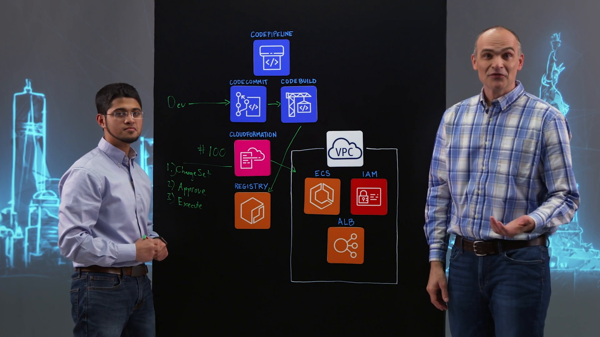
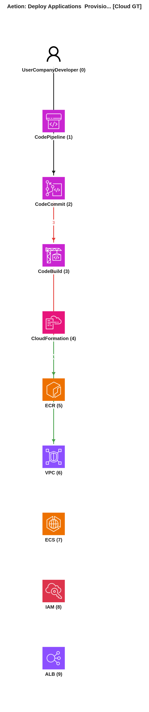
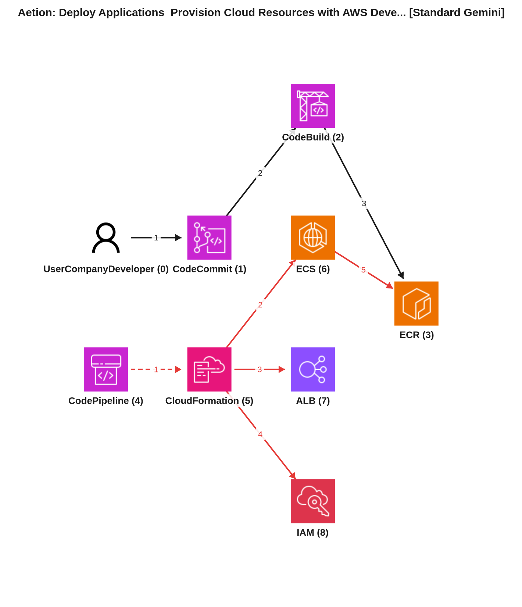
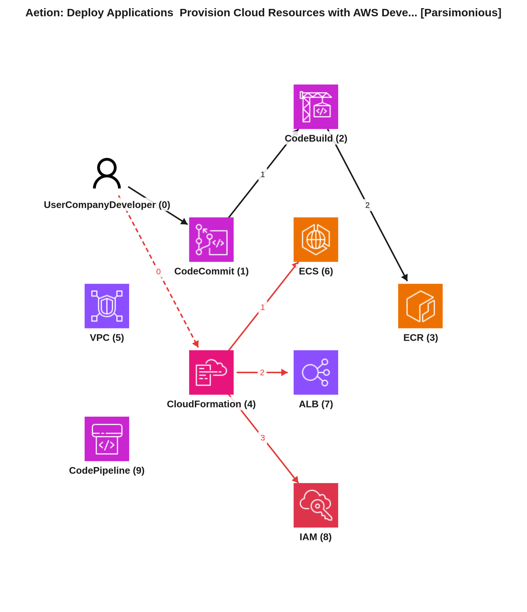

# Reporte de Comparación Cloudscape — Video 6YkguepAQuQ (Aetion: Deploy Applications Provision Cloud Resources with AWS Developer Tools)

Este reporte tiene como propósito comparar el grafo manual de referencia (Ground Truth) de la arquitectura del video 6YkguepAQuQ con los dos grafos extraídos automáticamente por inteligencia artificial: el generado por el agente estándar (Gemini Vision) y el generado por el agente simplificado o parsimonioso (Gemini Vision Parsimonioso). Se analizarán las similitudes y diferencias en la identificación de componentes (nodos) y sus interacciones (aristas), evaluando la precisión y la utilidad de cada representación.

---

## 📹 Descripción del Video
*   **ID del Video:** `6YkguepAQuQ`
*   **Título:** *Aetion: Deploy Applications Provision Cloud Resources with AWS Developer Tools*
*   **Canal:** Amazon Web Services
*   **Duración:** 06:35
*   **Resumen General:** Aetion, una empresa de análisis de atención médica, utiliza el campo de la epidemiología para proporcionar resultados basados en evidencia del mundo real. En este video, presentan una arquitectura de CI/CD (Integración Continua/Entrega Continua) que soluciona los problemas de su arquitectura heredada, que era "un poco caótica" a pesar de estar en la nube. El objetivo era agilizar todo el proceso desde que un desarrollador envía código hasta que este llega a producción.

    La solución se basa en las Herramientas para Desarrolladores de AWS. El proceso comienza cuando un desarrollador envía código (tanto de aplicación como plantillas de infraestructura de CloudFormation) a un repositorio de AWS CodeCommit. Una pipeline orquestada (implícitamente CodePipeline) toma este cambio, y AWS CodeBuild se encarga de compilar el código y generar una imagen de contenedor Docker, pagando solo por el tiempo de compilación. Esta imagen se almacena en Amazon ECR (Elastic Container Registry), quedando lista para el despliegue.

    La etapa de despliegue es gestionada por AWS CloudFormation. Aetion eligió CloudFormation no solo para desplegar la imagen de la aplicación en Amazon ECS, sino también para provisionar y gestionar componentes de infraestructura subyacentes críticos, como balanceadores de carga de aplicaciones (ALB) y roles y permisos de IAM. Para asegurar la consistencia y la estandarización en los despliegues a múltiples VPC de clientes, utilizan una única plantilla de CloudFormation como línea base, permitiendo ejecuciones paralelas para atender a numerosos clientes simultáneamente, con configuraciones únicas gestionadas mediante parámetros.

    Un mecanismo de gobernanza clave para evitar cambios accidentales en la infraestructura desplegada es un proceso de tres pasos en la etapa de CloudFormation: primero, se genera un "Change Set" que detalla los cambios propuestos; luego, una persona con los roles y permisos adecuados debe aprobar o rechazar esos cambios; finalmente, se ejecuta el Change Set para desplegar la infraestructura y la aplicación. Este enfoque garantiza que los entornos de VPC se construyan de manera consistente y cumplan con los estándares tanto de Aetion como de sus clientes, al tiempo que mantiene un proceso ágil y rápido.

---

## 🖼️ Mejor Imagen de Pizarra (Fotograma de Trabajo)
La mejor imagen seleccionada por los filtros y aprobada en el pipeline fue **`best_whiteboard.jpg`**.

### Razón de la Selección:
Este fotograma es óptimo porque muestra el diagrama arquitectónico completo en la pizarra, con todos los componentes de AWS y los flujos de datos claramente dibujados y etiquetados. Los presentadores no obstruyen significativamente elementos clave del diagrama, lo que permite una visualización clara y completa de la solución propuesta.

---

## 🗣️ Traducción de la Transcripción (Whisper a Español)
A continuación se presenta la traducción al español de la transcripción del diálogo de los presentadores:

> **Kurt:** Bienvenidos a "Esta es mi Arquitectura". Soy Kurt y hoy estamos en la ciudad de Nueva York y me acompaña Chinead de Aetion. Bienvenida al programa, Chinead.
> **Chinead:** Gracias, es un placer estar aquí.
> **Kurt:** ¿Por qué no nos cuentas sobre tu negocio?
> **Chinead:** Aetion es una empresa de análisis de atención médica y aprovechamos el campo de la epidemiología para proporcionar resultados basados en evidencia del mundo real.
> **Kurt:** Gracias por eso. Y me dijiste que ustedes encontraron una forma muy interesante de desplegar no solo sus aplicaciones, sino también la infraestructura que las acompaña, y nos trajiste tu arquitectura. ¿Qué problemas resuelve esta arquitectura para ustedes?
> **Chinead:** En realidad, resuelve bastantes problemas. Si la comparamos con nuestra arquitectura heredada, estábamos usando diferentes herramientas, estábamos en la nube, pero era un poco caótica y queríamos agilizar todo el proceso desde que un desarrollador envía código hasta que termina en producción.
> **Kurt:** ¿Así que cuando llegas a esta VPC aquí con el producto de producción desplegado, verdad?
> **Chinead:** Eso es correcto.
> **Kurt:** Entonces, ¿cómo lo hacen?
> **Chinead:** Claro. Comenzamos con un desarrollador que envía código a un repositorio de AWS llamado CodeCommit. Así que este es su desarrollador aquí y él enviará cualquier tipo de cambio al repositorio de CodeCommit. Ahora, lo que hacemos en este punto es permitir que la *pipeline* haga su magia y simplemente mueve ese *commit* a la siguiente etapa, siendo esa etapa CodeBuild. Ahora, CodeBuild es otro servicio de AWS. Nos permite iniciar un contenedor, pagar solo por la duración en que se realiza esa compilación, y podemos pasar inmediatamente a la siguiente etapa. Y CodeBuild también está controlado por el desarrollador. Entonces, si el desarrollador quisiera modificar cómo se realizó esa compilación o agregar o hacer cualquier cosa, podría hacerlo simplemente modificando el repositorio. De todos modos, al final de una compilación exitosa, CodeBuild enviará inmediatamente un contenedor al registro ECR de Amazon. En este momento, tenemos un contenedor de aplicación como una imagen dentro del registro listo para ser desplegado.
> **Kurt:** Así que ahora has construido toda la aplicación. Está ahí en el registro lista para que la despliegues.
> **Chinead:** Eso es correcto.
> **Kurt:** Bien. ¿Cómo funciona el despliegue?
> **Chinead:** Correcto. Aquí es donde las cosas se ponen un poco interesantes. De hecho, tenemos una tercera etapa que se conoce como nuestra etapa de despliegue, aprovechada a través de CloudFormation.
> **Kurt:** Bien. Teníamos múltiples opciones aquí. Podríamos haber usado CodeDeploy. Podríamos haber usado el desplegador de definiciones de tareas de ECS. Podríamos haber usado Lambda. Pero hay una razón específica por la que elegimos CloudFormation. Y eso no fue porque solo quisiéramos desplegar una imagen de aplicación en, digamos, Elastic Container Service.
> **Kurt:** O sea, no solo en ECS.
> **Chinead:** Eso es correcto. De hecho, reconocemos que nuestra aplicación tiene componentes subyacentes que se requieren en el momento de un despliegue o fuera del momento de un despliegue. Y esos elementos son el balanceador de carga de la aplicación, por ejemplo, y los roles y permisos de IAM. Y esos son solo algunos de los componentes. Pero para acomodar eso, en realidad tenemos dentro de estos repositorios de desarrolladores plantillas de CloudFormation que definen toda la infraestructura de la aplicación. Y tan pronto como la compilación termina y la imagen está dentro del registro, se inicia la parte de CloudFormation. Y esa parte de CloudFormation avanza para desplegar en una VPC, una definición de tarea de Elastic Container Service, un rol de IAM, así como un balanceador de carga de la aplicación, que en cualquier momento bajo demanda puede ser modificado por el desarrollador simplemente volviendo a la primera etapa.
> **Kurt:** Genial. Entonces, Chinead, un proceso muy optimizado. Llegas a la VPC, supongo, relativamente rápido. Esto pasa por el proceso rápidamente. Así que haces esto para muchos clientes. ¿Cómo aseguras que estos entornos en la VPC se construyan consistentemente y según tus estándares y los de tus clientes?
> **Chinead:** Correcto. Así que, de nuevo, eso en realidad se remonta a la plantilla de CloudFormation. Así que lo primero que hacemos es separar nuestros entornos de desarrollo de nuestros entornos de producción y QA de clientes. En el caso de nuestros entornos de producción, tendremos una plantilla de CloudFormation que define exactamente la línea base de cómo deben crearse estos entornos. Correcto. Y esa plantilla de CloudFormation permanece igual. Si queremos hacer una modificación, tienes que hacerla en esa única plantilla, lo que podría potencialmente afectar a todos los clientes. Sin embargo, reconocemos el hecho de que cada cliente se despliega en una VPC diferente. Entonces, ¿cómo logramos eso? ¿Cómo lo gobiernan?
> **Chinead:** Lo gobernamos simplemente creando, número uno, ejecución paralela. Así que si tenemos, digamos, 100 clientes, tendríamos etapas paralelas aquí que acomodarían hasta 100 clientes a nivel de plantilla de CloudFormation. Así que procedemos a desplegar en CloudFormation. Y CloudFormation luego irá a 100 VPC diferentes y enviará los mismos cambios. Y si hay elementos únicos como el nombre de la VPC y el clúster de ECS, eso es a través de una pequeña configuración que cada uno de ellos tiene.
> **Kurt:** Chinead, ahora tienes un mecanismo donde puedes desplegar esta plantilla de CloudFormation muchas veces para instanciar esta VPC. Pero tus desarrolladores aún podrían hacer cambios, accidentales o de cualquier otra manera, que podrían afectar la instanciación de la VPC. ¿Cuál es el mecanismo de gobernanza ahí?
> **Chinead:** Correcto. Así que, número uno, usamos una única plantilla de CloudFormation para cada despliegue de VPC que pueda tener lugar. Pero la forma en que lo gobernamos es que en realidad dividiremos esta etapa de CloudFormation en un proceso de tres pasos. El primer elemento aquí será algo llamado *change set*. Así que un *change set* básicamente nos dice cuáles son los cambios que vas a realizar como parte de este despliegue. Correcto. Y en este momento, tendremos a otra persona con los roles y permisos adecuados para aprobar o rechazar ese cambio. Y una vez que ese cambio ha sido aprobado, procederá a ejecutar el *change set* en la siguiente etapa, lo que significa que desplegará la infraestructura y la aplicación.
> **Kurt:** Así que ahora tienes un mecanismo para asegurar que siempre construyas estas piezas de componentes de la misma manera. Es ágil porque se mueve rápido a través de la infraestructura y construye imágenes consistentes para tus clientes. Chinead, muchas gracias por compartir tu patrón arquitectónico con nosotros. Y gracias por acompañarnos hoy. Y gracias por ver "Esta es mi Arquitectura". "Esta es mi Arquitectura".

---

## 📐 Redacción y Explicación del Diagrama Resultante

### 1. ¿Por qué el Grafo Manual (Ground Truth) está estructurado de esa manera?

*   **Estructura de Nodos:**
    *   `NodeID: 0, Service: UserCompanyDeveloper`: Representa al desarrollador de la empresa, quien es el actor principal que inicia los cambios.
    *   `NodeID: 1, Service: CodePipeline`: Este nodo simboliza el servicio de AWS CodePipeline, la herramienta de orquestación de la pipeline de CI/CD, aunque sus conexiones no siempre son explícitas en el texto GT, su rol de orquestador se infiere de la transcripción.
    *   `NodeID: 2, Service: CodeCommit`: Es el repositorio de AWS CodeCommit donde los desarrolladores almacenan el código fuente y las plantillas de infraestructura.
    *   `NodeID: 3, Service: CodeBuild`: El servicio de AWS CodeBuild, encargado de compilar el código y construir las imágenes de contenedor.
    *   `NodeID: 4, Service: CloudFormation`: AWS CloudFormation, utilizado para provisionar y gestionar la infraestructura.
    *   `NodeID: 5, Service: ECR`: Amazon Elastic Container Registry, el registro donde se almacenan las imágenes de contenedores Docker.
    *   `NodeID: 6, Service: VPC`: La Amazon Virtual Private Cloud, que representa el entorno de red aislado donde se despliegan las aplicaciones de los clientes.
    *   `NodeID: 7, Service: ECS`: Amazon Elastic Container Service, el servicio que ejecuta las aplicaciones en contenedores.
    *   `NodeID: 8, Service: IAM`: AWS Identity and Access Management, que gestiona los roles y permisos necesarios para los recursos y la aplicación.
    *   `NodeID: 9, Service: ALB`: El Application Load Balancer, que distribuye el tráfico entrante a las tareas de ECS.

*   **Flujos e Interacciones Clave:**
    *   `FlowID: 0, Seq: 0` (`0 -> 2`): El desarrollador (`NodeID: 0`) comienza el proceso al enviar cambios de código al repositorio de CodeCommit (`NodeID: 2`).
    *   `FlowID: 0, Seq: 1` (`2 -> 0`): CodeCommit proporciona información o estado (meta-data) de vuelta al desarrollador.
    *   `FlowID: 1, Seq: 0` (`2 -> 3`): El repositorio de CodeCommit (`NodeID: 2`) desencadena la etapa de compilación en CodeBuild (`NodeID: 3`), orquestada por la pipeline.
    *   `FlowID: 1, Seq: 1` (`3 -> 5`): CodeBuild (`NodeID: 3`), después de una compilación exitosa, empuja la imagen del contenedor de la aplicación a Amazon ECR (`NodeID: 5`).
    *   `FlowID: 1, Seq: 3` (`3 -> 2`): Se representa una interacción de meta-data de CodeBuild (`NodeID: 3`) a CodeCommit (`NodeID: 2`), lo que podría indicar que el desarrollador puede modificar la configuración de la compilación a través del repositorio, o que los logs/estado se reportan de vuelta.
    *   `FlowID: 2, Seq: 1` (`5 -> 4`): La imagen lista en ECR (`NodeID: 5`) es utilizada por CloudFormation (`NodeID: 4`) para la fase de despliegue.
    *   `FlowID: 2, Seq: 0` (`4 -> 5`): Se indica una interacción de meta-data de CloudFormation (`NodeID: 4`) con ECR (`NodeID: 5`), posiblemente para consultar información de la imagen o su estado. (Aunque la secuencia `Seq: 0` es anterior a `Seq: 1`, ambas describen interacción entre estos servicios).
    *   `FlowID: 2, Seq: 2` (`4 -> 6`): CloudFormation (`NodeID: 4`) despliega los recursos de infraestructura en la VPC del cliente (`NodeID: 6`).
    *   CloudFormation también despliega o gestiona `NodeID: 7` (ECS), `NodeID: 8` (IAM) y `NodeID: 9` (ALB) dentro de la VPC, aunque estas aristas específicas no están detalladas con `FlowID` y `Seq` en el texto del Ground Truth, sí se muestran en el diagrama visual y se infieren del `4 -> 6` y de la descripción del video.
    *   `FlowID: 2, Seq: 3` (`6 -> 4`): La VPC (`NodeID: 6`) proporciona meta-data o estado a CloudFormation (`NodeID: 4`), ya que CloudFormation gestiona los recursos dentro de ella.

### 2. ¿Por qué el Grafo Automático Estándar (Gemini Vision) está estructurado de esa manera y en qué parte del texto se basó?

*   **Mapeo de Nodos y Justificación de Flujos:**
    El modelo estándar (Service F1: 94.7%) interpreta la arquitectura de la siguiente manera:
    *   Identifica correctamente al `Developer` (`NodeID: 0`) como el iniciador del proceso.
    *   Reconoce `AWS CodeCommit` (`NodeID: 1`), `AWS CodeBuild` (`NodeID: 2`), `Amazon ECR` (`NodeID: 3`), `AWS CloudFormation` (`NodeID: 5`), `Amazon ECS` (`NodeID: 6`), `Application Load Balancer` (`NodeID: 7`) y `AWS IAM` (`NodeID: 8`) como servicios clave.
    *   A diferencia del Ground Truth textual, el modelo estándar incluye explícitamente `AWS CodePipeline` (`NodeID: 4`) como un nodo, lo cual es consistente con la mención en la transcripción: "> **Chinead:** ...permitir que la *pipeline* haga su magia...".
    *   **Flujos clave basados en el texto:**
        *   `0 -> 1` (Developer -> CodeCommit): "> **Chinead:** ...un desarrollador que envía código a un AWS repository llamado CodeCommit."
        *   `1 -> 2` (CodeCommit -> CodeBuild): El código en CodeCommit desencadena la etapa de compilación. "> **Chinead:** ...simplemente mueve ese commit a la siguiente etapa, esa etapa siendo CodeBuild."
        *   `2 -> 3` (CodeBuild -> ECR): CodeBuild construye y empuja la imagen. "> **Chinead:** ...CodeBuild enviará inmediatamente un contenedor al registro ECR de Amazon."
        *   `4 -> 5` (CodePipeline -> CloudFormation): CodePipeline orquesta el despliegue. "> **Chinead:** ...tenemos una tercera etapa... conocida como nuestra etapa de despliegue, aprovechada a través de CloudFormation." (CodePipeline se infiere como el orquestador).
        *   `5 -> 6`, `5 -> 7`, `5 -> 8` (CloudFormation -> ECS, ALB, IAM): CloudFormation despliega la infraestructura. "> **Chinead:** ...esa parte de CloudFormation avanza para desplegar en una VPC, una definición de tarea de Elastic Container Service, un rol de IAM, así como un balanceador de carga de la aplicación..."
        *   `6 -> 3` (ECS -> ECR): Se añade el flujo de ECS tirando imágenes de ECR para el despliegue. "> **Chinead:** ...tenemos un contenedor de aplicación como una imagen dentro del registro listo para ser desplegado." (Implica que ECS la usa).

*   **⚠️ Brecha Clave Detectada:**
    *   **Ausencia del nodo VPC:** A pesar de que la transcripción menciona repetidamente "VPC" como el entorno de despliegue ("llegas a esta VPC aquí", "desplegar en una VPC", "100 VPC diferentes"), el grafo estándar no incluye un nodo explícito para la `VPC`. Solo infiere que ECS, ALB e IAM se despliegan *en* algún lugar. Esto es una brecha de *recall* para un componente estructural clave.
    *   **Omisión de aristas de metadatos:** El modelo estándar omite varias de las aristas de tipo `meta` presentes en el Ground Truth textual (como `CodeCommit -> Developer`, `CodeBuild -> CodeCommit`, `VPC -> CloudFormation`), priorizando flujos de datos directos sobre interacciones de control o retroalimentación.
    *   **Inclusión del flujo de ECS a ECR:** Aunque técnicamente correcto que ECS "tira" imágenes de ECR en tiempo de ejecución, el Ground Truth textual no lo incluye explícitamente en sus aristas. La adición de esta arista por parte del modelo estándar puede ser vista como una interpretación más completa del ciclo de vida de la aplicación, pero se desvía de la especificidad del Ground Truth.

### 3. ¿Por qué el Grafo Automático Parsimonioso (Gemini Vision Parsimonioso) está estructurado de esa manera y cómo mejora el resultado?

*   **Análisis de Mejoras y Razonamiento del Agente Parsimonioso:**
    El modelo parsimonioso (Service F1: 100.0%) mejora significativamente la representación de los nodos y el mapeo de los flujos en comparación con el modelo estándar y se alinea más estrechamente con el Ground Truth manual y la intención arquitectónica descrita:
    *   **Nodos Completos y Precisos:** Logra una puntuación F1 del 100% en servicios, lo que significa que identificó todos los nodos del Ground Truth y no introdujo ninguno adicional. Esto incluye la adición clave de `VPC` (`NodeID: 5, Name: Production VPC`), lo que corrige la omisión del modelo estándar y es fundamental para entender el contexto de despliegue. También nombra explícitamente `CodePipeline` (`NodeID: 9`), que está presente en el Ground Truth visual pero no en sus aristas textuales.
    *   **Flujos Refinados y Gobernanza:** El modelo parsimonioso captura flujos esenciales y aspectos de gobernanza mencionados en la transcripción:
        *   `0 -> 4` (Developer -> CloudFormation): Se añade una arista crucial donde el `Developer` (`NodeID: 0`) aprueba el *Change Set* de `CloudFormation` (`NodeID: 4`). Esto se basa en la descripción detallada del proceso de aprobación: "> **Chinead:** ...tendremos a otra persona con los roles y permisos adecuados para aprobar o rechazar ese cambio." Esta arista es vital para entender la parte de gobernanza del despliegue.
        *   Se enfoca en las interacciones directas de la pipeline y el despliegue de infraestructura, simplificando la cadena de eventos.
    *   **Omisión del flujo de ECS a ECR (6 -> 3):** A diferencia del modelo estándar, el parsimonioso omite la arista `ECS -> ECR`. Esta omisión se justifica en un contexto parsimonioso al considerar que el objetivo principal es la pipeline de CI/CD y el despliegue. Si bien ECS consume imágenes de ECR, esta es una dependencia en tiempo de ejecución posterior al despliegue, y no una etapa directa o un artefacto de la pipeline misma que CloudFormation gestiona. Al omitirla, el diagrama se centra más estrictamente en el flujo de entrega y provisión de la arquitectura.

*   **Conclusión Comparativa:**
    La formulación parsimoniosa es superior y más representativa de un diagrama arquitectónico real en comparación con el modelo estándar. Su capacidad para identificar con precisión todos los nodos del Ground Truth, incluyendo componentes críticos como la `VPC`, la convierte en una base más sólida para el análisis arquitectónico. Además, la inclusión del flujo de aprobación del desarrollador a CloudFormation demuestra una mejor comprensión de los procesos de gobernanza descritos en la transcripción, lo que resulta en un diagrama más contextual y completo desde la perspectiva del flujo de trabajo. Aunque su Edge F1 sigue siendo moderado debido a las diferencias con las aristas de metadatos del Ground Truth textual, los flujos que incluye son más relevantes para la descripción de la arquitectura del despliegue. El enfoque parsimonioso prioriza los componentes y las interacciones que definen la topología clave y el flujo principal, evitando detalles excesivos que podrían saturar el diagrama.