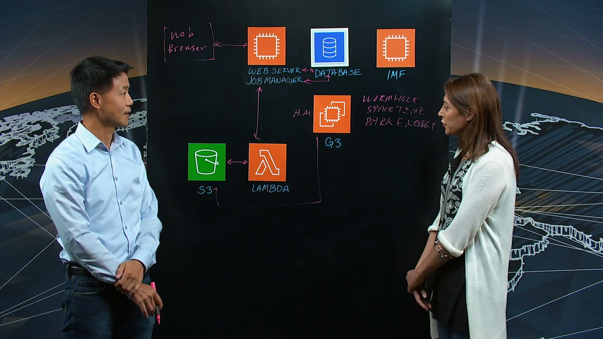
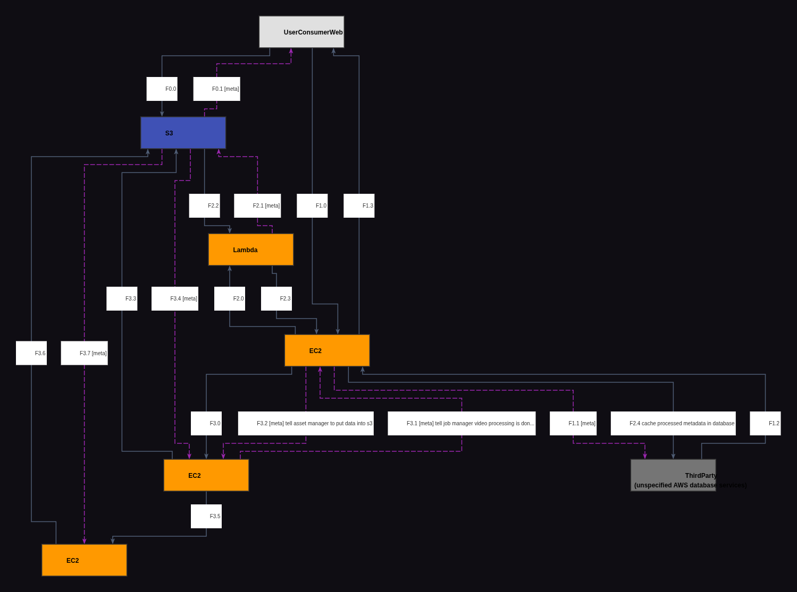
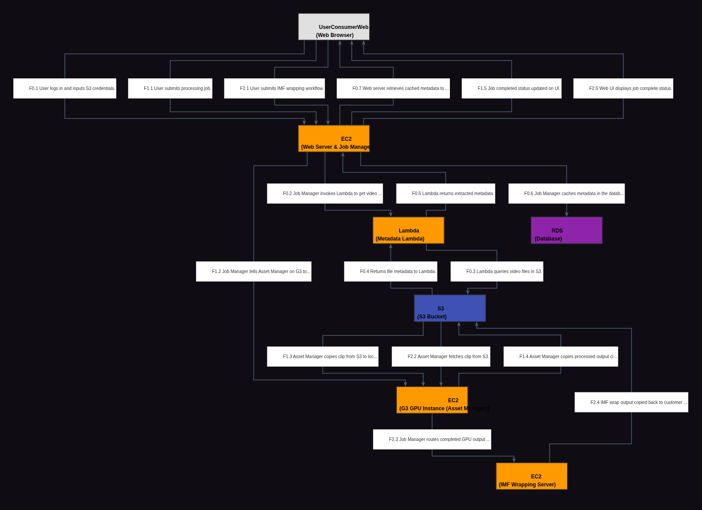

# Reporte de Comparación Cloudscape — Video BZ32w0SSAoY (Cinnafilm PixelStrings)

Este reporte detalla el análisis del video **BZ32w0SSAoY**, correspondiente a la arquitectura de **PixelStrings por Cinnafilm**, comparando su grafo manual de referencia (Ground Truth) con el grafo extraído automáticamente por el modelo Gemini Vision.

---

## 📹 Descripción del Video

* **ID del Video:** `BZ32w0SSAoY`
* **Título:** *PixelStrings by Cinnafilm: A Flexible & Scalable Platform for Video Audio Optimization & Conversion*
* **Canal:** AWS - This is My Architecture
* **Duración:** 05:48 (según transcripción / info)
* **Resumen General:** PixelStrings es una plataforma en la nube (PaaS/SaaS) desarrollada por Cinnafilm que permite optimizar y convertir audio y video profesional en tiempo real. Sus principales capacidades incluyen reajuste de fotogramas (retiming), desentrelazado de video, conversión de resolución (upscaling), reducción de ruido y retexturizado. Toda la carga pesada de codificación y procesamiento gráfico se ejecuta en clusters de instancias EC2 aceleradas por GPU (específicamente la familia G3 de AWS), mientras que la gestión de metadatos se delega a funciones serverless Lambda con herramientas como MediaInfo, y las salidas finales se empaquetan en formatos avanzados como IMF (Interoperable Master Format) requeridos por plataformas como Netflix.

---

## 🖼️ Mejor Imagen de Pizarra (Fotograma de Trabajo)

La mejor imagen seleccionada por los filtros automáticos fue **`BZ32w0SSAoY_frame_0039.jpg`** (o equivalente en el procesamiento final, guardada localmente como `best_whiteboard.jpg`).

### Razón de la Selección:
Este fotograma captura el final de la explicación arquitectónica. En este punto, la pizarra de dibujo muestra toda la topología arquitectónica de Cinnafilm terminada (con los flujos de extracción de metadatos, el procesamiento GPU G3 en paralelo, y el flujo alternativo de IMF), mientras que la oclusión física del presentador se minimiza para permitir una total legibilidad de los logos y conexiones.

---

## 🗣️ Traducción de la Transcripción (Whisper a Español)

A continuación se presenta la traducción al español de la transcripción del diálogo de los presentadores:

> "Hola, bienvenidos a This is My Architecture. Mi nombre es Andrea y estoy aquí con Al de Cinnafilm. Hola Al. Bienvenido al programa.
> 
> Gracias, Andrea. Es genial estar aquí.
> 
> Cuéntanos sobre Cinnafilm. ¿Qué hacen ustedes?
> 
> Hacemos software que procesa video para reajuste de tiempo (retiming), desentrelazado (deinterlacing), escalado (upscaling), eliminación de ruido (noise removal) y retexturizado.
> 
> Genial. Hoy vamos a hablar sobre PixelStrings. Esa es una plataforma que se ejecuta en AWS. Y puedo ver varios servicios diferentes aquí en la pizarra. Recorramos el caso de uso. ¿Qué es lo primero que sucede?
> 
> Bien. PixelStrings es un servicio que se ejecuta en AWS. Y para acceder al servicio, el usuario solo tiene que usar un navegador web regular. Recomendamos Chrome. E inician sesión. Crean una cuenta en el servidor de PixelStrings, que se ejecuta aquí en una instancia EC2. Esta es una conexión a internet normal. Y necesitan 'traer sus propios clips de video'.
> 
> Bien. Entonces uso el navegador de internet para acceder a su frontend web. ¿Interactúo luego agregando contenido? ¿O cómo sucede?
> 
> Sí. El usuario sube sus clips de entrada a un bucket de S3 que ellos mismos administran. Pero en el navegador web, necesitan ingresar sus claves de S3 para que nuestro servidor, de hecho nuestro administrador de trabajos (job manager), pueda comunicarse con el bucket de S3.
> 
> Bien. Y luego subo esos datos. ¿Cómo recuperan esa información de vuelta para el usuario desde la interfaz de usuario?
> 
> Bien. Usamos MediaInfo ejecutándose dentro de una función Lambda, AWS Lambda. Y el administrador de trabajos utiliza Lambda para obtener metadatos del bucket S3 para cada clip que esté dentro. Así que el usuario inicialmente, si ya tiene un bucket S3 configurado, digamos con 100 clips, al principio solo verá 100 clips sin metadatos. Pero cada uno o dos segundos, verán que los metadatos se van completando en el navegador porque estas llamadas ocurren en segundo plano.
> 
> Entiendo. Muy bien. Capturan los metadatos y los exponen. ¿Se almacena eso en algún lugar o sucede sobre la marcha?
> 
> Eso se almacena. Se guarda en caché dentro de una base de datos. Así que el administrador de trabajos, después de obtener los metadatos, los guarda en la base de datos. El servidor web no habla directamente con el administrador de trabajos, de hecho habla con la base de datos, y así es como ven los metadatos.
> 
> Ya veo. Ahora tengo mis datos cargados y los metadatos expuestos. Cuéntanos qué tipo de trabajo puede hacer el usuario que sube el contenido. ¿Cuál es el conjunto de cosas diferentes que se pueden hacer con la plataforma a partir de aquí?
> 
> Puedes hacer cosas como reajuste de tiempo (retiming), que llamamos Wormhole. El desentrelazado es manejado por lo que llamamos Spacetime. Y la eliminación de ruido y retexturizado son manejados por Dark Energy. Estos servicios están expuestos y todos están acelerados por GPU. El usuario en el navegador web puede decidir activar uno o más. Podrían tener todos activos en su trabajo. Definen un flujo de trabajo (workflow), incluyendo el códec de salida utilizado para el archivo de salida.
> 
> Recorramos una situación aquí. Para Wormhole, mencionaste que el cliente quiere editar el clip. ¿Qué pasa después? Si eligen hacer eso, ¿cuál es el siguiente conjunto de pasos que ocurren en este ecosistema?
> 
> Pueden seleccionar uno o más clips y uno o más flujos de trabajo por clip. Pueden ser flujos de trabajo diferentes para clips diferentes. Y luego dicen 'adelante' y los envían. Nosotros les damos un costo estimado, porque conocemos la duración de cada clip gracias a los metadatos. Les damos un estimado y les decimos: 'Esto es lo que costará, ¿de verdad quieren hacerlo?'. Ellos dicen que sí, presionan enviar y el trabajo se envía. El administrador de trabajos ahora puede enviar un trabajo a cada GPU. Todos estos trabajos pueden ejecutarse en paralelo, hasta 200 trabajos a la vez por región.
> 
> Entendido. Tienen trabajo paralelo ocurriendo aquí. Veo 'G3', sospecho que te refieres a un clúster habilitado para GPU aquí. ¿Es una suposición justa?
> 
> Sí. El procesamiento ocurre aquí. ¿Cómo se traduce eso en algo que el cliente pueda ver o tener a su disposición?
> 
> El administrador de trabajos, después de que las GPUs terminan el procesamiento y la codificación, escribe su salida en el disco local y luego la salida se escribe de vuelta en el bucket. Hay un administrador de recursos (asset manager) aquí. Debería haber mencionado que el administrador de trabajos le dice al administrador de recursos que copie el clip de entrada al disco local de la instancia G3. Y luego, cuando todo el procesamiento y la codificación de la GPU han terminado, el administrador de trabajos le dice al administrador de recursos que copie el clip de salida de regreso al bucket del cliente.
> 
> Eso tiene perfecto sentido. En esta plataforma, puedo asumir que muchos usuarios hacen esto simultáneamente. Háblanos de la escala. ¿A cuántos usuarios pueden acomodar al mismo tiempo accediendo y procesando?
> 
> El servidor web puede manejar alrededor de 100 usuarios. En realidad no lo hemos llevado al límite, pero escala bastante bien. Y 200 trabajos como límite, debido a la cantidad de instancias G3 que tenemos asignadas por región. Si nos asignaran más, podríamos escalar a más trabajos. Y siempre podríamos cambiar el servidor web a una instancia EC2 diferente para manejar más usuarios.
> 
> Entiendo. ¿Y esto viene con múltiples instancias o es individual? Háblanos de la alta disponibilidad.
> 
> En este momento es individual. Nos enfocamos en hacer que nuestro software funcione en un gran grupo de GPUs al mismo tiempo. Si una GPU falla, lo cual es muy raro porque AWS es muy confiable, pero de vez en cuando hay algún error de inicio, ocurre un tiempo de espera (timeout), el administrador de trabajos se dará cuenta y apagará esa GPU y encenderá una nueva, y el trabajo puede continuar.
> 
> Muy bien. De manera continua tienen retroalimentación de lo que realmente pasa en su clúster y se aseguran de que sea altamente disponible. Veo 'IMF'. ¿Qué significa y qué hace?
> 
> IMF significa Interoperable Master Format. Es como el paquete de cine digital (DCP), pero está destinado a ser el siguiente paso más allá de eso. Netflix anima a sus clientes a enviar clips en formato IMF, por lo que si alguien quiere publicar en Netflix, debe usar IMF.
> 
> ¿Cómo funciona ahora? La ejecución del trabajo es procesada por las instancias G3. ¿Dónde entra en juego IMF? ¿Es un paso siguiente o el servidor web se comunica directamente con el framework maestro interoperable?
> 
> Eso es seleccionado por el flujo de trabajo. En el navegador web, si el usuario quiere que la salida esté en formato IMF, hay un menú desplegable. Pueden seleccionarlo e ingresar los metadatos de IMF. Eso se envía, el administrador de trabajos sabe que es IMF, y cuando el procesamiento de la GPU y la codificación terminan, el administrador de trabajos dice: 'Oh, por cierto, este es un trabajo IMF'. No le dice al administrador de recursos que copie esa salida directamente. En cambio, envía los datos a la envoltura IMF (IMF wrapping). Se realiza el empaquetado IMF y luego el administrador de recursos copia el resultado de regreso al usuario.
> 
> Eso tiene perfecto sentido. Hablemos del alcance geográfico. ¿Es accesible para usuarios de todo el mundo?
> 
> Tenemos clústeres de GPU en EE.UU. Oeste, EE.UU. Este e Irlanda. Por lo tanto, los usuarios con buckets en esas regiones no tienen que pagar enormes costos de transferencia de salida (egress costs) porque nuestras instancias EC2 están cerca de sus buckets.
> 
> Es una gran oportunidad. ¿Hacia dónde ves que va esto? ¿Cuál es tu visión del futuro?
> 
> En el futuro agregaremos más códecs, mejor reajuste de tiempo (incluyendo de audio) y más escalabilidad. Queremos que el servidor web tenga una conmutación por error (failover) en tiempo real a otro servidor.
> 
> Excelente. Gracias, Al, por guiarnos a través de esta arquitectura. Básicamente nos has hablado de una interfaz de usuario para procesar datos en GPUs y luego devolver los archivos de salida al usuario en S3.
> 
> Sí. Muchas gracias por estar aquí.
> 
> Muchas gracias por ver. Esto es My Architecture."

---

## 📐 Redacción y Explicación del Diagrama Resultante

### 1. ¿Por qué el Grafo Manual (Ground Truth) está estructurado de esa manera?

El grafo de referencia Ground Truth (`data/cloudscape_gt/BZ32w0SSAoY.graphml`) consta de **7 nodos** diseñados de forma abstracta e interactiva:

* **Estructura de Nodos:**
  * **`UserConsumerWeb` (Node 0):** El actor final que interactúa a través de su interfaz.
  * **`EC2` (Node 1 - Web Server & Job Manager):** La instancia que centraliza las peticiones de usuario y organiza los trabajos de procesamiento en paralelo.
  * **`EC2` (Node 2 - Video Processing G3):** El host con aceleración por hardware GPU (G3) donde residen los motores Wormhole, Spacetime y Dark Energy de Cinnafilm.
  * **`EC2` (Node 3 - IMF Wrapping):** El servidor que ejecuta las herramientas para empaquetar el video final en Interoperable Master Format.
  * **`ThirdParty` (Node 4 - unspecified AWS database services):** Representa a la base de datos utilizada para almacenar en caché los metadatos de los videos del cliente.
  * **`S3` (Node 5):** El bucket de almacenamiento del cliente donde residen los archivos originales y procesados.
  * **`Lambda` (Node 6):** El servicio serverless para ejecutar de manera asíncrona la herramienta MediaInfo.

* **Flujos e Interacciones Clave:**
  * **Flujo 0 (Gestión de Archivos S3):** El usuario interactúa directamente con su S3 subiendo videos y visualizándolos (aristas 0 -> 5 -> 0).
  * **Flujo 1 (Autenticación y Carga):** El usuario se loguea en el Web Server/Job Manager (Node 1). Este consulta a la Base de Datos (Node 4) para verificar datos y le regresa la respuesta al cliente.
  * **Flujo 2 (Extracción de Metadatos asíncrona):** El Job Manager (Node 1) solicita metadatos. Invoca a `Lambda` (Node 6), que lee del bucket S3 (Node 5) usando MediaInfo y devuelve la información técnica. El Job Manager escribe y guarda estos datos en la base de datos (Node 4).
  * **Flujo 3 (Pipeline de Renderizado e IMF):** El Job Manager envía las tareas al procesador G3 GPU (Node 2). Este copia los datos desde S3 (Node 5), los procesa físicamente y, en caso de flujo IMF, los transfiere al IMF Wrapper (Node 3) para empaquetar, de donde finalmente se escriben de vuelta en el bucket S3 del usuario.

---

### 2. ¿Por qué el Grafo Automático (Gemini Vision) está estructurado de esa manera y en qué parte del texto se basó?

El grafo detectado automáticamente por Gemini reproduce exactamente la estructura de **7 nodos**, pero introduce una especialización semántica muy precisa para la base de datos y los flujos:

* **Mapeo y Sustento en el Texto de los Componentes:**
  * **Node 2 como `RDS` en lugar de `ThirdParty`:** Gemini infirió que la "database" mencionada por Al para guardar los metadatos en caché corresponde a un servicio gestionado SQL/NoSQL en la nube de AWS, traduciéndolo al icono de `RDS` (Relational Database Service). 
    * *Sustento:* *"That is stored. And it's cached inside a database. So the job manager, after it gets the metadata, it saves the metadata to the database."*
  * **Flujo de Metadatos (Lambda + MediaInfo):** Gemini conectó `Web Server` -> `Lambda` -> `S3` -> `Lambda` -> `Web Server` -> `RDS`.
    * *Sustento:* *"We use media and photo running inside AWS Lambda function... the job manager uses Lambda to get metadata from the S3 bucket from each clip... every second or two, they'll see metadata filled in in the browser... after it gets the metadata, it saves the metadata to the database."*
  * **Flujo de Copiado Local y Procesamiento GPU (G3):**
    * *Sustento:* *"The job manager tells the asset manager to copy the input clip to the local disk of the G3. And then... when all the GPU processing is done and encoding is done... copy the output clip back to the customer's bucket."*
    * Gemini representó este flujo con interacciones explícitas entre el host G3 (Node 5), el bucket S3 (Node 3) y el Job Manager (Node 1).
  * **Flujo Especializado IMF Wrapping:**
    * *Sustento:* *"IMF stands for Interoperable Master Format... when the GPU processing is done... the job manager says... this is an IMF job. It doesn't tell the asset manager to copy that output. Instead, it sends the data to IMF. IMF wrapping takes place. And then the asset manager copies the result... back to the user."*
    * Gemini implementó el desvío hacia el Nodo 6 (`IMF Wrapping Server`) antes de escribir en S3, tal como lo describe Al gráficamente.
