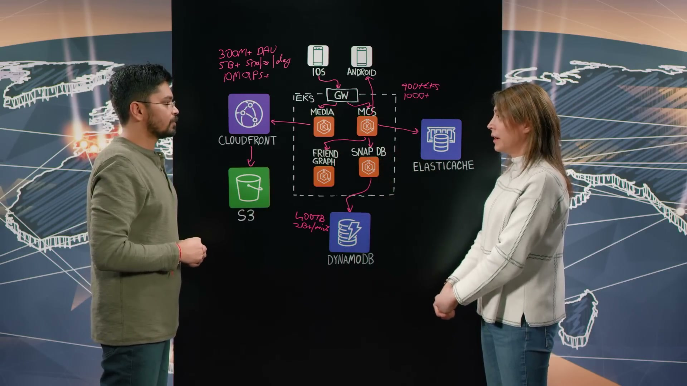
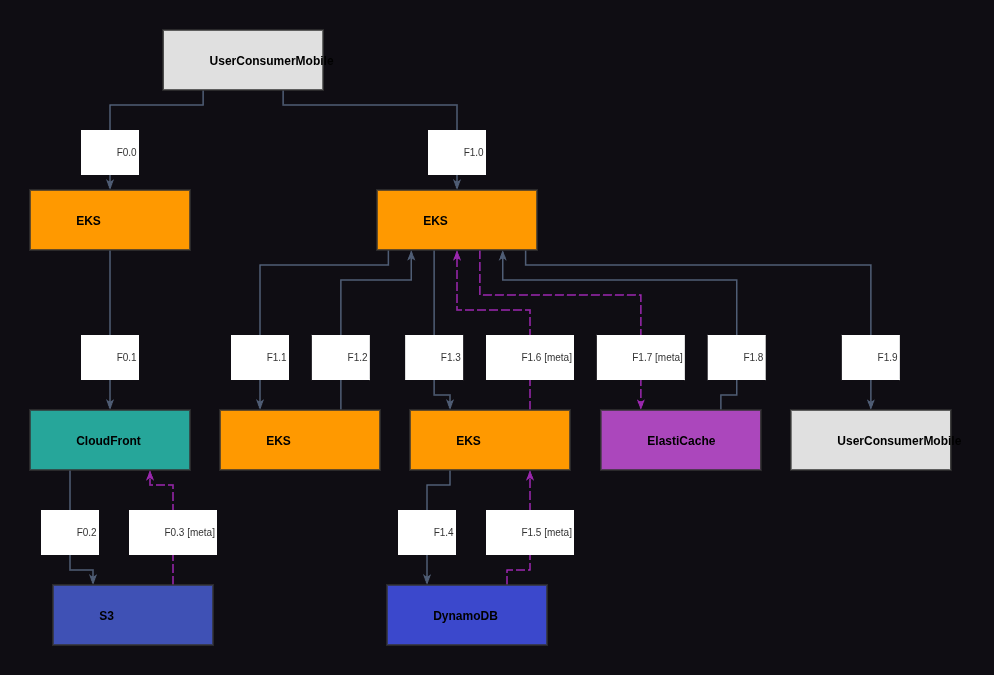
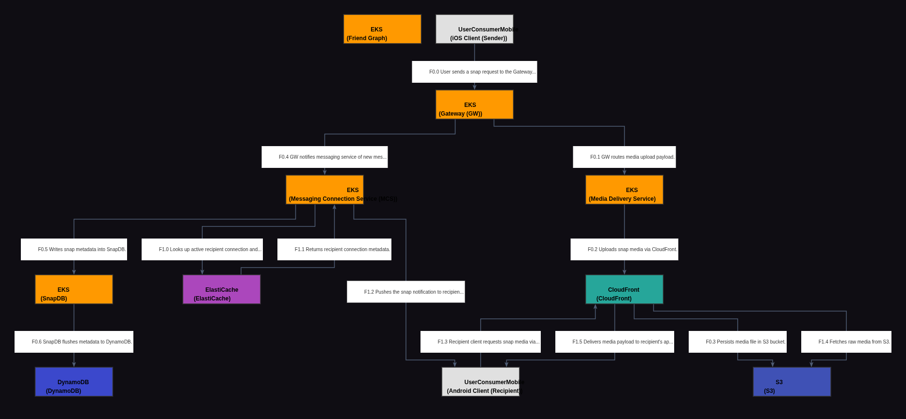

# Reporte de Comparación Cloudscape — Video Cgv0kfp_6xQ (Snapchat)

Este reporte detalla el análisis del video **Cgv0kfp_6xQ**, correspondiente a la arquitectura de **Snapchat en AWS**, comparando su grafo manual de referencia (Ground Truth) con el grafo extraído automáticamente por el modelo Gemini Vision.

---

## 📹 Descripción del Video

* **ID del Video:** `Cgv0kfp_6xQ`
* **Título:** *Snap: Journey of a Snap on Snapchat Using AWS*
* **Canal:** AWS - This is My Architecture
* **Duración:** 05:05 (según transcripción / info)
* **Resumen General:** El video detalla el ciclo de vida de un "Snap" (mensaje de imagen o video efímero) desde que es enviado por un cliente emisor (por ejemplo, en iOS) hasta que es recibido por otro cliente (por ejemplo, en Android). Debido a su escala masiva de más de **300 millones de usuarios activos diarios (DAUs)** y miles de millones de snaps al día, la infraestructura está alojada en un cluster gigante de Amazon EKS con más de 900 subclusters. El sistema se apoya en una base de datos híbrida de alto rendimiento denominada **SnapDB** (construida sobre Amazon DynamoDB con 400TB+ de datos) para control de costes y transacciones de datos efímeros, y en Amazon ElastiCache para enrutar notificaciones push ultra rápidas a través de conexiones persistentes, reduciendo la latencia de entrega en un 24%.

---

## 🖼️ Mejor Imagen de Pizarra (Fotograma de Trabajo)

La mejor imagen seleccionada por los filtros automáticos fue **`Cgv0kfp_6xQ_frame_0039.jpg`** (o equivalente en el procesamiento final, guardada localmente como `best_whiteboard.jpg`).

### Razón de la Selección:
Este fotograma final captura el diagrama completo de Snapchat expuesto en su totalidad por Saral. La pizarra contiene todos los microservicios de EKS (Gateway, Media Delivery, MCS, Friend Graph, SnapDB), el almacenamiento S3, CloudFront y las rutas de entrega y recepción completamente detalladas sin que el cuerpo del presentador interfiera visualmente con los trazos principales.

---

## 🗣️ Traducción de la Transcripción (Whisper a Español)

A continuación se presenta la traducción al español de la transcripción del diálogo de los presentadores:

> "Bienvenidos a This is My Architecture. Mi nombre es Andrea, y estoy aquí con Saral de Snap. Hola, Saral. Bienvenido al programa.
> 
> Gracias por invitarme.
> 
> Entonces, ¿qué hacen ustedes?
> 
> Snapchat es una aplicación que cientos de millones de personas en todo el mundo utilizan para comunicarse con sus amigos cercanos. Nuestro enfoque son las amistades cercanas, y permitimos la forma más rápida de comunicarse construyendo características como lentes AR, mapas, bitmoji y spotlight.
> 
> Impresionante. Hoy vamos a hablar sobre la plataforma, que reside en AWS. Estoy muy emocionada. Y veamos un flujo de trabajo de extremo a extremo, enviando un snap usando Snapchat. Esto debe ser a una escala masiva. Es decir, ¿cuántos usuarios tienen y con cuántos snaps lidian a diario?
> 
> Sí, esa es una gran pregunta. Tenemos más de 300 millones de usuarios activos diarios en la plataforma.
> 
> Bien, esa es una escala masiva. Veamos el ciclo de vida. Ya sabes, soy un usuario, uso iOS o Android. ¿Cuál es el flujo? ¿Qué es lo primero que pasa cuando envío un snap?
> 
> Correcto. Lo primero que sucede es que la aplicación iOS utiliza nuestro gateway, que es un servicio EKS que hemos construido, para hablar con el servicio de entrega de medios y enviar el snap a CloudFront y almacenarlo en S3, solo para que esté más cerca del destinatario cuando lo necesite.
> 
> Ya veo. Entiendo.
> 
> Por lo tanto, entraremos en nuestra propia base de datos llamada SnapDB, que por debajo utiliza DynamoDB.
> 
> Ya veo. ¿Qué les hizo elegir crear su propia SnapDB como interfaz para DynamoDB?
> 
> Sí. Estamos hablando de mucha escala en DynamoDB, y elegimos construir algunas características de nivel superior nosotros mismos, como transacciones, TTL, y cómo lidiar de manera eficiente con datos efímeros en nuestra propia capa. También lidiamos con la sincronización incremental de estado para no sobrecargar a DynamoDB y mantener nuestros costos controlados.
> 
> Entiendo. Así que están almacenando los metadatos en DynamoDB, ¿verdad? ¿De qué nivel de escala estamos hablando aquí?
> 
> Hablamos de 400 terabytes de datos que almacenamos en DynamoDB. E interesantemente, ejecutamos escaneos nocturnos en DynamoDB que procesan 2 mil millones de filas por minuto para hacer varias cosas en DynamoDB, incluyendo buscar sugerencias de amigos o eliminar datos efímeros también. Así que somos usuarios muy pesados de DynamoDB.
> 
> De acuerdo. Así que hacen escaneos nocturnos justos para asegurarse de que se mantengan las relaciones, los amigos y todo.
> 
> Correcto.
> 
> Bien. Hablamos de enviar un snap. ¿Qué pasa en el extremo receptor? ¿Qué sucede?
> 
> Correcto. La parte más interesante de recibir un snap es que es muy sensible a la latencia, ¿verdad? Tu amigo quiere recibir el mensaje lo antes posible. Así que lo primero que hace el servicio de mensajería es buscar un ID de conexión, un ID de servidor, en ElastiCache para obtener acceso a la conexión persistente que un servidor tiene con el cliente de Android o con cualquier cliente en el mundo, para que podamos enviar rápidamente un mensaje a ese cliente. Así que buscamos los metadatos en ElastiCache. Encontramos el servidor al que este cliente ya está conectado. Y a través de esa puerta de enlace (gateway), básicamente enviamos el mensaje al destinatario.
> 
> Ya veo. Y luego recuperan los datos también, la imagen o el video y la información de chat a través de S3.
> 
> Exactamente. Ese ID de medio se persistió durante todo el camino en ElastiCache y en DynamoDB. Así que usamos ese ID de medio para obtener la información de CloudFront.
> 
> Tiene mucho sentido. Ahora, esto es a escala masiva. ¿Nos puedes dar algunos detalles cuantitativos sobre el tamaño del clúster que ejecutan? Danos algunos números.
> 
> Sí. Tenemos más de 900 clústeres de EKS en funcionamiento. Y muchos de esos clústeres tienen más de 1000 instancias, lo que hace que esto sea, esencialmente, un gráfico de servicios realmente pesado.
> 
> Tiene perfecto sentido. ¿And cómo mantienen esto a bajo costo y alto rendimiento? Mencionaste que la latencia es sumamente importante en el lado receptor, pero también el costo.
> 
> Sí, por supuesto. En cuanto a la latencia, cuando nos mudamos a esta arquitectura, pudimos reducir la latencia mediana (P50) de envío de un snap en un 24%, lo cual tiene un impacto comercial enorme para nosotros. En segundo lugar, en términos de costo, debido a que usamos tanta infraestructura de cómputo, siempre estamos atentos a cosas como el autoescalado y el uso de los tipos de instancia correctos como Graviton para mantener bajo nuestro costo de cómputo.
> 
> Eso es fantástico. Esta es una arquitectura interesante porque manejan una cantidad masiva de datos y proponen formas innovadoras, por ejemplo, SnapDB, para reducir la latencia y realmente mejorar la experiencia del usuario, utilizando Graviton y otros para mantener los costos bajos. Gracias por guiarnos a través de esta arquitectura.
> 
> Muchas gracias.
> 
> Y gracias por ver. Esto es My Architecture."

---

## 📐 Redacción y Explicación del Diagrama Resultante

### 1. ¿Por qué el Grafo Manual (Ground Truth) está estructurado de esa manera?

El grafo Ground Truth (`data/cloudscape_gt/Cgv0kfp_6xQ.graphml`) modela el flujo con **10 nodos**, representando rigurosamente la orquestación interna de microservicios sobre la plataforma EKS:

* **Estructura de Nodos:**
  * **`UserConsumerMobile` (Sender - ID: 0) y `UserConsumerMobile` (Recipient - ID: 1):** Delimita el emisor y el receptor como dos identidades separadas para rastrear los flujos direccionales.
  * **Los 4 Microservicios EKS:** 
    * `EKS` (ID: 2 - Media Service): Encargado del upload y procesamiento de los ficheros de video/imagen.
    * `EKS` (ID: 3 - Messaging Connection Service, MCS): Mantiene conexiones Socket TCP persistentes para notificaciones inmediatas.
    * `EKS` (ID: 4 - Friend Graph): Servicio para evaluar y verificar permisos de mensajería entre amigos.
    * `EKS` (ID: 5 - SnapDB): Capa de abstracción superior a DynamoDB.
  * **`CloudFront` (ID: 6) y `S3` (ID: 7):** El pipeline CDN y storage para archivos multimedia.
  * **`ElastiCache` (ID: 8):** El almacén en memoria para resolver IDs de servidor y ruteo en tiempo real.
  * **`DynamoDB` (ID: 9):** El storage principal de metadatos persistentes.

* **Flujos e Interacciones Clave:**
  * **Flujo 0 (Carga de Media):** El emisor (iOS - Node 0) sube el payload de video al microservicio de Media (Node 2), el cual lo transfiere a S3 (Node 7) por medio del CDN Edge CloudFront (Node 6).
  * **Flujo 1 (Ciclo de Mensajería):** El emisor notifica el evento de Snap al MCS (Node 3). El MCS consulta al Friend Graph (Node 4) para verificar la amistad y luego almacena el registro en SnapDB (Node 5) que escribe en DynamoDB (Node 9). Paralelamente, el MCS recupera el ID del servidor persistente del destinatario desde ElastiCache (Node 8), despacha el push al receptor (Node 1), quien finalmente jala el video de S3 a través de CloudFront (Node 6).

---

### 2. ¿Por qué el Grafo Automático (Gemini Vision) está estructurado de esa manera y en qué parte del texto se basó?

El grafo automático extraído por Gemini Vision reproduce la topología de **11 nodos**, pero presenta una diferencia muy importante en las conexiones (aristas) debido a la omisión del ruteo del servicio Friend Graph:

* **Mapeo de Nodos y Justificación de Flujos:**
  * **Gateway (Node 2) vs Media Delivery (Node 3):** Gemini identificó al `Gateway (GW)` como el punto de entrada primario de los dispositivos móviles a EKS, basándose en la transcripción:
    * *Sustento:* *"The first thing which happens is the iOS app uses our gateway, which is an EKS service which we have built, to talk to the media delivery service..."*
    Esto divide la recepción en EKS en dos microservicios (`Gateway` y `Media Delivery`), a diferencia del Ground Truth que asume un ruteo directo del cliente al microservicio.
  * **Inyección de Metadatos mediante SnapDB (Nodos 6 y 7):**
    * *Sustento:* *"So we're going to go into our own database called SnapDB, which under the covers uses DynamoDB... build some higher level features ourselves, like transactions, TTL..."*
    Gemini mapeó correctamente la conexión del MCS (Node 8) a SnapDB (Node 6) y este finalmente a DynamoDB (Node 7).
  * **Resolución y Envío de Conexión en ElastiCache (Nodo 9):**
    * *Sustento:* *"So the first thing the messaging service does is it looks up a connection ID, a server ID from ElastiCache to get access to the persistent connection... push a message to that client... and through that gateway, we basically send the message to the recipient."*
    Se mapea de forma exacta mediante la arista entre MCS (Node 8) y ElastiCache (Node 9), y el push resultante al receptor (Node 1).

* **⚠️ Brecha Clave Detectada (Friend Graph - Nodo 10):**
  * Gemini extrajo la existencia física del componente `Friend Graph` (Node 10) porque aparece rotulado en la pizarra y se le menciona en la transcripción (para realizar escaneos nocturnos y recomendaciones), pero **no generó conexiones o aristas asociadas a él**. En el Ground Truth, este nodo tiene llamadas activas desde el MCS para validar que el emisor tenga permisos antes de guardar y procesar el snap.
