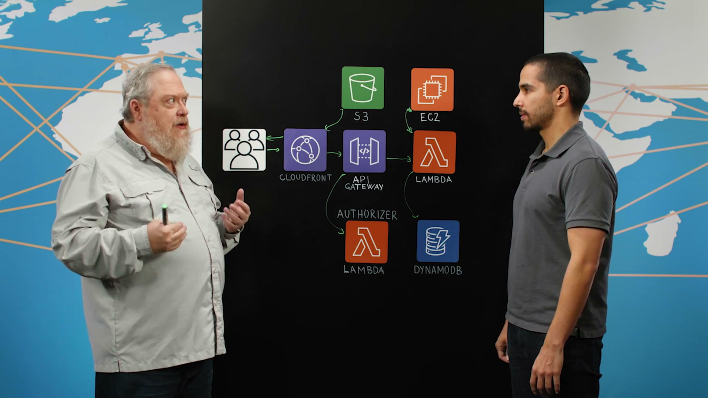
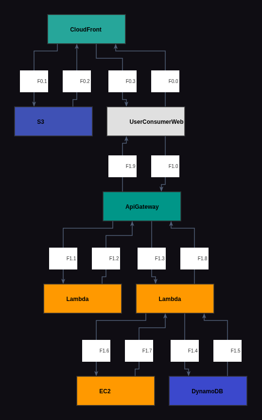
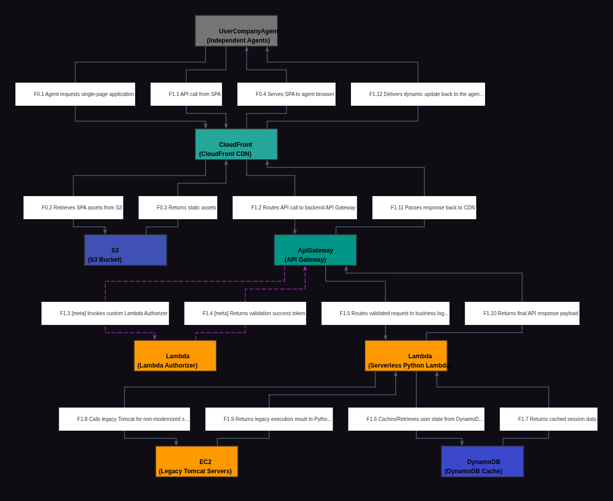

# Reporte de Comparación Cloudscape — Video wjtSHyENv0I (Main Street America Insurance)

Este reporte detalla el análisis del video **wjtSHyENv0I**, correspondiente a la arquitectura de **Main Street America Insurance (American Family Group)**, comparando su grafo manual de referencia (Ground Truth) con el grafo extraído automáticamente por el modelo Gemini Vision.

---

## 📹 Descripción del Video

* **ID del Video:** `wjtSHyENv0I`
* **Título:** *Main Street America Insurance: The Independent Agent Portal, Breaking up the Monolith*
* **Canal:** AWS - This is My Architecture
* **Duración:** 04:22 (según transcripción / info)
* **Resumen General:** El video expone una estrategia pragmática de modernización y migración gradual de una aplicación web monolítica en Java (que corría en servidores Tomcat on-premise con balanceo de carga) hacia una arquitectura serverless en AWS escrita en Python. En lugar de hacer una migración total desde el inicio ("big bang"), el equipo utiliza el patrón **Strangler Fig (Higo Estrangulador)**: mantienen el monolito EC2 para funciones antiguas (como gestión de usuarios) y migran o crean nuevas características directamente en AWS Lambda. Gracias a esta arquitectura serverless, lograron apagar 25 servidores locales, incrementar la satisfacción de sus agentes en un 25% y atraer un 10% más de usuarios activos.

---

## 🖼️ Mejor Imagen de Pizarra (Fotograma de Trabajo)

La mejor imagen seleccionada por los filtros automáticos fue **`wjtSHyENv0I_frame_0027.jpg`** (o equivalente en el procesamiento final, guardada localmente como `best_whiteboard.jpg`).

### Razón de la Selección:
Este fotograma al final del video ofrece una captura limpia y de alta calidad del diagrama de la pizarra una vez finalizada la explicación por parte de Gerald. Muestra claramente la interacción híbrida entre la nueva pila serverless (S3, CloudFront, API Gateway, Lambda, DynamoDB) y el antiguo monolito Tomcat (EC2), con el presentador situado al lado para no obstruir los componentes principales.

---

## 🗣️ Traducción de la Transcripción (Whisper a Español)

A continuación se presenta la traducción al español de la transcripción del diálogo de los presentadores:

> "Bienvenidos a This is My Architecture. Soy Gerardo y me acompaña hoy Gerald de American Family Group. Bienvenido Gerald.
> 
> Gracias por invitarme, señor.
> 
> Entonces, Gerald, ¿qué es American Family Group?
> 
> American Family Group es la empresa matriz de varias compañías de seguros, una de las cuales es Main Street America. Trabajo para American Family Group y la arquitectura de la que estamos hablando es para Main Street America. Es para agentes independientes.
> 
> Bien, genial. Escuché que están en medio de la migración y transformación de una aplicación heredada (legacy) y que está sucediendo mientras hablamos.
> 
> Sí, estamos modernizando esta aplicación mientras hablamos.
> 
> Eso es bueno. ¿Puedes guiarme a través de algunos de los componentes y lo que han modernizado hasta ahora?
> 
> Claro. A medida que avancemos, hablaré de cuáles son. Bueno, los agentes entran y solicitan la aplicación de página única (Single Page Application - SPA). Hemos modernizado eso. Solía estar en un Apache. Ahora se sirve desde un bucket de S3 a través de CloudFront a la aplicación.
> 
> Genial.
> 
> Luego, cuando hacen llamadas al backend, solían ir a unos servidores Tomcat locales con balanceo de carga que ejecutaban JavaScript. Ahora ingresan a un API Gateway. Lo primero que hace API Gateway es usar un Lambda Authorizer moderno para validar que tengan acceso. Luego, realiza las llamadas a esta Lambda aquí, que es una Lambda Python serverless, por lo que puede escalar hacia arriba y hacia abajo fácilmente. Esa Lambda en particular luego decide... hemos modernizado moviendo algunas de las funciones a las Lambdas en la pila serverless, pero todavía no hemos movido toda la aplicación. Así que, para algunas cosas, llama aquí, que llama de vuelta allá.
> 
> Bien. Entonces, ¿algunas de las funcionalidades todavía se encuentran en la aplicación Tomcat heredada?
> 
> Sí, así es, señor.
> 
> ¿Puedes darme algunos ejemplos de las funcionalidades que todavía están allí y qué se ha movido al mundo serverless?
> 
> Bueno, cosas como la gestión de usuarios todavía están allí porque aún no hemos tenido que moverlas. Movemos cosas cuando hay un cambio de características nuevo; todo lo nuevo se implementa en la pila serverless. Si hay mejoras significativas en una función, también se migran y se mueven a una pila Python serverless más moderna. Y finalmente, por supuesto, los temidos errores (bugs). Si hay un error significativo, no uno de una o dos líneas, sino algo importante, esa parte del código se moderniza. Así que, poco a poco, estamos 'estrangulando' a este Tomcat.
> 
> Oh, eso es genial. Eso es genial. Así que, de estos componentes, todavía nos falta hablar de esto.
> 
> Ah, sí.
> 
> Entonces, ¿qué es este tiempo de espera (cache) de DynamoDB?
> 
> Bueno, DynamoDB se utiliza para almacenar y almacenar en caché la información del usuario. Cuando entra un usuario, la guardamos en caché. Y lo hacemos en DynamoDB por un par de razones. Primero, la función Lambda: puedes golpear otra instancia de la Lambda la próxima vez que hagas una llamada de API. Así que no podemos guardarlo en caché localmente en la máquina. Esta base de datos DynamoDB es regional. Entonces, todo está en la región. De esta manera, si una de estas Lambdas se está ejecutando en la Zona de Disponibilidad A y otras en la B, ambas pueden acceder a esa información en caché. And finalmente, por supuesto, sé que nunca sucede, pero si la Zona de Disponibilidad A se cayera, las que se ejecutan en la B pueden acceder a ella sin interrupciones.
> 
> Sí, eso tiene sentido. Eso tiene sentido. ¿Han comenzado a ver algunos de los beneficios de la modernización por la que están pasando?
> 
> De hecho, sí. Primero, hemos podido apagar 25 servidores locales (on-premise). También hemos visto aumentar la satisfacción de nuestros usuarios en un 25% respecto a lo que solía ser. Y debido a esa satisfacción de los usuarios, los agentes están entusiasmados con esto y hablan con sus compañeros diciendo: 'Tienes que darle una nueva oportunidad a esa aplicación'. Así que hemos visto un 10% de nuevos usuarios ingresando, lo que nos está vendiendo más pólizas. Y por último, por supuesto, usar Lambdas y demás es mucho más barato que ejecutar un montón de servidores locales.
> 
> Muchas gracias por compartir esta gran historia de modernización con nosotros.
> 
> Gracias por recibirme y permitirme presentarla.
> 
> Y gracias por ver. Esto es Markitecture. Nos vemos la próxima vez.
> 
> Nos vemos la próxima vez."

---

## 📐 Redacción y Explicación del Diagrama Resultante

### 1. ¿Por qué el Grafo Manual (Ground Truth) está estructurado de esa manera?

El grafo Ground Truth (`data/cloudscape_gt/wjtSHyENv0I.graphml`) representa el flujo con **8 nodos** y captura fielmente la transición serverless-monolito:

* **Estructura de Nodos:**
  * **`UserConsumerWeb` (Node 7):** Representa a los agentes independientes que usan la aplicación web.
  * **`CloudFront` (Node 0) y `S3` (Node 4):** La capa CDN y storage que hospeda los assets estáticos de la aplicación moderna (Single Page Application - SPA).
  * **`ApiGateway` (Node 1):** Punto de entrada unificado para todas las APIs de backend.
  * **`Lambda` (Node 2 - Auth):** Un Lambda Authorizer dedicado para validar permisos antes de procesar cualquier llamada.
  * **`Lambda` (Node 3 - Python Business Logic):** La función Lambda que contiene la lógica de negocio moderna.
  * **`DynamoDB` (Node 6):** Almacenamiento regional para guardar en caché los metadatos y estados de sesión del usuario.
  * **`EC2` (Node 5 - Legacy Tomcat):** Los servidores Tomcat on-premise heredados que ejecutan la funcionalidad que aún no ha sido migrada.

* **Lógica del Grafo de Referencia:**
  * **Flujo Estático (Flow 0):** El usuario solicita la SPA al CDN CloudFront (seq 0), el cual recupera y devuelve los archivos desde el bucket S3 de origen (seq 1 y 2) para entregárselos al navegador del cliente (seq 3).
  * **Flujo Dinámico/API (Flow 1):** El usuario inicia una llamada API directo a API Gateway (seq 0). El gateway delega primero a la Lambda de Autorización (seq 1 y 2), y tras validar la sesión, enruta la petición al Lambda de lógica Python (seq 3). Este Lambda interactúa asíncronamente con DynamoDB (seq 4 y 5) para leer la sesión del usuario. Si la función requerida no está modernizada, el Lambda hace un proxy HTTP contra el servidor Tomcat heredado (seq 6 y 7). Por último, retorna la respuesta a través del API Gateway (seq 8) al usuario final (seq 9).

---

### 2. ¿Por qué el Grafo Automático (Gemini Vision) está estructurado de esa manera y en qué parte del texto se basó?

El grafo extraído por Gemini Vision es conceptualmente idéntico (cuenta con **8 nodos** y el mismo mapeo funcional), con una pequeña variación de ruteo de red en las APIs de frontend:

* **Mapeo de Nodos y Justificación en el Texto:**
  * **Migración de S3 y CloudFront (Nodos 1 y 2):**
    * *Sustento:* *"Well, the agents come in and they request the single page application. We've modernized that. It used to be on an Apache. Now it's served up from an S3 bucket through a CloudFront to the application."*
    Gemini representa de forma impecable el Flow 0 de distribución de la Single Page Application (SPA).
  * **Lambda Authorizer y API Gateway (Nodos 3 y 4):**
    * *Sustento:* *"Now they come into an API gateway. The first thing that API gateway is use a modern Lambda authorizer to validate that they do have access."*
    Este diálogo soporta exactamente las aristas secuenciales 3 y 4 de validación de tokens entre API Gateway y Lambda Authorizer.
  * **Lógica Serverless Python e Integración Tomcat (Nodos 5 y 6):**
    * *Sustento:* *"Then, it makes the calls to this Lambda here, which is a serverless Python Lambda... for some things, it calls up to here [Tomcat], who calls back down there."*
    Gemini mapeó la comunicación bidireccional entre la función Lambda Python y los servidores legacy EC2 Tomcat para funciones como la administración de usuarios.
  * **Caché en DynamoDB Regional (Nodo 7):**
    * *Sustento:* *"Well, the DynamoDB is used for storing, caching the user information... This DynamoDB is a regional one... if one of these Lambdas is running in Availability Zone A and others in B, they can both access that cache..."*
    Se mapea en el grafo automático como el almacenamiento `DynamoDB Cache` conectado a la Lambda de negocio (Node 5).

* **Diferencia de Ruteo Detectada:**
  * En el **Grafo de Ground Truth (GT)**, el usuario realiza las llamadas de API dinámica directamente hacia el nodo `ApiGateway`.
  * En el **Grafo Automático**, Gemini ruteó el Flow 1 haciendo que el dispositivo del usuario (`UserCompanyAgent`) llame primero a `CloudFront (CDN)`, y sea este CDN el que enrute la petición hacia el `ApiGateway` (seq 2 del Flow 1). Esta es una diferencia menor de red que refleja un backend donde CloudFront actúa también como proxy inverso de APIs (comportamiento muy común en arquitecturas reales de AWS).
