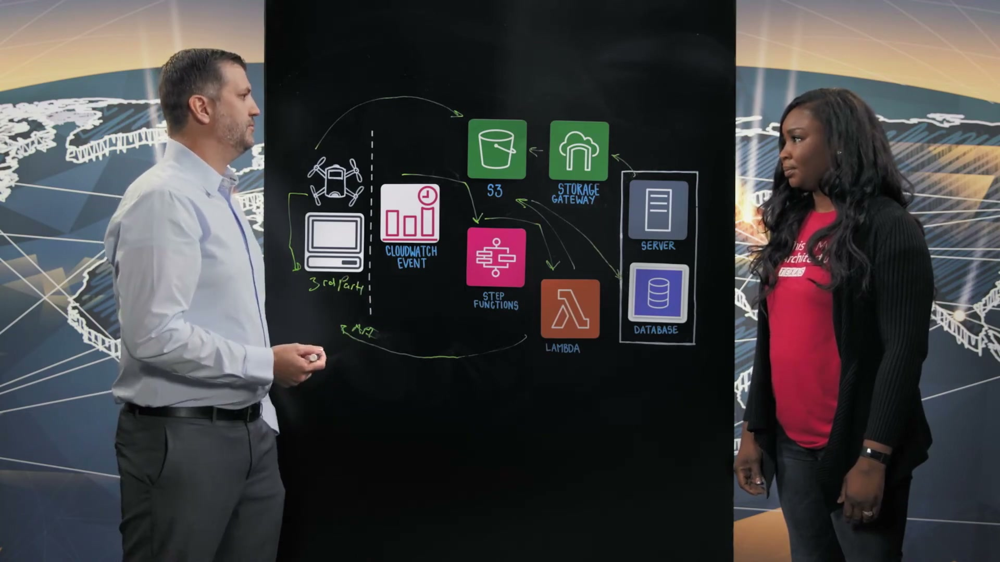
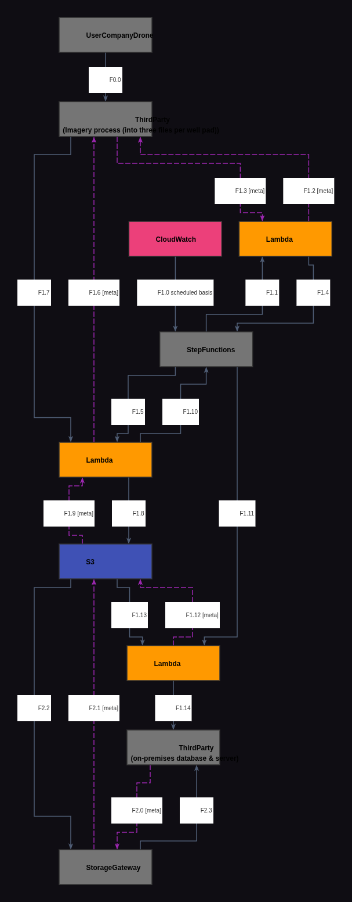
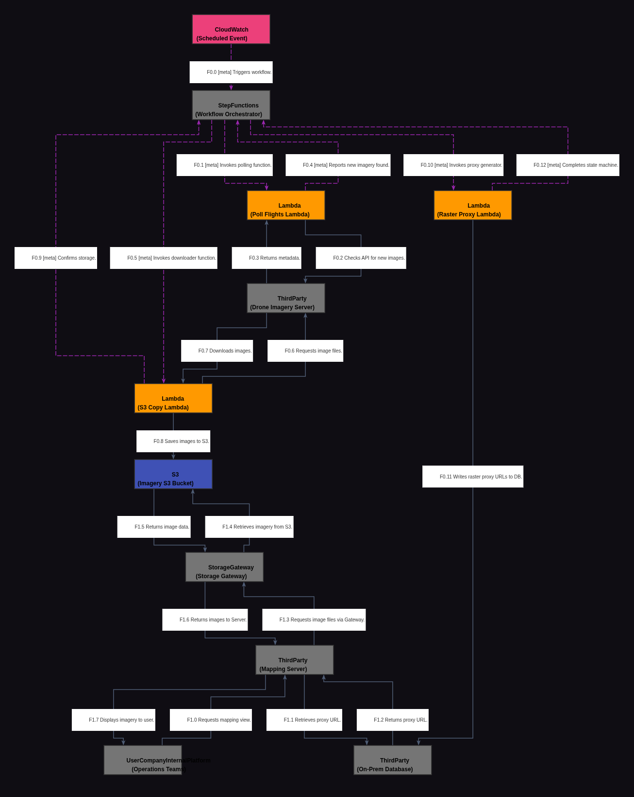

# Reporte de Comparación Cloudscape — Video ww5fiygF6eg (Marathon Oil)

Este reporte detalla el análisis del video **ww5fiygF6eg**, correspondiente a la arquitectura de **Marathon Oil**, comparando su grafo manual de referencia (Ground Truth) con el grafo extraído automáticamente por el modelo Gemini Vision.

---

## 📹 Descripción del Video

* **ID del Video:** `ww5fiygF6eg`
* **Título:** *Marathon Oil: Automating Drone Image Processing to Monitor Equipment Health*
* **Canal:** AWS - This is My Architecture
* **Duración:** 03:50 (según transcripción / info)
* **Resumen General:** Marathon Oil es una corporación energética estadounidense que monitorea rutinariamente la salud de sus plataformas de pozos (well pads) mediante el uso de drones operados por pilotos licenciados en campo. El video describe una arquitectura serverless que automatiza por completo el procesamiento y mapeo de las imágenes capturadas. El pipeline descarga asíncronamente las imágenes procesadas por un tercero (ortomosaicos, DTM y DEM) hacia Amazon S3 usando Step Functions y funciones AWS Lambda. Posteriormente, otra función Lambda indexa las imágenes creando proxies de ráster (enlaces lógicos) en la base de datos local de la compañía. De esta manera, el software de mapas on-premise puede consumir las imágenes almacenadas en S3 a través de AWS Storage Gateway de forma transparente, sin necesidad de reescribir la aplicación legacy.

---

## 🖼️ Mejor Imagen de Pizarra (Fotograma de Trabajo)

La mejor imagen seleccionada por los filtros automáticos fue **`ww5fiygF6eg_frame_0021.jpg`** (o equivalente en el procesamiento final, guardada localmente como `best_whiteboard.jpg`).

### Razón de la Selección:
Este fotograma al final del video ofrece una captura completa e ideal del diagrama arquitectónico dibujado por Mark. Muestra con excelente nivel de contraste y enfoque la totalidad del flujo de ingesta de drones de terceros, la orquestación serverless (Step Functions, Lambdas, S3) y la integración híbrida (Storage Gateway y servidores de mapas locales), con el presentador parado en una posición que no genera oclusión en los componentes.

---

## 🗣️ Traducción de la Transcripción (Whisper a Español)

A continuación se presenta la traducción al español de la transcripción del diálogo de los presentadores:

> "Hola, bienvenidos a This is My Architecture. Soy Jennifer y estoy aquí con Mark de Marathon Oil.
> 
> Hola Mark, gracias por acompañarnos hoy.
> 
> Hola Jennifer, un placer estar aquí.
> 
> ¿Podrías contarnos un poco sobre Marathon Oil?
> 
> Sí, somos una empresa de exploración y producción independiente y responsable, con profundas raíces en la energía estadounidense.
> 
> Genial, veo un dron aquí. ¿Podrías guiarnos a través de esta arquitectura y cómo se utiliza para resolver tu problema de negocio?
> 
> Sí, rutinariamente monitoreamos nuestras plataformas de pozos (well pads). En el pasado lo hacíamos a través de personas y ahora nos hemos mudado a drones. Estos drones son volados por pilotos terceros licenciados que van a cada una de nuestras plataformas de pozos de manera rutinaria. Una vez que toman esas imágenes, las cargan en un software de terceros que procesa todas las imágenes y crea tres archivos separados por plataforma de pozo. Esos tres archivos de imagen son: uno, un ortomosaico, que es una vista de arriba hacia abajo de alta resolución de la plataforma del pozo; también obtenemos un modelo digital de terreno (DTM) y un modelo digital de elevación (DEM).
> 
> Entonces, ¿qué sucede cuando los drones capturan estas imágenes?
> 
> Sí, una vez que las imágenes se crean y se almacenan en ese servidor de terceros, aquí es donde la arquitectura de AWS toma el control. El primer evento que tenemos es un evento de CloudWatch que se ejecuta de forma programada. Este evento de CloudWatch llama a una Step Function, y esa Step Function consta de tres funciones Lambda separadas. La primera función Lambda va a este software de terceros a través de una API y determina si hay nuevas imágenes y nuevos vuelos disponibles. Si encuentra un nuevo vuelo o una nueva imagen, llamará a una segunda función Lambda que toma esas imágenes del tercero y las almacena en un bucket de S3 en nuestro entorno.
> 
> Entonces, ¿qué sucede después de que estas imágenes están en S3?
> 
> Sí, necesitamos llevarlas a nuestro software de mapas local (on-premise). El software de mapas local no puede leer directamente de S3. Por lo tanto, necesitamos llamar a una función Lambda separada que toma estas imágenes de S3 y crea lo que se llama un 'raster proxy' (proxy de ráster). Este proxy de ráster sirve como una especie de URL para que este servidor entienda cómo salir y obtener esas imágenes. Estos proxies de ráster se almacenan en la base de datos de los servidores locales. Y a partir de ahí, si soy un usuario y quiero ver estas imágenes, accedo al software de mapas, que a través de un Storage Gateway saldrá, encontrará esos archivos de imagen y los mostrará al usuario final.
> 
> De acuerdo. Entonces, para tus servidores locales, ¿tuviste que cambiar la aplicación para aprovechar Storage Gateway?
> 
> No. Esa tercera función Lambda que estamos usando es la que hace eso por nosotros. Crea la URL que el servidor puede entender, llamada proxy de ráster, lo que permite que el software local lea directamente desde el bucket de S3 a través de Storage Gateway.
> 
> Entonces, ¿qué sucede después de que estos archivos de índice están en S3? ¿Cómo aprovechan estos archivos tus usuarios finales internos?
> 
> Sí, tenemos un equipo de mantenimiento y varios otros equipos de operaciones que aprovechan estas imágenes por diversas razones. Realmente, es para identificar cualquier problema con el equipo o ver si necesitamos hacer mantenimiento preventivo, y obtener un control de salud general de la plataforma de pozo en sí misma.
> 
> Gracias, Mark, por guiarnos a través de esta arquitectura. Ha sido realmente interesante aprender cómo Marathon Oil utiliza la arquitectura serverless para procesar las imágenes de tus drones y también poder proporcionar un monitoreo automático de tus equipos de salud.
> 
> Y gracias por ver. Esto es My Architecture.
> 
> Gracias."

---

## 📐 Redacción y Explicación del Diagrama Resultante

### 1. ¿Por qué el Grafo Manual (Ground Truth) está estructurado de esa manera?

El grafo Ground Truth (`data/cloudscape_gt/ww5fiygF6eg.graphml`) describe el pipeline mediante **10 nodos**:

* **Estructura de Nodos:**
  * **`UserCompanyDrone` (Node 0):** Representa a los pilotos en campo que vuelan físicamente los drones.
  * **`ThirdParty` (Node 1 - Procesamiento Externo):** El software de terceros que genera las ortofotos, DTM y DEM iniciales.
  * **`ThirdParty` (Node 2 - on-premises database & server):** Agrupa en un solo nodo el servidor de mapas local de Marathon Oil y su base de datos relacional.
  * **`CloudWatch` (Node 3):** Evento programado (cron) que despierta al pipeline de AWS.
  * **`S3` (Node 4):** El almacén en la nube para resguardar las imágenes y capas geográficas.
  * **`StorageGateway` (Node 5):** Dispositivo virtual/físico para permitir que el servidor on-prem acceda a S3 montándolo como almacenamiento de red.
  * **`StepFunctions` (Node 6):** La máquina de estados que coordina secuencialmente las tareas.
  * **Los 3 Microservicios Lambda:**
    * `Lambda` (ID: 7): Consulta al software de terceros si existen vuelos nuevos.
    * `Lambda` (ID: 8): Descarga los archivos multimedia del software de terceros a S3.
    * `Lambda` (ID: 9): Lee el objeto de S3, calcula la ruta lógica "raster proxy" y la escribe en el servidor local.

* **Flujos e Interacciones Clave:**
  * **Flujo 0 (Operación Física):** Los drones (Node 0) graban y cargan las capturas al software de procesamiento de terceros (Node 1).
  * **Flujo 1 (Ciclo Serverless de Ingesta):** CloudWatch (Node 3) despierta a Step Functions (Node 6). Este invoca al Lambda 1 (Node 7) para consultar la API de terceros (Node 1). Si hay novedades, invoca al Lambda 2 (Node 8) para descargar los archivos de video e imagen desde el servidor de terceros y subirlos a S3 (Node 4). Por último, Step Functions invoca al Lambda 3 (Node 9) el cual genera el raster proxy en base al objeto S3 y escribe este proxy directamente en el servidor local de mapas y su BD (Node 2).
  * **Flujo 2 (Acceso de Usuario):** El servidor local (Node 2) mapea los proxies de ráster y los utiliza para solicitar los archivos a S3 a través del Storage Gateway (Node 5), entregándole la visualización final a los ingenieros de Marathon Oil.

---

### 2. ¿Por qué el Grafo Automático (Gemini Vision) está estructurado de esa manera y en qué parte del texto se basó?

El grafo de Gemini Vision contiene **11 nodos** y sigue fielmente la narrativa, revelando diferencias estructurales interesantes:

* **Mapeo de Nodos y Justificación en el Texto:**
  * **Separación de Servidor de Mapas y Base de Datos On-Prem (Nodos 8 y 9):** A diferencia del Ground Truth que unificó el software y la BD locales, Gemini los extrajo de manera independiente:
    * *Sustento:* *"These raster proxies are stored in the local servers database. And from there, if I'm a user... I hit the mapping software, which via a storage gateway will come out, find those image files..."*
    Gemini consideró que el `Mapping Server` (Node 8) y la `On-Prem Database` (Node 9) interactúan entre sí antes de llamar a Storage Gateway, lo cual representa con mayor fidelidad la física real de la red on-premise descrita por Mark.
  * **El triple Lambda orquestado por Step Functions (Nodos 2, 3, 4 y 5):**
    * *Sustento:* *"This cloud watch event is calling a step function, and that step function consists of three separate Lambda functions. The first... determines if there's new images... it will call a second... which stores them in an S3... we need to call a separate Lambda... creating what's called a raster proxy..."*
    Gemini generó de forma secuencial exacta las llamadas coordinadas por Step Functions para cada Lambda, conectando cada una con sus respectivas APIs de terceros, S3 y la base de datos de Marathon.

* **Diferencia Clave y Omisión:**
  * **Omisión de los Drones en Campo (`UserCompanyDrone`):** Gemini comenzó su grafo directamente desde la API del servidor de terceros (`ThirdParty` / `Drone Imagery Server` - Node 0) donde se alojan las imágenes ya procesadas. Omitió el nodo inicial de "Piloto/Dron" en campo. Esta omisión se debe a que la arquitectura de software puro en la nube inicia en el servidor externo y el diagrama de la pizarra sitúa a los drones como un elemento meramente introductorio.
  * **Modelado del Usuario Operacional (Node 10):** Gemini inyectó el nodo de `Operations Teams` en el extremo del flujo (Flow 1) para representar al usuario final que accede al software de mapas.
    * *Sustento:* *"So we have a maintenance team and various other operations teams that leverage these images... to identify any issues with equipment..."*
