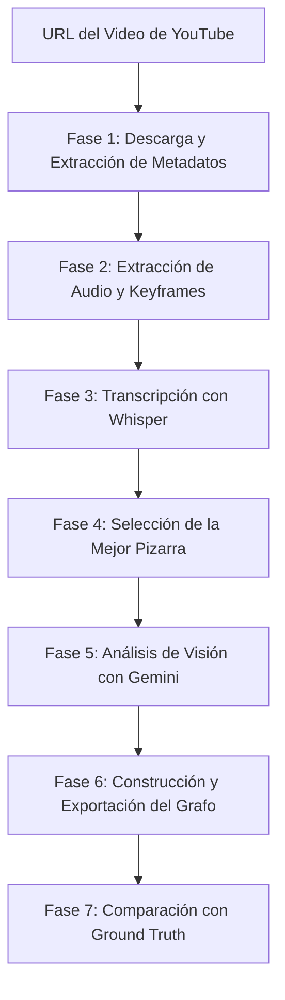

# Documentación General del Proyecto: Cloud Architecture Extractor

Este documento describe la estructura completa del proyecto, el pipeline del sistema y el pseudocódigo detallado de cada archivo de ejecución y script en el repositorio.

---

## 1. Pipeline General del Sistema

El sistema es un pipeline automatizado para extraer diagramas de arquitectura en la nube (formato GraphML) a partir de videos de YouTube de la serie *"This is My Architecture"* de AWS. El flujo de trabajo completo se divide en las siguientes fases:



### Detalle de las fases del Pipeline:
1. **Descarga (`downloader.py`)**: Utiliza `yt-dlp` para descargar el video (`.mp4`) en la carpeta `data/raw/` y sus metadatos (`.info.json`).
2. **Procesamiento de Medios (`extractor.py`)**:
   * Convierte el audio del video a formato WAV (16 kHz, mono) para un reconocimiento óptimo por Whisper.
   * Extrae fotogramas (keyframes) en formato JPEG a un intervalo configurable (por defecto cada 10 segundos).
3. **Transcripción (`transcriber.py`)**: Ejecuta un modelo local de OpenAI Whisper acelerado por GPU (CUDA) para transcribir el audio, generando segmentos con marcas de tiempo.
4. **Selección del Fotograma Óptimo (Filtros de Segunda Capa)**:
   * **Filtro de Contorno/Pizarra (`pizarra_filter.py`)**: Filtra y selecciona solo los fotogramas en primer plano donde se muestre la pizarra oscura, basándose en el porcentaje de píxeles oscuros (umbral adaptativo según la antigüedad del video).
   * **Filtro de Oclusión (`pizarra_occlusion_filter.py`)**: Analiza la presencia física de los presentadores en la zona central de la pizarra y selecciona el fotograma que minimiza el bloqueo visual (menor oclusión).
   * **Filtro de Template Matching (`pizarra_template_matching_transcript.py`)**: Utiliza plantillas de logotipos oficiales de AWS y las palabras clave mencionadas en la transcripción de Whisper para buscar coincidencias. Elige el fotograma que contenga la mayor variedad de logotipos visibles y libres de obstrucción.
5. **Extracción y Visión (`vision_analyzer.py`)**: Envía el fotograma seleccionado (priorizando el de menor oclusión `best_whiteboard.jpg`) junto con la transcripción a la API de Gemini Vision. El modelo genera una representación estructurada en formato JSON compatible con el esquema de la base de datos *Cloudscape*.
6. **Exportación de Grafos (`graph_builder.py`)**:
   * Construye un grafo (`MultiDiGraph` en NetworkX) con los nodos (servicios de AWS normalizados) y relaciones (flujos de datos y triggers).
   * Exporta a formato `.graphml` estándar (compatible con el dataset FAST25).
   * Exporta a formato `.graphml` compatible con yEd (`_visual.graphml`) inyectando colores por categoría y layouts visuales.
7. **Comparación y Métricas (`graph_builder.py`)**: Compara el grafo generado contra el grafo de referencia manual (Ground Truth) y calcula métricas de Precisión y Recall para los servicios y flujos.

---

## 2. Estructura de Carpetas del Proyecto

El repositorio cuenta con dos versiones del pipeline principal que se estructuran de la siguiente forma:

* **Raíz del Proyecto (`/`)**:
  * [main.py](file:///home/stemjara/Projects/AWS-Architecture/main.py): Orquestador principal del pipeline estándar.
  * [requirements.txt](file:///home/stemjara/Projects/AWS-Architecture/requirements.txt): Dependencias de Python (opencv-python, networkx, rich, whisper, google-genai, pandas, etc.).
  * [videos.csv](file:///home/stemjara/Projects/AWS-Architecture/videos.csv) y [videos.txt](file:///home/stemjara/Projects/AWS-Architecture/videos.txt): Base de datos local de videos de AWS para búsquedas e información.
  * [buscarVideo.py](file:///home/stemjara/Projects/AWS-Architecture/buscarVideo.py): Buscador local interactivo de videos en el archivo CSV.
  * **`config/`**:
    * `settings.py`: Carga las variables de entorno (`.env`) y define rutas globales de almacenamiento, modelo de Gemini, modelo de Whisper y configuraciones por defecto.
  * **`scripts/`**: Módulos independientes de procesamiento y filtros de pizarra.
  * **`data/`**:
    * `raw/`: Almacena videos originales (`.mp4`), metadatos (`.info.json`), transcripciones (`_transcript.json`) y respuestas de Gemini (`_vision_analysis.json`).
    * `audio/`: Audios en formato WAV extraídos de los videos.
    * `frames/`: Capturas extraídas de los videos. Contiene subcarpetas `{video_id}_pizarra/` con los fotogramas preseleccionados de la pizarra, depuración de filtros e informes interactivos HTML.
    * `graphs/`: Contiene los grafos generados (`.graphml`) y una subcarpeta `visual/` con los archivos de extensión de estilo para yEd.
    * `cloudscape_gt/`: Contiene los grafos de referencia manuales de la base de datos de FAST25 (Ground Truth) y sus versiones visuales (`visual/`).
    * `templates/`: Plantillas cortadas de logos AWS en estilos clásico 3D y plano (flat).
  * **`simplified/`**: Réplica ordenada de la estructura del proyecto. Esta versión simplifica el diseño visual de los diagramas generados y exportados a yEd, eliminando notas de descripción en las relaciones para evitar bloques gigantes de texto que tapen las flechas.

---

## 3. Pseudocódigo de los Componentes y Funciones Ejecutables

A continuación se detalla el pseudocódigo estructurado de cada uno de los archivos principales del proyecto.

### 3.1 Orquestador Principal: `main.py`
**Propósito:** Orquestar el flujo completo del pipeline.

```python
FUNCION run_pipeline(url_video, interval_frames, skip_vision, language):
    # Paso 1: Descargar
    info_video = download_video(url_video)
    video_id = info_video["id"]
    
    # Paso 2: Extraer Audio
    path_audio = extract_audio(video_path)
    
    # Paso 3: Extraer Keyframes
    SI ya_existen_frames(video_id):
        frames = obtener_frames_existentes(video_id)
    SINO:
        frames = extract_keyframes(video_path, interval_sec=interval_frames)
        
    # Paso 4: Transcribir Audio
    SI ya_existe_transcripcion_cache(video_id):
        segmentos_audio = cargar_transcripcion_cache(video_id)
    SINO:
        resultado_raw = transcribe(path_audio, language)
        segmentos_audio = get_timestamped_segments(resultado_raw)
        guardar_transcripcion_cache(video_id, segmentos_audio)
        
    # Paso 5: Selección de Pizarra y Análisis de Visión
    SI skip_vision:
        resultado_vision = {"graph": {}, "nodes": [], "edges": []}
    SINO SI ya_existe_analisis_cache(video_id):
        resultado_vision = cargar_analisis_cache(video_id)
    SINO:
        # Resolver el mejor fotograma de pizarra
        path_pizarra_occlusion = path_pizarra / "best_whiteboard.jpg"
        path_pizarra_template = path_pizarra / "best_whiteboard_template_transcript.jpg"
        
        SI path_pizarra_occlusion.exists():
            mejor_frame = path_pizarra_occlusion
        SI_NO_SI path_pizarra_template.exists():
            mejor_frame = path_pizarra_template
        SINO:
            mejor_frame = ultimo_frame_de_la_lista(frames)
            
        texto_transcrito = concatenar_textos(segmentos_audio)
        resultado_vision = analyze_frame(mejor_frame, texto_transcrito, url_video)
        guardar_analisis_cache(video_id, resultado_vision)
        
    # Paso 6: Construcción de Grafos
    G = create_graph_from_cloudscape_json(resultado_vision, video_id, url_video)
    export_graphml(G, video_id)
    export_yed_graphml(G, video_id)
    print_graph_summary(G)
    
    # Paso 7: Comparación con Ground Truth (si existe)
    path_gt = "data/cloudscape_gt/" + video_id + ".graphml"
    SI path_gt.exists():
        compare_with_ground_truth(G, path_gt)
        
    RETORNAR path_graphml
```

---

### 3.2 Descargador: `scripts/downloader.py`
**Propósito:** Interfaz de descarga para videos de YouTube y extracción de metadatos.

```python
FUNCION download_video(url, output_dir):
    configurar opciones_yt_dlp:
        - formato = mp4
        - ruta_salida = output_dir / video_id.mp4
        - guardar_info_json = Verdadero
        - callback_de_progreso = _progress_hook
        
    CON yt_dlp.YoutubeDL(opciones) COMO ydl:
        extraer_info(url, descargar=Verdadero)
        sanitizar_metadatos()
        
    RETORNAR info_sanitizada
```

---

### 3.3 Extractor de Medios: `scripts/extractor.py`
**Propósito:** Separación de componentes de video a través de herramientas de sistema FFmpeg.

```python
FUNCION extract_audio(video_path, output_dir):
    SI ya_existe_audio(video_path.stem):
        RETORNAR audio_path
        
    ejecutar_comando_consola([
        "ffmpeg", "-y", "-i", video_path,
        "-vn",                      # Desactivar canal de video
        "-acodec", "pcm_s16le",     # 16-bit PCM lineal
        "-ar", "16000",             # Frecuencia de muestreo 16kHz
        "-ac", "1",                 # Canal Mono
        audio_path_destino
    ])
    RETORNAR audio_path_destino

FUNCION extract_keyframes(video_path, interval_sec, output_dir):
    crear_directorio_destino(video_path.stem)
    ejecutar_comando_consola([
        "ffmpeg", "-y", "-i", video_path,
        "-vf", "fps=1/interval_sec", # Extraer un fotograma cada N segundos
        "-q:v", "2",                  # Calidad alta de JPEG
        patron_ruta_destino_frame_%04d.jpg
    ])
    RETORNAR lista_ordenada_de_frames_generados
```

---

### 3.4 Transcriptor: `scripts/transcriber.py`
**Propósito:** Cargar Whisper de forma perezosa en GPU y transcribir.

```python
FUNCION transcribe(audio_path, language):
    SI modelo_whisper_no_esta_cargado:
        cargar_modelo_en_gpu(nombre_modelo, dispositivo="cuda")
        
    configurar_opciones_whisper:
        - fp16 = Verdadero
        - lenguaje = language (si se provee)
        
    resultado = ejecutar_transcripcion(audio_path, opciones)
    RETORNAR resultado

FUNCION get_timestamped_segments(result):
    segmentos_filtrados = []
    PARA CADA seg EN result["segments"]:
        SI texto_no_vacio:
            segmentos_filtrados.append({
                "start": seg["start"],
                "end": seg["end"],
                "text": limpiar_texto(seg["text"])
            })
    RETORNAR segmentos_filtrados
```

---

### 3.5 Filtro de Detección de Pizarra: `scripts/pizarra_filter.py`
**Propósito:** Filtrar fotogramas oscuros correspondientes a la pizarra de dibujo y reportar similitudes.

```python
FUNCION filter_pizarra_frames(video_id, dark_threshold):
    limpiar_directorio_pizarra_anterior(video_id)
    
    # Determinar antigüedad del video
    antigüedad = get_video_age_from_csv(video_id)
    SI dark_threshold NO_DEFINIDO:
        SI antigüedad == "hace 1 año" o antigüedad == "unknown":
            dark_threshold = 75.0  # Umbral alto para pizarras modernas
        SINO:
            dark_threshold = 38.0  # Umbral adaptativo para pizarras más antiguas/claras
            
    tiempo_fin_hablado = leer_fin_de_transcripcion(video_id)
    
    PARA CADA frame EN frames_extraidos:
        SI tiempo_de_frame > tiempo_fin_hablado:
            saltar_frame(frame) # Evitar frames post-explicación (créditos)
            
        img = cargar_imagen(frame)
        gray = convertir_escala_grises(img)
        
        # Calcular porcentaje de píxeles oscuros (intensidad < 45)
        pixeles_oscuros = contar_pixeles_menores_a(gray, 45)
        pct_oscuro = (pixeles_oscuros / total_pixeles) * 100
        
        SI promedio_brillo < 5.0 o pct_oscuro > 95.0:
            saltar_frame(frame) # Evitar pantallas completamente negras de transición
            
        SI pct_oscuro >= dark_threshold:
            copiar_a_carpeta_pizarra(frame)
            guardar_metadatos_pizarra(frame, pct_oscuro, resize(gray, 256x144))
            
    # Generar Reporte de Similitud
    PARA i DESDE 1 HASTA total_pizarras:
        calcular_mae_entre_frames(pizarras[i-1], pizarras[i])
        clasificar_duplicado(mae < 8.0)
    guardar_reporte_html_comparativo()
```

---

### 3.6 Filtro de Oclusión de Presentador: `scripts/pizarra_occlusion_filter.py`
**Propósito:** Detectar la cantidad de obstrucción provocada por los presentadores y guardar la mejor imagen limpia.

```python
FUNCION run_occlusion_filter(video_id):
    obtener_frames_de_carpeta_pizarra(video_id)
    
    # Evaluar candidatos en el último 10% del video
    cant_candidatos = max(3, ceil(total_frames * 0.10))
    indice_inicio = total_frames - cant_candidatos
    
    PARA CADA idx, frame EN frames_pizarra:
        img = cargar_imagen(frame)
        gray = convertir_escala_grises(img)
        
        # Extraer ROI central (X: 25% a 75%, Y: 200 a 900)
        roi = gray[200:900, w*0.25 : w*0.75]
        
        # Calcular media de intensidad por columnas en el ROI
        media_columnas = calcular_media_columnas(roi)
        
        # Columnas bloqueadas tienen mayor brillo (ropa/piel del presentador > 55.0)
        columnas_bloqueadas = media_columnas > 55.0
        pct_occlusion = (sum(columnas_bloqueadas) / total_columnas) * 100
        
        generar_mascara_roja_debug(columnas_bloqueadas)
        guardar_imagen_debug(frame)
        
        guardar_resultado(frame, pct_occlusion, es_candidato = idx >= indice_inicio)
        
    # Seleccionar candidato con menor oclusión
    mejor_candidato = obtener_minimo_occlusion(candidatos)
    copiar_mejor_candidato_como("best_whiteboard.jpg")
    generar_reporte_html_occlusion()
```

---

### 3.7 Filtro por Coincidencia de Logos y Transcripción: `scripts/pizarra_template_matching_transcript.py`
**Propósito:** Buscar logos de servicios nombrados en el texto para estimar cuántos elementos del diagrama están expuestos.

```python
FUNCION run_template_matching_transcript_filter(video_id, threshold):
    # Cargar servicios mencionados en Whisper
    servicios_mencionados = get_services_from_transcript(path_transcripcion)
    
    # Cargar plantillas de logos oficiales de AWS
    plantillas = cargar_templates_desde_directorio()
    
    # Filtrar plantillas basándose en prefijos de servicios mencionados
    # Por ejemplo, si se menciona "s3", se buscarán "s3_flat", "s3_old", etc.
    plantillas_filtradas = {}
    PARA CADA servicio EN servicios_mencionados:
        PARA CADA t_nombre, t_img EN plantillas:
            SI t_nombre == servicio O t_nombre.startswith(servicio + "_"):
                plantillas_filtradas[t_nombre] = t_img
                
    SI plantillas_filtradas vacia:
        plantillas_filtradas = plantillas # Fallback a buscar todas si no hay transcripción coincidente
        
    PARA CADA frame EN frames_pizarra:
        img_gray = convertir_escala_grises(frame)
        servicios_unicos_detectados = {}
        
        PARA CADA t_nombre, t_img EN plantillas_filtradas:
            # Correr template matching de OpenCV (Correlación cruzada normalizada)
            mapa_correlacion = matchTemplate(img_gray, t_img, TM_CCOEFF_NORMED)
            
            # Obtener picos locales sobre el umbral
            coordenadas = obtener_maximos_locales(mapa_correlacion, threshold)
            
            cajas_candidatas = []
            PARA CADA coord EN coordenadas:
                cajas_candidatas.append(crear_bounding_box(coord, t_img.shape, score))
                
            # Eliminar solapamientos repetidos
            cajas_limpias = non_max_suppression(cajas_candidatas, overlap_thresh=0.3)
            
            SI cajas_limpias no_vacia:
                servicio_base = extraer_nombre_base(t_nombre) # "s3_flat" -> "s3"
                servicios_unicos_detectados[servicio_base] = cajas_limpias[0]
                dibujar_rectangulos_verdes_debug(cajas_limpias)
                
        guardar_imagen_debug(frame)
        guardar_resultado(frame, total_servicios_detectados = len(servicios_unicos_detectados))
        
    # Selección: elegir el frame con el máximo de servicios únicos, usando el índice (tiempo) como desempate
    mejor_frame = maximizar_servicios_y_tiempo(resultados_frames)
    copiar_mejor_frame_como("best_whiteboard_template_transcript.jpg")
    generar_reporte_html_template_matching()
```

---

### 3.8 Comparador de Métodos: `scripts/pizarra_compare_methods.py`
**Propósito:** Ejecutar los filtros de oclusión y de logos en paralelo y generar una vista comparativa interactiva.

```python
FUNCION run_comparison(video_id):
    # 1. Correr filtro de oclusión de presentador
    res_occlusion = run_occlusion_filter(video_id)
    
    # 2. Correr filtro de template matching con transcripción
    res_templates = run_template_matching_transcript_filter(video_id)
    
    # 3. Generar HTML comparativo
    generar_reporte_comparativo_html(res_occlusion, res_templates)
```

---

### 3.9 Analizador de Visión: `scripts/vision_analyzer.py`
**Propósito:** Codificar la imagen seleccionada y enviar la solicitud a la API Gemini de Google GenAI.

```python
FUNCION analyze_frame(frame_path, transcript, video_url):
    cliente = inicializar_cliente_gemini(GEMINI_API_KEY)
    
    imagen_bytes = leer_bytes_imagen(frame_path)
    imagen_codificada = Part.from_bytes(data=imagen_bytes, mime_type="image/jpeg")
    
    instrucciones = CLOUDSCAPE_PROMPT + "\nURL del Video: " + video_url + "\nTranscripción: " + transcript
    
    # Configurar respuesta estructurada JSON
    config = GenerateContentConfig(
        response_mime_type="application/json",
        temperature=0.1
    )
    
    respuesta = cliente.models.generate_content(
        model=GEMINI_MODEL,
        contents=[imagen_codificada, instrucciones],
        config=config
    )
    
    json_result = interpretar_json(respuesta.text)
    RETORNAR json_result
```

---

### 3.10 Constructor del Grafo y Comparador: `scripts/graph_builder.py`
**Propósito:** Traducir el JSON de Gemini a grafos de NetworkX, exportar y comparar contra la referencia Ground Truth.

```python
FUNCION create_graph_from_cloudscape_json(analysis_result, video_id, video_url):
    G = nx.MultiDiGraph()
    G.graph["name"] = name_de_resultado
    G.graph["link"] = video_url
    
    # Agregar y normalizar nodos
    PARA CADA nodo EN analysis_result["nodes"]:
        servicio = normalizar_nombre_servicio_aws(nodo["service"]) # Ej. "lambda_function" -> "Lambda"
        G.add_node(nodo["id"], service=servicio, name=nodo["name"], notes=nodo["notes"])
        
    # Agregar relaciones
    PARA CADA relacion EN analysis_result["edges"]:
        G.add_edge(
            relacion["source"],
            relacion["target"],
            flow_id=int(relacion["flow_id"]),
            notes=relacion["notes"], # En la versión clásica
            seq=str(relacion["seq"]),
            type=relacion["type"]
        )
    RETORNAR G

FUNCION export_yed_graphml(G, video_id, output_dir):
    # Genera el XML compatible con yEd (Visual GraphML)
    xml = []
    inicializar_cabeceras_y_namespaces_yed(xml)
    
    # 1. Definir Nodos con tamaño y colores específicos de AWS
    PARA CADA nodo, attrs EN G.nodes():
        color = obtener_color_por_servicio(attrs["service"]) # Naranja para Cómputo, Azul para Storage, etc.
        etiqueta = attrs["service"] + "\n(" + attrs["name"] + ")"
        escribir_nodo_xml(xml, nodo, color, etiqueta)
        
    # 2. Definir Flechas
    PARA CADA origen, destino, attrs EN G.edges():
        etiqueta_flecha = "F" + attrs["flow_id"] + "." + attrs["seq"]
        SI attrs["type"] == "meta":
            color_linea = Morado, tipo = Discontinuo
            etiqueta_flecha += " [meta]"
        SINO:
            color_linea = Gris, tipo = Solido
            
        # En la versión clásica se concatena la nota en la flecha
        SI attrs["notes"] no_vacio:
            etiqueta_flecha += " " + acortar_notas(attrs["notes"])
            
        escribir_flecha_xml(xml, origen, destino, color_linea, tipo, etiqueta_flecha)
        
    guardar_archivo_xml(output_dir / video_id + "_visual.graphml")

FUNCION compare_with_ground_truth(generated_graph, ground_truth_path):
    GT = nx.read_graphml(ground_truth_path)
    
    servicios_generados = extraer_servicios(generated_graph)
    servicios_gt = extraer_servicios(GT)
    
    interseccion = servicios_generados & servicios_gt
    precision = len(interseccion) / len(servicios_generados)
    recall = len(interseccion) / len(servicios_gt)
    
    imprimir_tabla_comparativa_rich(precision, recall, generated_graph.edges, GT.edges)
```

---

### 3.11 Generador de Visuales de Referencia: `scripts/visualize_gt.py`
**Propósito:** Leer los archivos estándar de Ground Truth (que solo guardan los datos limpios) y procesarlos por el motor de estilos visuales para que el usuario pueda cargarlos y verlos en yEd.

```python
FUNCION visualize_all_gt():
    directorio_gt = Path("data/cloudscape_gt")
    archivos_gt = buscar_archivos_graphml_directos(directorio_gt)
    
    PARA CADA archivo EN archivos_gt:
        video_id = archivo.stem
        # Leer el grafo de datos estructurados de referencia
        G_raw = nx.read_graphml(archivo)
        G = nx.MultiDiGraph(G_raw) # Conversión a multi-grafo dirigida
        
        # Exportar con el estilo yEd a la carpeta visual
        export_yed_graphml(G, video_id, output_dir=directorio_gt)
```

---

## 4. Diferencia entre la Versión Estándar y la Versión Simplificada (`simplified/`)

El usuario dispone de una carpeta independiente llamada `/simplified` para evitar sobreescribir o dañar el pipeline de extracción y validación original.

### Versión Estándar (`/`)
* **Propósito**: Extracción completa de datos fiel a la base de datos de FAST25.
* **Diseño Visual**: Las flechas en yEd incluyen el texto descriptivo de las interacciones (`notes`). Esto genera textos largos sobre las flechas en el lienzo de dibujo.
* **Pseudocódigo de Relaciones en Grafo**:
  ```python
  G.add_edge(src, tgt, flow_id=..., notes=edge.get("notes", ""), seq=..., type=...)
  ```

### Versión Simplificada (`/simplified`)
* **Propósito**: Generar diagramas visualmente impecables, profesionales y compactos.
* **Diseño Visual**: Se eliminan por completo los comentarios descriptivos sobre las flechas, dejando únicamente la etiqueta de secuencia (ej. `F1.2 [meta]`). Esto previene que los textos tapen las líneas y cajas en yEd, imitando los diagramas hechos manualmente.
* **Pseudocódigo de Relaciones en Grafo**:
  ```python
  G.add_edge(src, tgt, flow_id=..., notes="", seq=..., type=...) # La nota va vacía
  ```

---

## 5. Directrices de Procesamiento y Control de Calidad de Pizarras

Para mantener una alta calidad en la generación de grafos y evitar llamadas innecesarias o erróneas a la API de Gemini Vision, se han establecido las siguientes reglas estrictas de procesamiento en el pipeline:

### A. Restricción Obligatoria de `good_whiteboard`
* **Regla:** El pipeline con llamadas a la API de visión (`main.py` y `main_parsimonious.py` ejecutados sin `--skip-vision`) **solo procesará videos que tengan un fotograma de pizarra aprobado y guardado manualmente** en:
  `data/good_whiteboard/{video_id}.jpg`
* **Comportamiento:** Si un video no tiene su respectivo archivo en la carpeta `data/good_whiteboard/`, la ejecución del pipeline se abortará inmediatamente para evitar generar grafos con pizarras de mala calidad u ocluidas.

### B. Flujo de Trabajo para Nuevos Videos
1. **Ejecución Local Inicial (`--skip-vision`):** Ejecuta el pipeline en modo local para descargar el video, generar la transcripción de Whisper y extraer propuestas de keyframes de pizarra:
   ```bash
   .venv/bin/python main.py --url "https://www.youtube.com/watch?v=VIDEO_ID" --skip-vision
   ```
2. **Revisión y Aprobación:** Abre el fotograma propuesto en `data/frames/{video_id}_pizarra/best_whiteboard.jpg`. 
   - Si la pizarra se ve completa, clara y sin oclusión grave, **cópiala** a `data/good_whiteboard/{video_id}.jpg`.
   - Si es incorrecta o defectuosa, muévela a `data/bad_whiteboard/` para re-evaluar la selección del fotograma.
3. **Ejecución Final con API:** Una vez que la imagen está aprobada en `data/good_whiteboard/`, ejecuta el pipeline normalmente sin `--skip-vision` para que la API de Gemini analice la pizarra aprobada y exporte el grafo definitivo `.graphml`.

### C. Casos Especiales y Exclusiones de Videos
* **Vídeos en Idiomas Distintos al Inglés:** Varios videos están grabados en español, francés, italiano o japonés (ej. `CsD5bmM6mpY`, `7dtomip_VXc`, `G5tNCpmD2uQ`). Estos deben ser omitidos de procesamiento.
* **Vídeos Especiales y Recopilaciones:** Los videos que duran más de 12 minutos o que contienen palabras clave como "spotlight", "greatest hits", "bloopers", "reprise" se saltan automáticamente en `main.py` porque recopilan múltiples casos o no presentan un diagrama único analizable.
